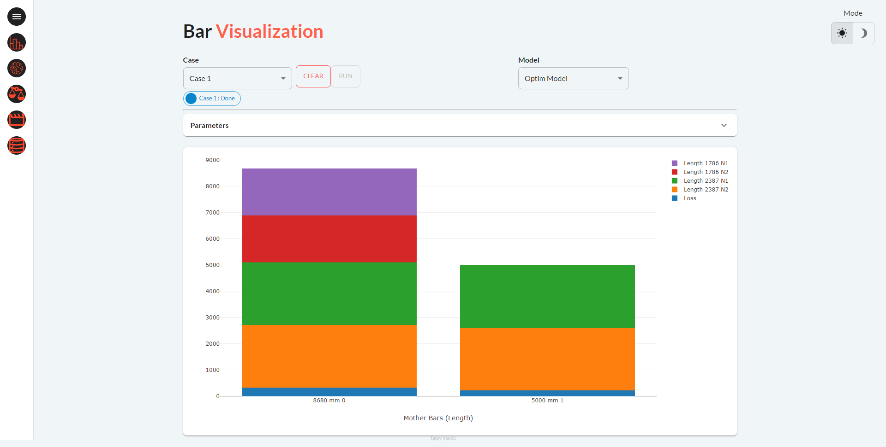

This demo showcases how to optimize the bar-cutting process to minimize waste.
Bar-cutting optimization minimizes waste by choosing optimal cutting patterns. This is
crucial in industries with significant material costs, such as Steel and timber. This
demo embeds a powerful optimization engine that has demonstrated huge savings for several
large companies. It can easily be extended to cater for specific requirements.

!!! note "Taipy Enterprise edition"

    Taipy provides robust, business-focused applications tailored for enterprise environments. To
    maintain standards of security and customization, these applications are proprietary like this
    application. If you’re looking for solutions that are immediately deployable and customizable
    to your business needs, we invite you to try them out and contact us for more detailed
    information.

    [Try it live](https://bar-cutting.taipy.cloud/Databases){: .tp-btn target='blank' }
    [Contact us](https://taipy.io/book-a-call){: .tp-btn .tp-btn--accent target='blank' }

# Understand the Application

The application comprises five pages accessible via the left panel.
To visualize them expand the menu list by just clicking inside this left panel

## Page 1: Bar Visualization

1. Load the selected dataset by choosing from two cases ("Case 1" or "Case 2").
2. Select one algorithm (amongst the two algorithms proposed): the "Baseline" or the "Optim Model".
3. Click on "RUN"
4. Within seconds, the results get displayed, highlighting material loss in blue on a bar chart.
5. Switch algorithms to compare material waste.

{width=90% : .tp-image-border }

To access additional information, you can open the Parameters panel
(Taipy Expandable) to review the input data related to the selected
case, Stock available and Demand to fulfill.

## Page 2: Visual Metrics

On this page, you'll find metrics for both the Baseline Model and
the Optim Model presented in two distinct formats: bar charts and pie
charts. These metrics provide insights into the loss, which can be
visualized as either a percentage of the total length of the mother
bars utilized or as the precise loss value measured in millimeters.

{width=90% : .tp-image-border }

## Page 3: Compare Models

Compare Baseline and Optim models' performance side by side.

{width=90% : .tp-image-border }

## Page 4: Compare Cases

Assess the performance of each model across various scenarios.
This represents one of Taipy's most valuable features.

{width=90% : .tp-image-border }

## Page 5: Databases

Results are neatly summarized in a table, allowing you to select the case,
model and table. The results are then accessible for download in CSV format.

{width=90% : .tp-image-border }
