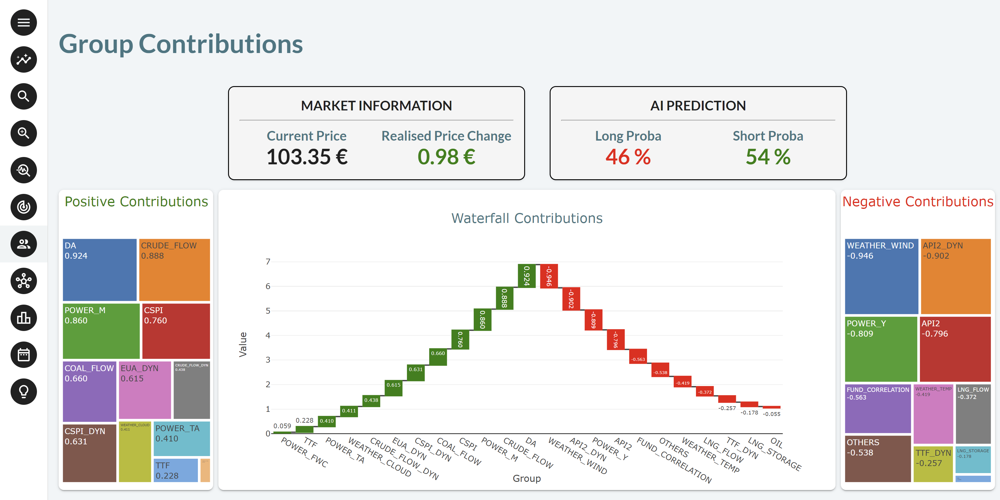
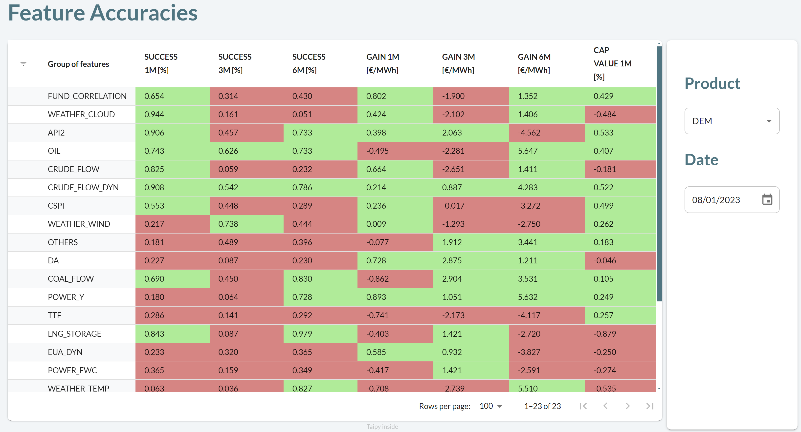
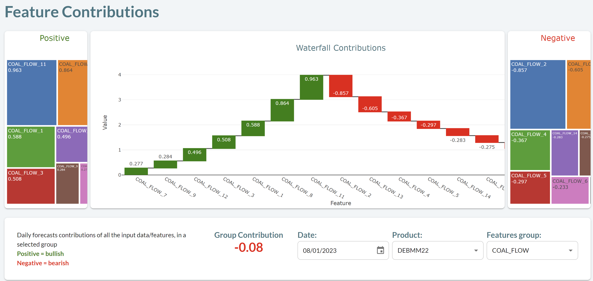
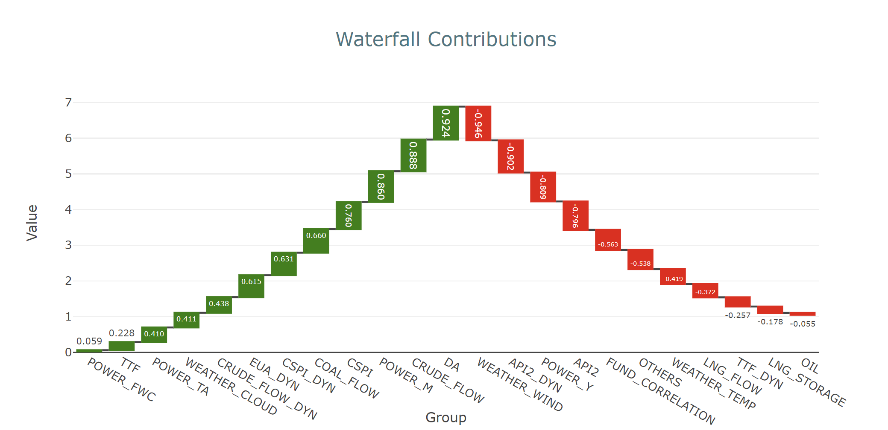
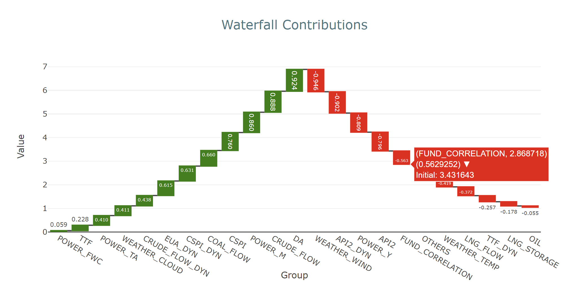

This application illustrates a typical environment for Commodity Trading. It uses an AI 
engine that provides sell/buy recommendations (Short/Long) for the various 
products, together with an explanation of the main influencers that contributed 
the most to the decision. 

This application can be customized for different sets of commodities. 

!!! note "Taipy Enterprise edition"

    Taipy provides robust, business-focused applications tailored for enterprise environments. To 
    maintain standards of security and customization, these applications are proprietary like this 
    application. If you’re looking for solutions that are immediately deployable and customizable to 
    your business needs, we invite you to try them out and contact us for more detailed information.

    [Try it live](https://commodity-trading.taipy.cloud){: .tp-btn target='blank' }
    [Contact us](https://taipy.io/book-a-call){: .tp-btn .tp-btn--accent target='blank' }

{width=90% : .tp-image-border }

# Understanding the Application

In this trading application, you can navigate through the main menu to check on 
the different aspects of the traded products. These are commodity products. The 
traded products, DEBMK22, FDBMK22, etc., represent 15 different types of a given 
commodity.  

## Market Forecast Panel

The first screen is the "Market Forecast" panel. Here, one can visualize the 
different trading recommendations made by the AI engine for commodity products. 
Each box displays the AI engine forecast: Buy (Long) or Sell (Short) with an 
attached confidence level. Note that the user can choose different products.

{width=90% : .tp-image-border }

## Health Indicators

This panel simply checks for each commodity if it trades in a normal range, if 
the volatility index is high, etc.

{width=90% : .tp-image-border }

### Detailed Health Indicators

This panel provides a more precise view of some key indicators like CHI2 
indicators.

### Health Indicators (HI) Evolution

Display the evolution the HI values over a time period.

## Feature Accuracies

The ML forecasting engine uses many features, which are also grouped by Type. 
For instance, the COAL_FLOW feature group combines many COAL_FLOW features. 
This panel displays:

- the accuracies of the trading algorithm over different horizons - See the 3 
SUCCESS columns.
- the gains generated over different horizons - See the 3 GAIN columns.

{width=90% : .tp-image-border }

## Group Contributions

Two types of charts are displayed.

{width=90% : .tp-image-border }

### The Waterfall Chart

This panel is interesting as it shows which feature group has the most 
significant positive impact (in green) or biggest negative impact (in red) on 
the price of the selected commodity.

{width=70% : .tp-image-border }

Note that different products or dates can be selected.

You can move your mouse over each box to get more information:

{width=70% : .tp-image-border }

Do note that when you click on a given red or green box, you immediately get 
access to the same chart for each feature of the selected feature group. This 
provides a detailed understanding of the impact of each feature within each 
feature group. For instance, by clicking on the COAL_FLOW red box, the following 
chart with all the individual features of the COAL_FLOW group is displayed.

{width=70% : .tp-image-border }

## Feature Ranking

This chart visualizes the evolution of the ranking of each feature over time.

{width=90% : .tp-image-border }

## Model Explainability

This interesting panel displays three dimensions in a single graph: the feature 
value, its contribution to the forecast, and whether the trade direction was 
correct. You want to see a high contribution with high value, leading to a 
successful prediction. This is an example of good "behavior" below.

{width=90% : .tp-image-border }