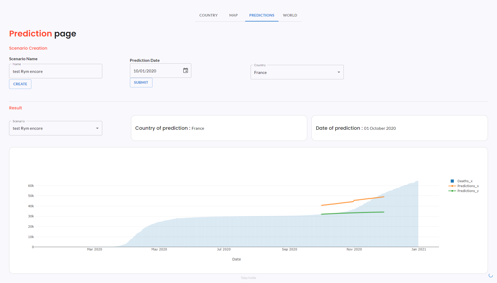

This demo visualizes a Covid dataset for the year 2020.
Pages show different graphs and information on Covid.
A Prediction page is also present to predict the number of casualties.

[Try it live](https://covid-dashboard.taipy.cloud/Country){: .tp-btn target='blank' }
[Get it on GitHub](https://github.com/Avaiga/demo-covid-dashboard){: .tp-btn .tp-btn--accent target='blank' }

# Understanding the Application
The application comprises four pages accessible via the upper tabs: Country, Map, Predictions, World.

## Page 1: Country
- Country-specific COVID-19 statistics.
- Easily switch between cumulative and density data views.
- Interactive bar chart for dynamic data exploration.
- Pie chart illustrating case distribution (Confirmed, Recovered, Deaths).

{width=90% : .tp-image-border }

## Page 2: Map
Visual representation of COVID-19 impact through dynamic zoomable color-coded maps.

{width=90% : .tp-image-border }

## Page 3: Predictions
Generate COVID-19 predictions by creating scenarios for different
prediction dates and different countries. This generates two different
predictions (prediction_x in orange and prediction_y in green) using respectively
an ARIMA model and a Linear Regression model.

How to use it:

1. Initiate a new scenario by assigning it a name.
2. Specify a prediction date.
3. Choose a country.
4. Click the "Submit" button and here we go!
5. To view your scenario, access it in the Scenario tab located within the Results section.

{width=90% : .tp-image-border }

## Page 4: World
Global COVID-19 statistics are summarized via line and pie charts.
The Comparison of Covid countries' impact can be seen by changing the toggle between ‘Absolute’ and ‘Relative’.

{width=90% : .tp-image-border }
