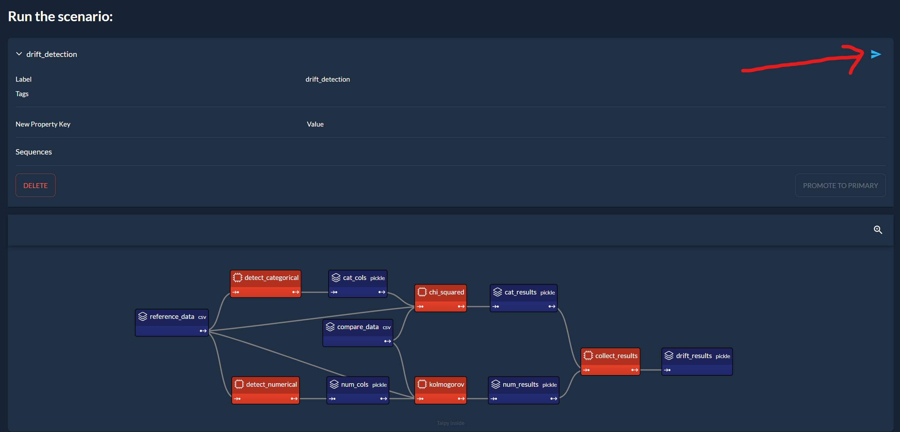

This demo aims to showcase the ability to select inputs and execute and visualize outputs of data
pipelines in a Taipy application. Here, we use the example of detecting drift on a dataset.

[Try it live](https://drift-detection.taipy.cloud/){: .tp-btn target='blank' }
[Get it on GitHub](https://github.com/Avaiga/demo-drift-detection){: .tp-btn .tp-btn--accent target='blank' }

# Understanding the Application

Data drift is a concept used mainly in machine learning, where the distribution of inference data
strays from the distribution of training data. Various factors, such as changes in the underlying
data source, changes in the data collection process, or changes in the data storage process, can
cause data drift. This generally causes a performance issue called training-serving skew, where
the model used for inference is not used for the distribution of the inference data and fails to
generalize.

{width=90% : .tp-image-border }

Statistical tests exist to detect drift in a dataset. These tests calculate the probability of
two series coming from the same distribution. If the probability is under a threshold, we consider
that there is drift.

The dataset used in this app has both numerical (age, body mass index, blood pressure) and
categorical (sex) columns. That is why we start by separating these columns. Then, we run a
statistical test for each column to detect drift (Kolmogorov for numerical, Chi-squared for
categorical).

{width=90% : .tp-image-border }

# How to use the Application

1. Select the comparison dataset:

    Here, we are selecting *data_big*, a dataset similar to the reference dataset but with rows
    with higher blood pressure values. We see on the blood pressure distribution chart that the
    distribution of the comparison dataset in red is shifted to the right compared to the
    reference dataset in green.

    {width=90% : .tp-image-border }

2. Run the scenario by clicking here:

    {width=90% : .tp-image-border }

3. Visualize the results at the bottom of the page:

    Here, we see that the p-value for the Kolmogorov test of the blood pressure column is under
    0.05, which means that the probability of both datasets of blood pressure coming from the
    same distribution is under 5%. We can reject the hypothesis that both datasets come from the
    same distribution and conclude that there is a drift in the blood pressure column.

    {width=90% : .tp-image-border }
