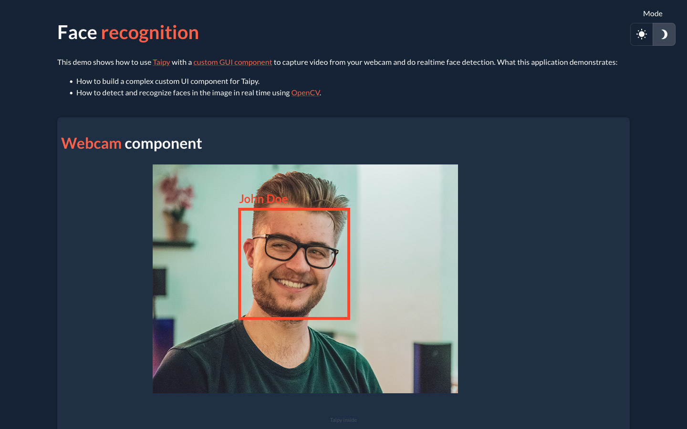

This demo seamlessly integrates face recognition into our platform,
offering a user-friendly real-time face detection experience using
your webcam.Just as a reminder, face recognition technology enables
computers to identify human faces in images and videos.

[Try it live](https://face-recognition.taipy.cloud/){: .tp-btn target='blank' }
[Get it on GitHub](https://github.com/Avaiga/demo-face-recognition){: .tp-btn .tp-btn--accent target='blank' }

# Understanding the Application

This one page demo provides real-time face detection capabilities
thanks to the robust [OpenCV library](https://opencv.org/).

## How to use the Application

1. While opening the application, you'll see yourself across your webcam. A red square
   surrounding your face with someone else's name.

2. Train the model to recognize you by clicking the "Capture" button and giving your name
   several times.

3. Click now the "Re-train" button. Your name should now appear. The model recognizes you now.

{width=90% : .tp-image-border }

**Quick note**: Enable your browser's camera usage option.
