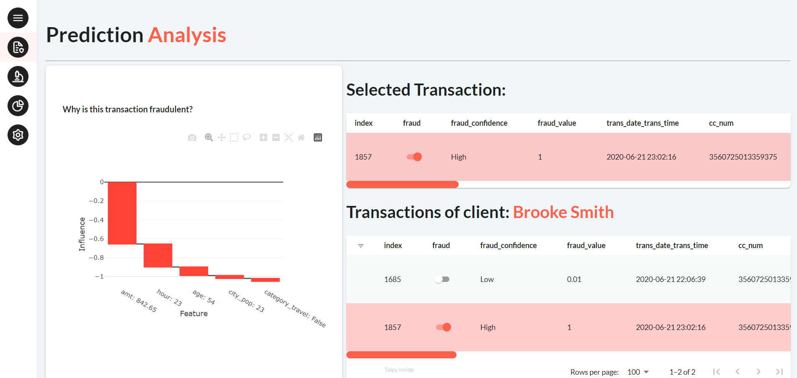
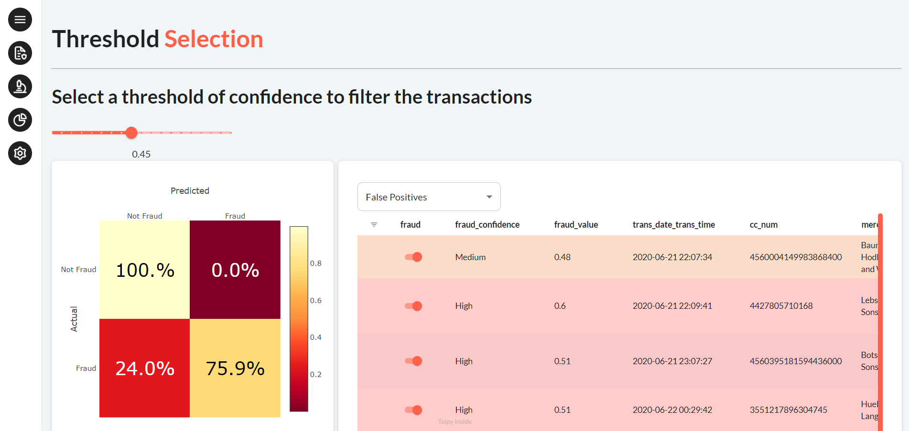

A Taipy Application that analyzes credit card transactions to detect fraud.

!!! note "Taipy Enterprise edition"

    Taipy provides robust, business-focused applications tailored for enterprise environments. To
    maintain standards of security and customization, these applications are proprietary like this
    application. If you’re looking for solutions that are immediately deployable and customizable to
    your business needs, we invite you to try them out and contact us for more detailed information.

    [Try it live](https://fraud-detection.taipy.cloud/Transactions){: .tp-btn target='blank' }
    [Contact us](https://taipy.io/book-a-call){: .tp-btn .tp-btn--accent target='blank' }

# Understanding the Application

This application shows a list of credit card transactions. The user can select a date range to
predict fraud. The application will then use an XGB model to mark potentially fraudulent
transactions in red or yellow.

{width=90% : .tp-image-border }

The user can select a transaction to see an explanation of the model's prediction, as well as the client's
other transactions.

{width=90% : .tp-image-border }

The user can also choose the threshold of the model. The threshold is the model output
above which a transaction is considered fraudulent. The user can select the model according
to the displayed confusion matrix and by looking at False Positive and False Negative transactions.

{width=90% : .tp-image-border }
