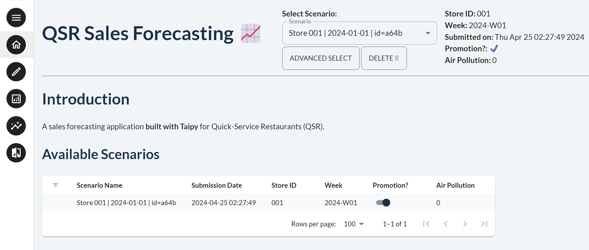
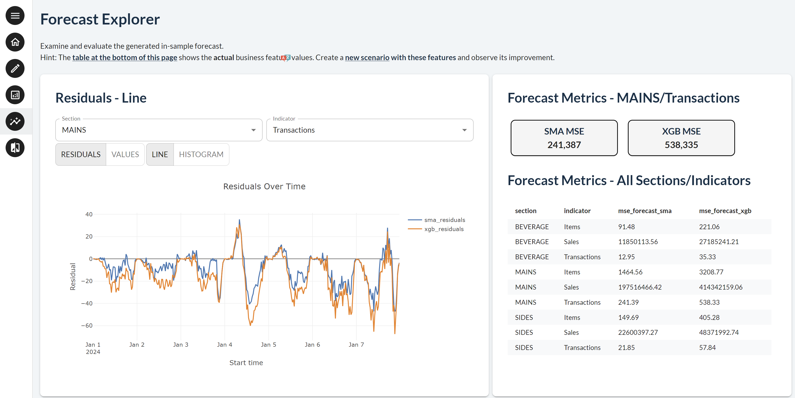
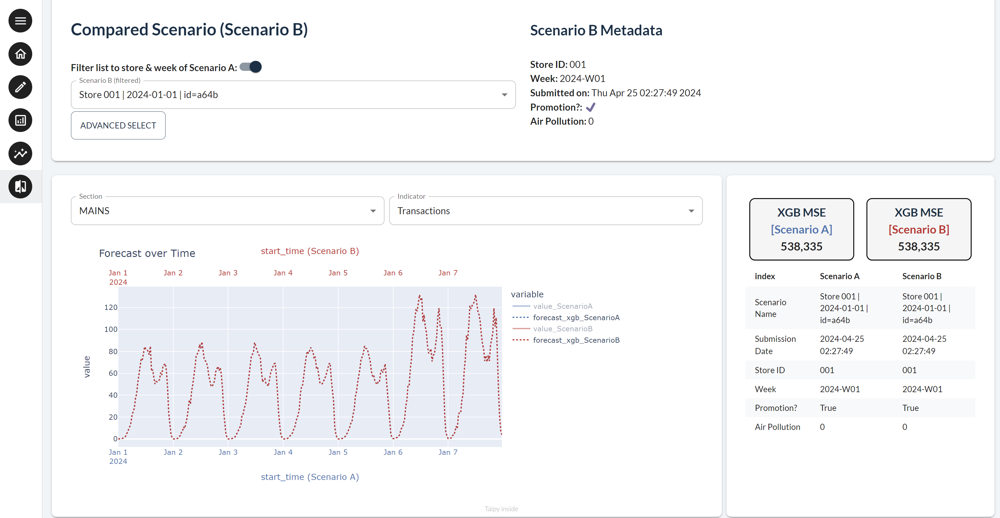

This demo is a scaled-down version of a real application using Taipy, which performs
sales forecasting for a renowned quick-service restaurant (QSR) franchise. This business
problem involves time series forecasting for several drivers (number of items sold,
revenue, number of transactions, etc.) for different store sections (drive-thru, counter, café
corner, etc.). High-quality sales forecasts are generated using powerful AI models and
various data sources. This demo can easily be extended to reflect specific store
requirements.

!!! note "Taipy Enterprise edition"

    Taipy provides robust, business-focused applications tailored for enterprise environments. To
    maintain standards of security and customization, these applications are proprietary like this
    application. If you’re looking for solutions that are immediately deployable and customizable
    to your business needs, we invite you to try them out and contact us for more detailed
    information.

    [Try it live](https://qsr-fcst.taipy.cloud/data){: .tp-btn target='blank' }
    [Contact us](https://taipy.io/book-a-call){: .tp-btn .tp-btn--accent target='blank' }

# Understanding the Application

This application showcases various capabilities of Taipy, including:

1. The use of Taipy Scenario management to handle the forecasting process --
encapsulating each forecast execution as a *Scenario*, persisting the parameters
and results for future reference and evaluation.
2. The use of Taipy GUI to easily create a multi-page application, featuring a navigation
sidebar and a top panel for selecting a *Scenario*, where both panels are present and
used on every page.
3. Demonstrates a mini version of a real implemented system that uses Taipy to
facilitate their sales forecasting.

## Home Page

The landing page which the user is greeted with when the application is launched. The
dropdown selector on the top panel allows the user to select a scenario to view -- more
relevant for the later pages. This page also displays a table of already generated
scenarios.

{width=70% : .tp-image-border }

## Create Page

The page for creating a new scenario. The user can select the scenario parameters, such
as the store name, forecast start and end dates and other parameters which may be used by
the forecasting algorithm. After the selections are made, the user can click the "Submit"
button to *submit* the scenario for execution, during which a progress bar will indicate
its progress.

{width=90% : .tp-image-border }

## Data and Forecast Page

The page for viewing the forecasts of the selected scenario, which is selected using the
top panel. Includes a line chart comparing the actual and forecasted sales, and a
histogram of residuals. The side panel is used to select the *"Section"* and
*"Indicator"*, which are the business areas that the forecasts are made for.

{width=90% : .tp-image-border }

{width=90% : .tp-image-border }

## Compare Page

The selected scenario is compared against another scenario, which is selected using the
side panel. Here, the user can view the actual and forecast sales of different stores on
the same chart.

{width=90% : .tp-image-border }
