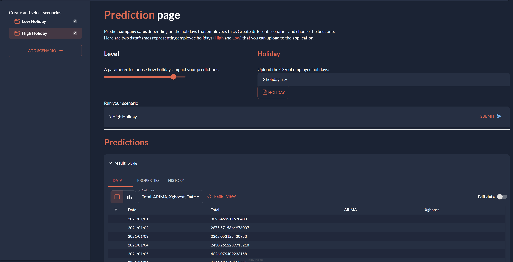

This demo allows users to extract data from an Excel file/CSV and derive meaningful insights.
The data is a list of transactions done by different branches in a company. Sales are
made in different cities, and each one is evaluated through ratings. The data also
contains more information, like the gender or type of customer.

Different visualizations are shown, from maps to sales bar charts including a page to
filter and analyze the sales data.

[Try it live](https://sales-insights.taipy.cloud/){: .tp-btn target='blank' }
[Get it on GitHub](https://github.com/Avaiga/demo-sales-insights){: .tp-btn .tp-btn--accent target='blank' }

{width=90% : .tp-image-border }

# Understanding the Application

This demo is a multi-page application. You can find a simpler version of this application
inside the repository.

**The first page** is an overview of the information found in the data.

{width=90% : .tp-image-border }

**The second page** is a way to interact with the data through filters dynamically.

{width=90% : .tp-image-border }

**The third page** lets you create different predictions and see their results.
You can predict company sales depending on the holidays that employees take.

- Create different scenarios,
- Choose the best one.

{width=90% : .tp-image-border }

## Source

The idea, as well as part of the code of this application, comes from Sven Bosau.
The original code can be found
[here](https://github.com/Sven-Bo/streamlit-sales-dashboard). It was recreated using Taipy.
