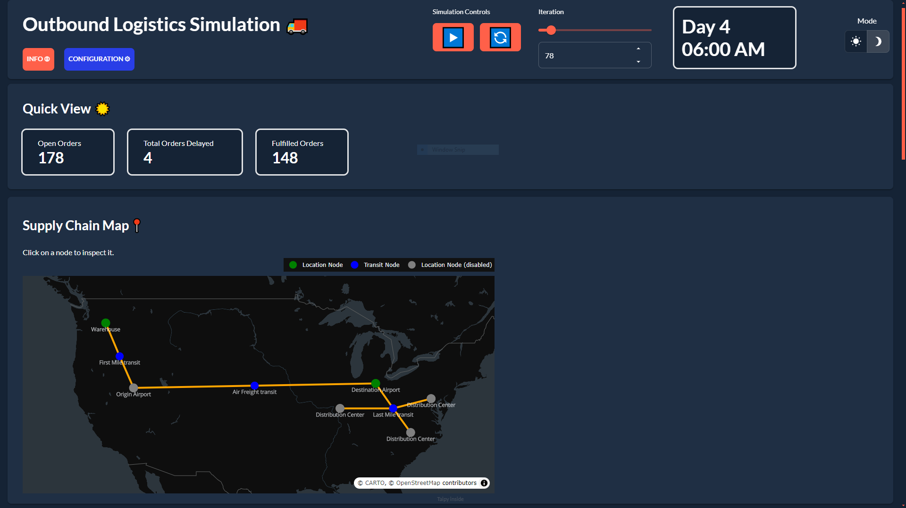
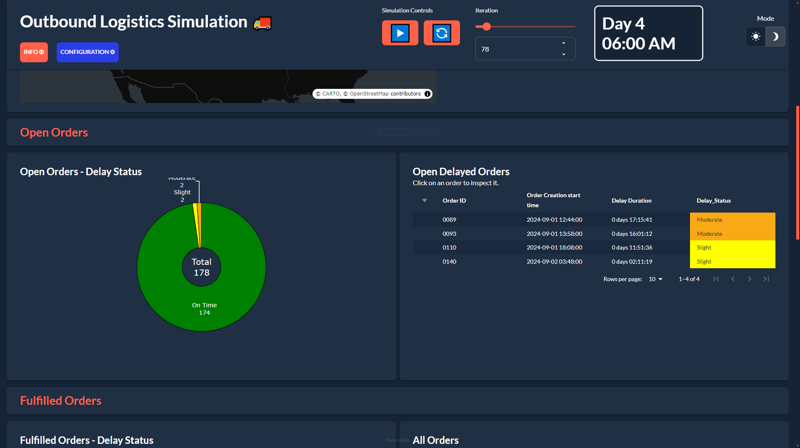
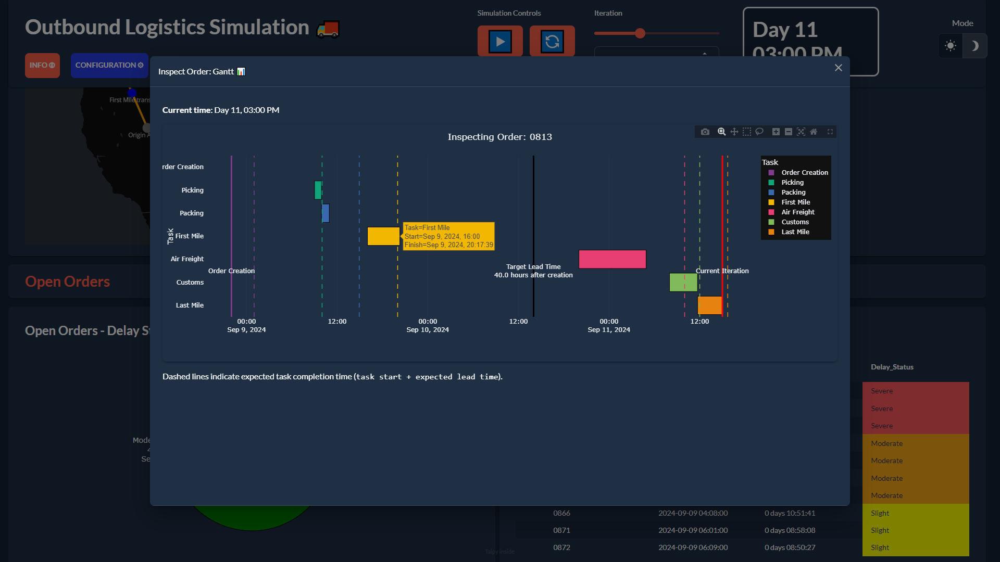
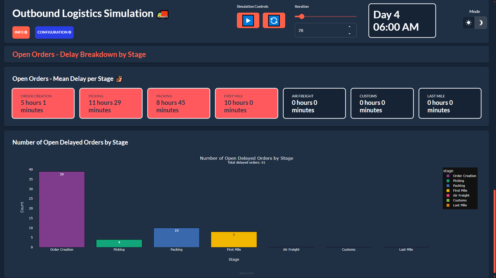
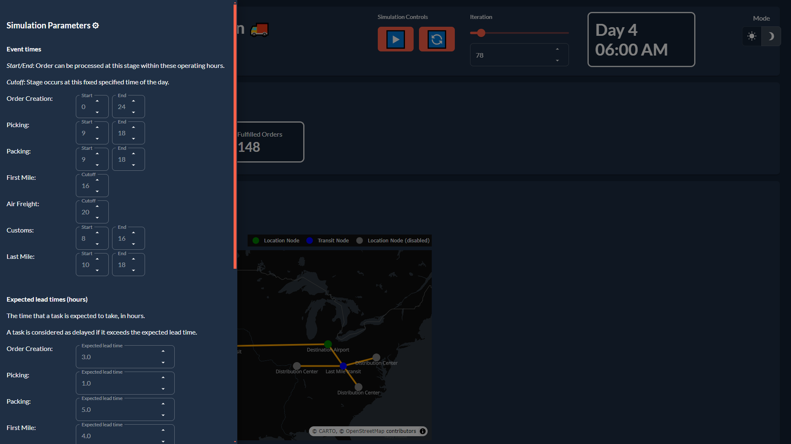

This application demonstrates a Supply Chain Monitoring use case for a supplier delivering orders to a distributor. It
tracks KPIs at each stage (e.g. "Picking", "Packing", "Air Freight"), classifying delays with degrees of severity and allows
the user to identify bottlenecks.

!!! note "Taipy Enterprise edition"

    Taipy provides robust, business-focused applications tailored for enterprise
    environments. To maintain standards of security and customization, these
    applications are proprietary like this application. If you're looking for solutions
    that are immediately deployable and customizable to your business needs, we invite
    you to try them out and contact us for more detailed information.

    [Try it live](https://supply-chain-monitoring.taipy.cloud){: .tp-btn target='blank' }
    [Contact us](https://taipy.io/book-a-call){: .tp-btn .tp-btn--accent target='blank' }

{width=90% : .tp-image-border }

# Understanding the Application

This application presents this Supply Chain Monitoring use case as a simulation occurring over the period of 1 month,
controlled with Play/Pause/Reset controls. KPIs and metrics are displayed using visualizations such as a map, cards,
donut charts, bar charts and Gantt charts.

## Map

The first section is the Quick View and Map, as shown in the image above. The Quick View panel gives the user a high-level status of
their shipments. The map helps visualize where open orders (orders which are not yet fulfilled) are. For example, by clicking on the "Warehouse" marker, users
may see all open orders which are in the "Order Creation", "Picking" or "Packing" stages.

## Open Orders Delayed Status

The next section informs the user about open delayed orders. The donut chart shows the proportion of delays by severity.
Additionally, a table listing all open delayed orders is shown. Users may click on an individual order to open a Gantt
chart and examine the order's history.

{width=90% : .tp-image-border }

## Gantt Chart

The Gantt chart shows an order's history. This makes it easy to identify the cause of delays, and take corrective
action. For example, in the example below, the "First Mile" stage ended at 2017 hrs — therefore, it missed the 2000 hrs
cutoff time for the next stage, "Air Freight".

{width=90% : .tp-image-border }

## Open Orders: Delay by Stage

This section shows the number of delayed orders by stage as a bar chart. Additionally, it shows the average delay
duration of delayed orders by stage as cards.

{width=90% : .tp-image-border }

## Configuration Panel

This side panel is used to configure the simulation parameters, including operation hours, cutoff times, expected lead
times (used to classify an order as delayed) and delay status (used to classify a delay's severity). Users may tweak
this to potentially lessen delays in the simulation.

{width=90% : .tp-image-border }
