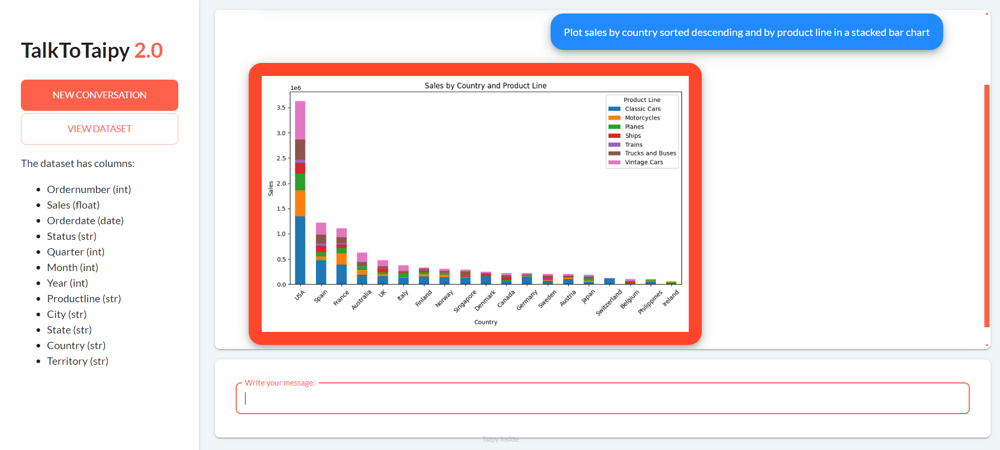

Use natural language to ask questions about a car sales dataset. PandasAI will answer with text, tables, and visualizations

!!! note "Taipy Enterprise edition"

    Taipy provides robust, business-focused applications tailored for enterprise
    environments. To maintain standards of security and customization, these
    applications are proprietary like this application. If you're looking for solutions
    that are immediately deployable and customizable to your business needs, we invite
    you to try them out and contact us for more detailed information.

    [Try it live](https://talk-to-taipy.taipy.cloud/){: .tp-btn target='blank' }
    [Contact us](https://taipy.io/book-a-call){: .tp-btn .tp-btn--accent target='blank' }

{width=90% : .tp-image-border }

# Understanding the Application

In this application, the user can ask a chatbot about a pre-defined car sales dataset. 
The chatbot uses PandasAI and OpenAI to interpret the query, run pandas and matplotlib 
code, and return text, tables, and visualizations as responses.

