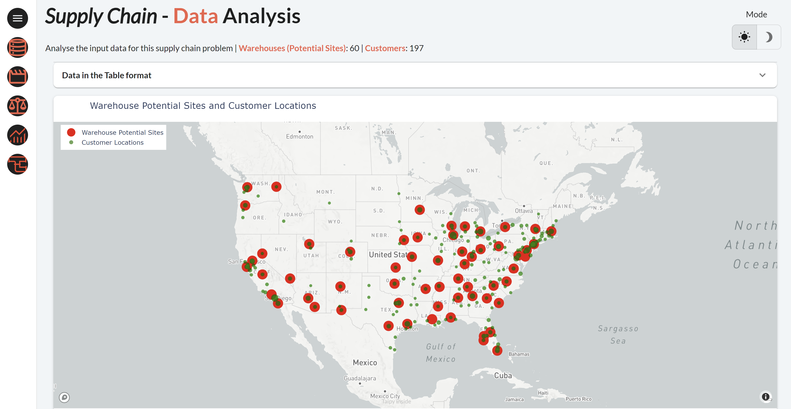
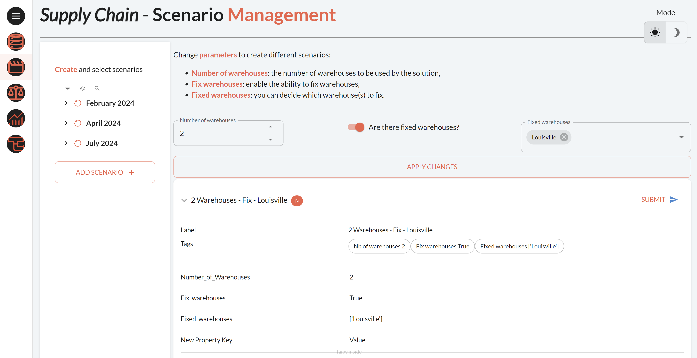
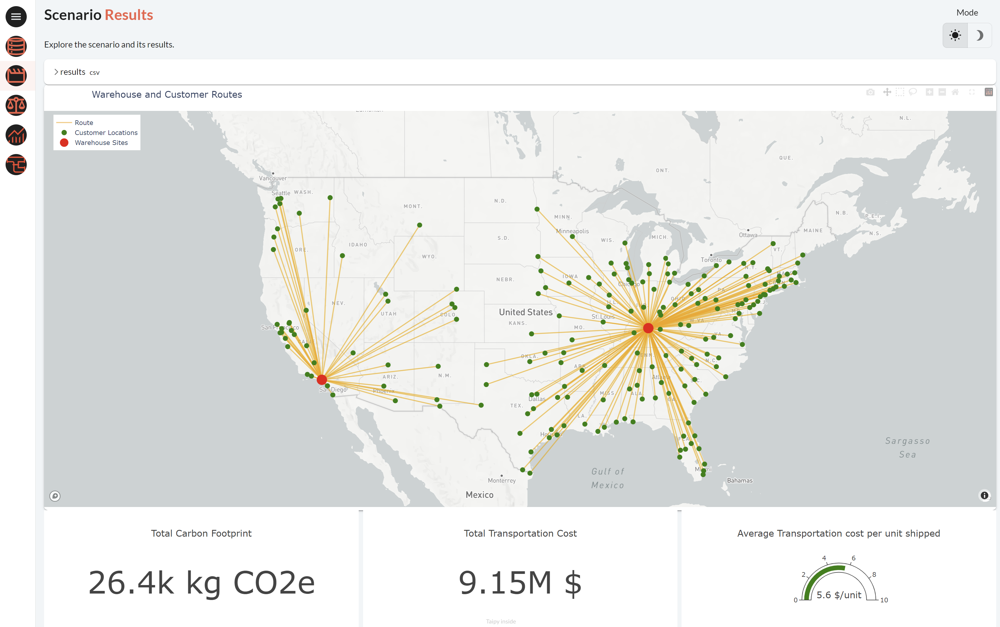
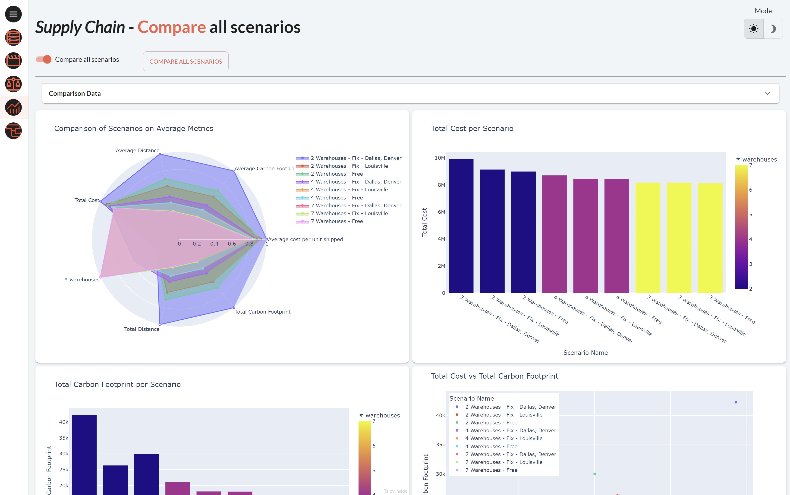
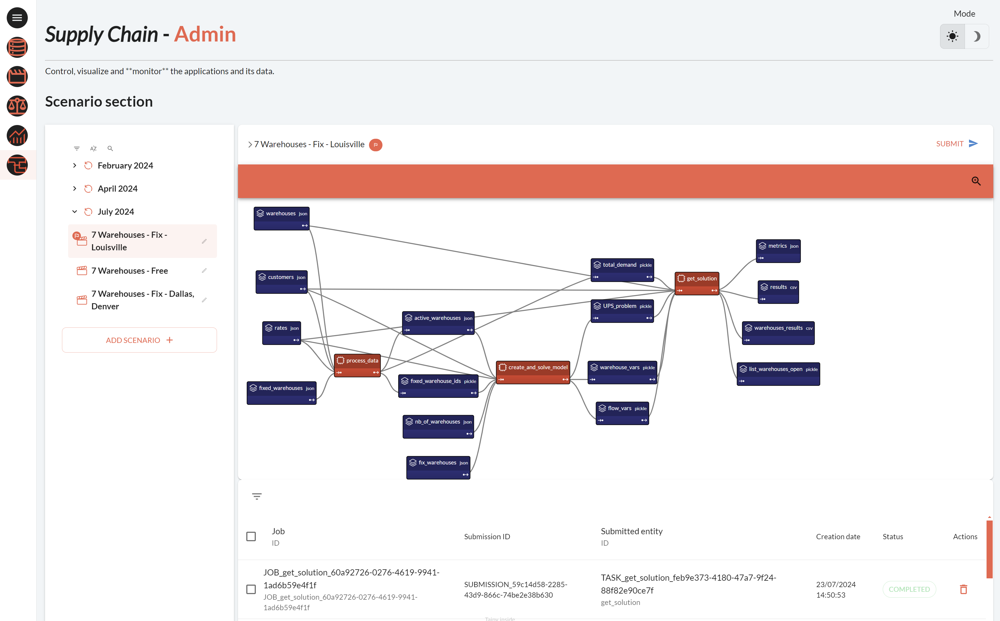

This application demonstrates a typical use case for optimizing supply chains. This is particularly suited for Manufacturers or 
distribution companies interested in minimizing their transportation costs from their warehouses to their customers. It
uses a mathematical model to find the optimal selection of warehouses to cover customer demand.

This application can be easily tailored to suit different supply chain configurations and constraints

!!! note "Taipy Enterprise edition"

    Taipy provides robust, business-focused applications tailored for enterprise
    environments. To maintain standards of security and customization, these
    applications are proprietary like this application. If you're looking for solutions
    that are immediately deployable and customizable to your business needs, we invite
    you to try them out and contact us for more detailed information.

    [Try it live](https://supply-chain.taipy.cloud){: .tp-btn target='blank' }
    [Contact us](https://taipy.io/book-a-call){: .tp-btn .tp-btn--accent target='blank' }

{width=90% : .tp-image-border }

# Understanding the Application

In this application, you can navigate to explore the input data and the optimal solutions generated.

## Data page

The first screen is the "Data" page. Here, you can view all the input data for the
supply chain problem, including a list of 60 potential warehouses and 197 customers
and their related information. You can also view a map showing the locations of
potential warehouse sites as well as all the customer locations.

{width=90% : .tp-image-border }

## Scenario Management

This page allows you to create and modify scenarios. You can adjust parameters such as:

the number of warehouses to be used
Select specific warehouses to be used in the
solution. 
After setting the parameters, you can submit the scenario to launch the optimization engine and then get the "optimal" solution.

{width=90% : .tp-image-border }

The results include a solution map showing the selected warehouses, customer locations,
and routes used to service each customer. Additionally, you can view metrics such as 
total carbon footprint, total transportation cost, and average transportation cost per 
unit shipped. Charts displaying the volume of demand handled by each warehouse and the 
number of clients assigned to them are also available.

{width=90% : .tp-image-border }

## Comparison

This page enables you to compare two different scenarios by displaying their solution maps and 
metrics side by side.

{width=90% : .tp-image-border }

## Global Comparison

Here, you can compare all scenarios or selected scenarios using charts that represent
various metrics, providing a comprehensive overview of the optimization results.

{width=90% : .tp-image-border }

## Admin page

The Admin page allows to visualize all the data nodes, executed jobs, and scenarios within
the application, giving you complete control over the management and monitoring of your
supply chain optimization processes.

{width=90% : .tp-image-border }