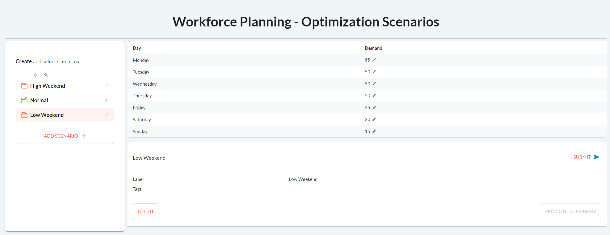
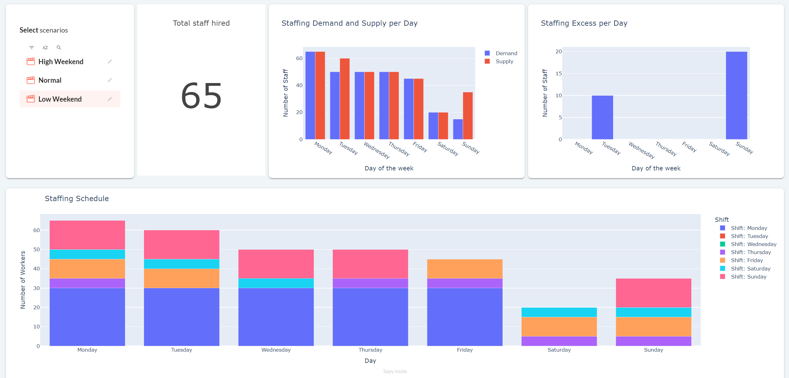

A simple application where you input the number of staff you need per day. A linear optimizer
will then minimize the amount of workers hired to meet the demand according to certain
constraints such as employees having to work 5 consecutive days and have 2 days off.

[Try it live](https://workforce-optim.taipy.cloud/){: .tp-btn target='blank' }
[Get it on GitHub](https://github.com/Avaiga/demo-workforce-plan){: .tp-btn .tp-btn--accent target='blank' }

More information about the problem can be found
[here](https://towardsdatascience.com/optimize-workforce-planning-using-linear-programming-with-python-47a0b5f89a6f).

# Understanding the Application

You can create new optimization scenarios, edit the demand for each day and submit the
optimization from this interface.

{width=90% : .tp-image-border }

The results will be displayed below.

{width=90% : .tp-image-border }