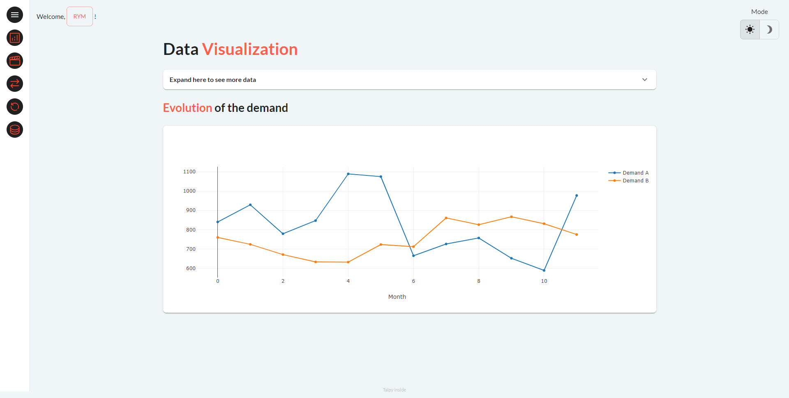

---
hide:
  - toc
---

Follow our tutorials and get the core concepts of Taipy.

<!-- Filters -->
<ul class="tp-pills-list tp-pills-filter">
  <li>
    <input type="checkbox" name="filter-all" id="filter-all" value="all" checked>
    <label class="tp-pill" for="filter-all">
      All
    </label>
  </li>
  <li>
    <input type="checkbox" name="filter-dashboard" id="filter-dashboard" value="dashboard">
    <label class="tp-pill" for="filter-dashboard">
      Dashboard
    </label>
  </li>
  <li>
    <input type="checkbox" name="filter-scenario" id="filter-scenario" value="scenario">
    <label class="tp-pill" for="filter-scenario">
      Scenario
    </label>
  </li>
  <li>
    <input type="checkbox" name="filter-ai" id="filter-ai" value="ai">
    <label class="tp-pill" for="filter-ai">
      Machine Learning
    </label>
  </li>
  <li>
    <input type="checkbox" name="filter-optimization" id="filter-optimization" value="optimization">
    <label class="tp-pill" for="filter-optimization">
      Optimization
    </label>
  </li>
</ul>

<ul class="tp-row tp-row--gutter-sm tp-filtered">
  <li class="tp-col-12 tp-col-md-6 d-flex" data-keywords="gui optimization scenario">
    <a class="tp-content-card tp-content-card--horizontal tp-content-card--small" href="bar_cutting/">
      <header class="tp-content-card-header">
        
      </header>
      

        <h4>Optimize Bar Cut Sizes to Minimize Waste</h4>
        

          Use two scenarios with distinct algorithms to reduces raw material waste by bar cut sizes optimizations.
        

      

    </a>
  </li>
  <li class="tp-col-12 tp-col-md-6 d-flex" data-keywords="gui ai classification scenario">
    <a class="tp-content-card tp-content-card--horizontal tp-content-card--small" href="churn_classification/">
      <header class="tp-content-card-header">
        
      </header>
      

        <h4>Churn Classification - Predict customer churn</h4>
        

          Leverage Scenario management and comparison to improve decision making on a Churn prediction demo.
        

      

    </a>
  </li>
  <li class="tp-col-12 tp-col-md-6 d-flex" data-keywords="gui ai scenario datanode dag configuration">
    <a class="tp-content-card tp-content-card--horizontal tp-content-card--small" href="drift_detection/">
      <header class="tp-content-card-header">
        
      </header>
      

        <h4>Drift Detection - Detect drift in a dataset</h4>
        

          Expose scenarios and pipeline executions to your end-users with this input dataset drift detection.
        

      

    </a>
  </li>
  <li class="tp-col-12 tp-col-md-6 d-flex" data-keywords="gui optimization scenario cycle comparison">
    <a class="tp-content-card tp-content-card--horizontal tp-content-card--small" href="production_planning/">
      <header class="tp-content-card-header">
        
      </header>
      

        <h4>Production Planning - Optimize production and cost management</h4>
        

          Simulate manufacturing scenarios and optimize production quantities to reduce production costs.
        

      

    </a>
  </li>
</ul>
