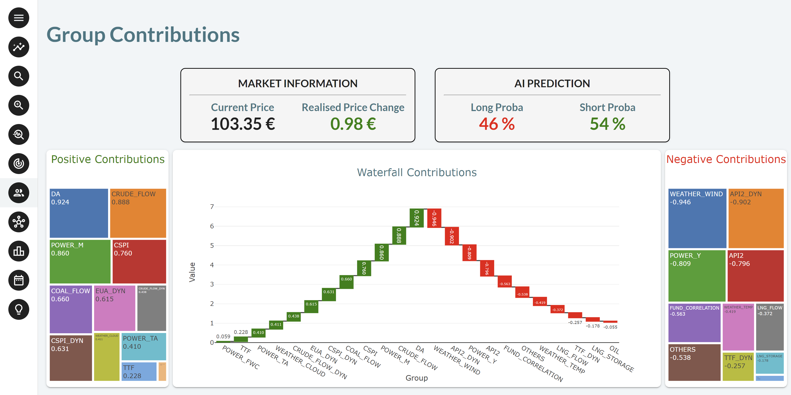

This application illustrates a typical environment for Commodity Trading. It uses an AI 
engine that provides sell/buy recommendations (Short/Long) for the various 
products, together with an explanation of the main influencers that contributed 
the most to the decision. 

This application can be customized for different sets of commodities. 

!!! note "Taipy Enterprise edition"

    Taipy provides robust, business-focused applications tailored for enterprise environments. To 
    maintain standards of security and customization, these applications are proprietary like this 
    application. If you’re looking for solutions that are immediately deployable and customizable to 
    your business needs, we invite you to try them out and contact us for more detailed information.

    [Try it live](https://commodity-trading.taipy.cloud){: .tp-btn target='blank' }
    [Contact us](https://taipy.io/book-a-call){: .tp-btn .tp-btn--accent target='blank' }

{width=90% : .tp-image-border }

# Understanding the Application

TODO