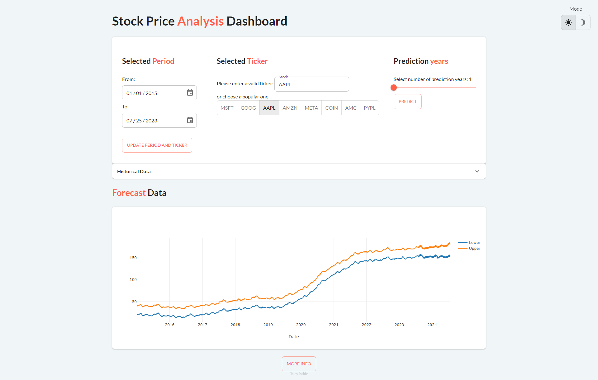

---
hide:
  - toc
---

Follow our tutorials and get the core concepts of Taipy.

<!-- Filters -->
<ul class="tp-pills-list tp-pills-filter">
  <li>
    <input type="checkbox" name="filter-all" id="filter-all" value="all" checked>
    <label class="tp-pill" for="filter-all">
      All
    </label>
  </li>
  <li>
    <input type="checkbox" name="filter-gui" id="filter-gui" value="gui">
    <label class="tp-pill" for="filter-gui">
      GUI
    </label>
  </li>
  <li>
    <input type="checkbox" name="filter-dashboard" id="filter-dashboard" value="dashboard">
    <label class="tp-pill" for="filter-dashboard">
      Dashboard
    </label>
  </li>
  <li>
    <input type="checkbox" name="filter-scenario" id="filter-scenario" value="scenario">
    <label class="tp-pill" for="filter-scenario">
      Scenario
    </label>
  </li>
  <li>
    <input type="checkbox" name="filter-studio" id="filter-studio" value="studio">
    <label class="tp-pill" for="filter-studio">
      Taipy Studio
    </label>
  </li>
</ul>

<ul class="tp-row tp-row--gutter-sm tp-filtered">
  <li class="tp-col-12 tp-col-md-6 d-flex" data-keywords="gui dashboard vizelement layout chart ai multi-page classification">
    <a class="tp-content-card tp-content-card--horizontal tp-content-card--small" href="fraud_detection/">
      <header class="tp-content-card-header">
        
      </header>
      

        <h4>Fraud Detection</h4>
        

          A Taipy Application that analyzes credit card transactions to detect fraud.
        

      

    </a>
  </li>
  <li class="tp-col-12 tp-col-md-6 d-flex" data-keywords="gui dashboard vizelement layout chart">
    <a class="tp-content-card tp-content-card--horizontal tp-content-card--small" href="sales_dashboard/">
      <header class="tp-content-card-header">
        
      </header>
      

        <h4>Sales Dashboard</h4>
        

          Check out our Sales Dashboard demo that shows valuable insights by exposing Excel files as a web application.
        

      

    </a>
  </li>
  <li class="tp-col-12 tp-col-md-6 d-flex" data-keywords="gui ai dashboard">
    <a class="tp-content-card tp-content-card--horizontal tp-content-card--small" href="stock_visualization/">
      <header class="tp-content-card-header">
        
      </header>
      

        <h4>Stock Visualization and Prediction</h4>
        

          Leverage Taipy and Prophet to visualize historical stock data and make predictions over 5 years.
        

      

    </a>
  </li>
</ul>
