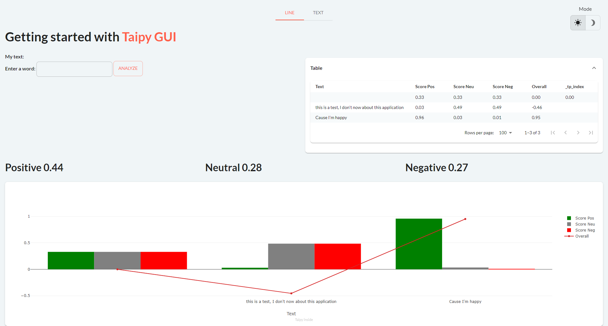

---
hide:
  - toc
---

Uncover a list of applications using LLM.

<!-- Filters -->
<ul class="tp-pills-list tp-pills-filter">
  <li>
    <input type="checkbox" name="filter-all" id="filter-all" value="all" checked>
    <label class="tp-pill" for="filter-all">
      All
    </label>
  </li>
  <li>
    <input type="checkbox" name="filter-dashboard" id="filter-dashboard" value="dashboard">
    <label class="tp-pill" for="filter-dashboard">
      Dashboard
    </label>
  </li>
  <li>
    <input type="checkbox" name="filter-scenario" id="filter-scenario" value="scenario">
    <label class="tp-pill" for="filter-scenario">
      Scenario
    </label>
  </li>
  <li>
    <input type="checkbox" name="filter-ai" id="filter-ai" value="ai">
    <label class="tp-pill" for="filter-ai">
      Machine Learning
    </label>
  </li>
  <li>
    <input type="checkbox" name="filter-optimization" id="filter-optimization" value="optimization">
    <label class="tp-pill" for="filter-optimization">
      Optimization
    </label>
  </li>
</ul>

<ul class="tp-row tp-row--gutter-sm tp-filtered">
  <li class="tp-col-12 tp-col-md-6 d-flex" data-keywords="vizelement ai">
    <a class="tp-content-card tp-content-card--horizontal tp-content-card--small" href="5_chatbot/">
      <header class="tp-content-card-header">
        
      </header>
      

        <h4>LLM ChatBot</h4>
        

          Leverage this chatbot demo using OpenAI's API with GPT-3 to use it as a template for an LLM inference application.
        

      

    </a>
  </li>
  <li class="tp-col-12 tp-col-md-6 d-flex" data-keywords="dashboard vizelement layout chart ai">
    <a class="tp-content-card tp-content-card--horizontal tp-content-card--small" href="6_talk_to_taipy/">
      <header class="tp-content-card-header">
        
      </header>
      

        <h4>TalkToTaipy</h4>
        

          Explore datasets using only natural language using TalkToTaipy!
        

      

    </a>
  </li>
  <li class="tp-col-12 tp-col-md-6 d-flex" data-keywords="dashboard ai">
    <a class="tp-content-card tp-content-card--horizontal tp-content-card--small" href="sentiment_analysis/">
      <header class="tp-content-card-header">
        
      </header>
      

        <h4>Sentiment Analysis - Detect emotional tones from a text</h4>
        

          Analyze user input and uploaded text to uncover sentiments effortlessly.
        

      

    </a>
  </li>
  <li class="tp-col-12 tp-col-md-6 d-flex" data-keywords="ai">
    <a class="tp-content-card tp-content-card--horizontal tp-content-card--small" href="tweet_generation/">
      <header class="tp-content-card-header">
        
      </header>
      

        <h4>Tweet Generation</h4>
        

          Experience the AI-powered Tweet Generation. Automate Tweets using GPT-3's Davinci engine and DALL·E.
        

      

    </a>
  </li>
</ul>
