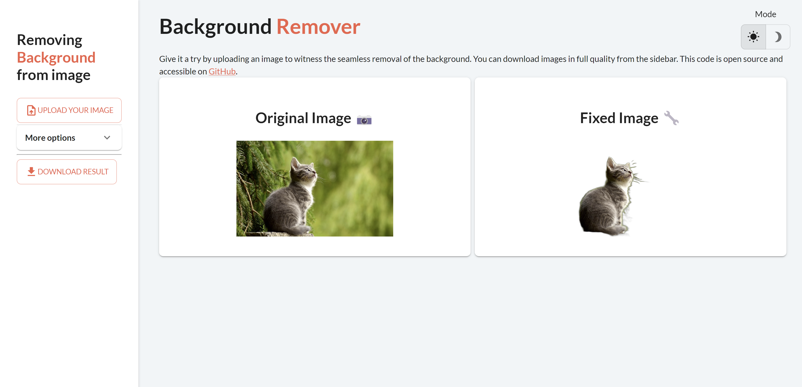

---
hide:
  - toc
---

Follow our tutorials and get the core concepts of Taipy.

<!-- Filters -->
<ul class="tp-pills-list tp-pills-filter">
  <li>
    <input type="checkbox" name="filter-all" id="filter-all" value="all" checked>
    <label class="tp-pill" for="filter-all">
      All
    </label>
  </li>
  <li>
    <input type="checkbox" name="filter-gui" id="filter-gui" value="gui">
    <label class="tp-pill" for="filter-gui">
      GUI
    </label>
  </li>
  <li>
    <input type="checkbox" name="filter-dashboard" id="filter-dashboard" value="dashboard">
    <label class="tp-pill" for="filter-dashboard">
      Dashboard
    </label>
  </li>
  <li>
    <input type="checkbox" name="filter-scenario" id="filter-scenario" value="scenario">
    <label class="tp-pill" for="filter-scenario">
      Scenario
    </label>
  </li>
  <li>
    <input type="checkbox" name="filter-studio" id="filter-studio" value="studio">
    <label class="tp-pill" for="filter-studio">
      Taipy Studio
    </label>
  </li>
</ul>

<ul class="tp-row tp-row--gutter-sm tp-filtered">
  <li class="tp-col-12 tp-col-md-6 d-flex" data-keywords="gui ai">
    <a class="tp-content-card tp-content-card--horizontal tp-content-card--small" href="background_remover/">
      <header class="tp-content-card-header">
        
      </header>
      

        <h4>Background Remover</h4>
        

          An interactive application to easily remove image backgrounds using automatic detection.
        

      

    </a>
  </li>
  <li class="tp-col-12 tp-col-md-6 d-flex" data-keywords="gui ai">
    <a class="tp-content-card tp-content-card--horizontal tp-content-card--small" href="face_recognition/">
      <header class="tp-content-card-header">
        
      </header>
      

        <h4>Real-time Face Recognition</h4>
        

          Real-time face detection and recognition demo using a Taipy UI with OpenCV.
        

      

    </a>
  </li>
  <li class="tp-col-12 tp-col-md-6 d-flex" data-keywords="gui ai dashboard">
    <a class="tp-content-card tp-content-card--horizontal tp-content-card--small" href="movie_genre_selector/">
      <header class="tp-content-card-header">
        
      </header>
      

        <h4>Movie Genre Selector</h4>
        

          Explore this user-friendly interface to help you discover movies from your favorite movie genres.
        

      

    </a>
  </li>
</ul>
