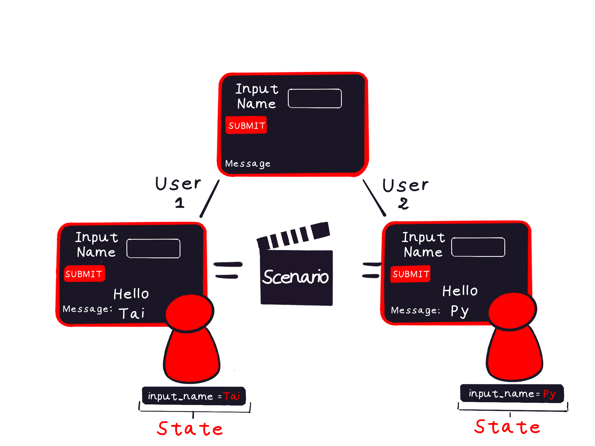

Dive into Taipy with this beginner-friendly guide. Learn to install, configure, and create your
first application with ease.

{width=50% : .tp-image-border }


# Installation with pip

1. **Prerequisites**: Ensure you have Python (**version between 3.8 and 3.12**) and
    [pip](https://pip.pypa.io)installed.

2. **Installation Command**: Run the following in your terminal or command prompt:
    ``` console
    pip install taipy
    ```

For alternative installation methods or if you're lacking Python or pip, refer to the
[installation page](../installation/index.md).

# Your First Taipy Scenario

A Taipy *Scenario* models pipeline executions. Think of it as an execution graph where tasks or
functions collaborate and exchange data. You have full control over how complex your scenario
can be.

Let's craft a basic "Hello World" scenario:

{width=50% : .tp-image-border }

The graph involves:

- An input data node named *input_name*.

- A task, referring to the function *build_message()*, that processes the *input_name* data node
    and outputs a *message* data node.

1. **Configuration**: Set up the execution graph with the following Python code:

    ```python linenums="1"
    from taipy import Config


    def build_message(name: str):
        return f"Hello {name}!"


    input_name_data_node_cfg = Config.configure_data_node(id="input_name")
    message_data_node_cfg = Config.configure_data_node(id="message")
    build_msg_task_cfg = Config.configure_task("build_msg", build_message, input_name_data_node_cfg, message_data_node_cfg)
    scenario_cfg = Config.configure_scenario("scenario", task_configs=[build_msg_task_cfg])
    ```

    - Lines 4-5 define the function that the task will use during execution.
    - Lines 8-9 configure the data nodes, *input_name* and *message*.
    - Line 10 configures a task called *build_msg* associated with the *build_message()*
      function, specifying the input and output data nodes.
    - Finally, line 11 configures the execution graph of the scenario providing
      the previously configured task.

2. **Core Service Initialization**: The Core service processes the configuration of the previous
    step to set up the scenario management feature.

    ```python linenums="1"
    from taipy import Core

    if __name__ == "__main__":
        Core().run()
    ```

3. **Scenario & Data Management**: With the Core service up and running, you can create
    and manage scenarios, submit task graphs for execution, and access data nodes:
    ```python linenums="1"
    import taipy as tp

    hello_scenario = tp.create_scenario(scenario_cfg)
    hello_scenario.input_name.write("Taipy")
    hello_scenario.submit()
    print(hello_scenario.message.read())
    ```

    - In line 3, method `tp.create_scenario()` instantiates the new scenario name
        *hello_scenario* from the scenario configuration built before.
    - Line 4, sets the input data node *input_name* of *hello_scenario* with the string value
        "Taipy" using the `write()` method.
    - Line 5 submits the *hello_scenario* for execution, which triggers the creation and
        execution of a job. This job reads the input data node, passes the value to the
        *build_message()* function, and writes the result to the output data node.
    - Line 6 reads and prints the output data node *message* written by the execution of the
        scenario *hello_scenario*.

4. **Run the application**:

    With the Taipy CLI command:

    ``` console
    $ taipy run hello_world_scenario.py
    ```

    Expected Output:
    ``` console
    [2023-02-08 20:19:35,062][Taipy][INFO] job JOB_build_msg_9e5a5c28-6c3e-4b59-831d-fcc8b43f882e is completed.
    Hello Taipy!
    ```

    [Get the scenario code](./hello_world_scenario.py){: .tp-btn target='blank'}

# Build a graphical interface

While we've used Taipy's Python APIs to handle our scenario, it usually works seamlessly with a
graphical interface, also created using Taipy, to provide a more user-friendly experience.
Here's a simple GUI set up for our "Hello World" scenario:

!!! example "GUI creation"

    === "Markdown"

        Taipy pages can be defined in multiple ways: Markdown, Html or Python. *page* is the Markdown representation of the page.

        ```python linenums="1"
        import taipy as tp

        # Previous configuration of scenario
        ...

        page = """
        Name: <|{input_name}|input|>
        <|submit|button|on_action=submit_scenario|>

        Message: <|{message}|text|>
        """

        input_name = "Taipy"
        message = None


        def submit_scenario(state):
            state.scenario.input_name.write(state.input_name)
            state.scenario.submit(wait=True)
            state.message = scenario.message.read()


        if __name__ == "__main__":
            tp.Core().run()
            scenario = tp.create_scenario(scenario_cfg)
            tp.Gui(page).run()
        ```

        [Get the whole code](./hello_world_md.py){: .tp-btn target='blank'}

        Now, let’s explain the key elements of this code:

        ```python
        import taipy as tp


        page = """
        Name: <|{input_name}|input|>
        <|submit|button|on_action=submit_scenario|>
        Message: <|{message}|text|>
        """
        ```

    === "Python"

        Taipy pages can be defined in multiple ways: Markdown, Html or Python. *page* is built through
        the Page Builder API.

        ```python linenums="1"
        import taipy as tp
        import taipy.gui.builder as tgb

        # Previous configuration of scenario
        ...

        with tgb.Page() as page:
            tgb.text("Name:")
            tgb.input("{input_name}")
            tgb.button("Submit", on_action=submit_scenario)
            tgb.text("Message {message}")


        input_name = "Taipy"
        message = None


        def submit_scenario(state):
            state.scenario.input_name.write(state.input_name)
            state.scenario.submit(wait=True)
            state.message = scenario.message.read()


        if __name__ == "__main__":
            tp.Core().run()
            scenario = tp.create_scenario(scenario_cfg)
            tp.Gui(page).run()
        ```

        [Get the whole code](./hello_world_tgb.py){: .tp-btn target='blank'}

        Now, let’s explain the key elements of this code:

        ```python
        import taipy as tp


        with tgb.Page() as page:
            tgb.text("Name:")
            tgb.input("{input_name}")
            tgb.button("Submit", on_action=submit_scenario)
            tgb.text("Message {message}")
        ```


**Visual elements**

Taipy offers various visual elements that can interact with your Python variables and
environment. It allows you to display variables, modify them, and interact with the application.

Here is a generic example of one: `<|{variable}|visual_element_type|...|>` with Markdown or
`tgb.visual_element_type("{variable}", ...)` with the Python API. *variable* is
the main property of the visual element and is usually what is displayed or modified through the
visual element.

In our initial example:

- *input_name* is bound to an input and text field, allowing the user’s input to be directly
    stored in the *input_name* variable.

- *message* is connected to a text field, allowing you to display changing content to the user.

## Interactivity Through Actions

Actions, like `on_action=submit_scenario`, allow visual elements like buttons to trigger
specific functions.

```python
def submit_scenario(state):
    scenario.input_name.write(state.input_name)
    scenario.submit()
    state.message = scenario.message.read()
```

Every callback, including *submit_scenario()*, receives a `State^` object as its first parameter.
This state represents a user's connection and is used to read and set variables while
the user is interacting with the application. It makes it possible for Taipy to handle multiple
users simultaneously.

While *scenario* is available to everyone, *state.input_name* and
*state.input* are specific to the user who interacts with them. This design ensures that each
user's actions are separate and efficiently controlled, while variables like *scenario* are
global variables.

{width=70% : .tp-image-border }

In the *submit_scenario()* function, the *input_name* entered by the user on the interface is
saved to the scenario. After submission, the outcome is retrieved and stored in the *message*
variable, which is then shown on the user interface.

```python
if __name__ == "__main__":
    tp.Core().run()
    scenario = tp.create_scenario(scenario_cfg)
    tp.Gui(page).run()
```

The main part of the application starts by setting up the Core service, generating a scenario,
and starting the GUI, which makes the interface active and functional.

{width=50% : .tp-image-border }

---

For more realistic and advanced use cases, check out our
[Knowledge Base](../knowledge_base/index.md), or [Manuals](../manuals/index.md) pages.
