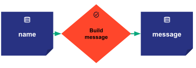

---
hide:
  - navigation
---

# Getting Started with Taipy

Dive into Taipy with this beginner-friendly guide. Learn to install, configure, and deploy your 
first application with ease.

## Installation with pip

1. **Prerequisites**: Ensure you have Python (version 3.8 or higher) and 
    [pip](https://pip.pypa.io)installed.

2. **Installation Command**: Run the following in your terminal or command prompt:
    ``` console
    $ pip install taipy
    ```

!!! info "Other installation options"

    For alternative installation methods or if you're lacking Python or pip, refer to the 
    [installation page](../installation/index.md).

## Your First Taipy Scenario

A Taipy *Scenario* models pipeline executions. Think of it as an execution graph where tasks or 
functions collaborate and exchange data. You have full control over how complex your scenario 
can be.

Let's craft a basic "Hello World" scenario:

{width=50%}

The graph involves:

- An input data node named *name*.

- A task, *build_message*, that processes the *name* data node and outputs a *message* data node.

### Setting It Up

1. **Configuration**: Set up the execution graph with the following Python code:

    ```python linenums="1"
    from taipy import Config
    
    
    def build_message(name: str):
        return f"Hello {name}!"
    
    
    name_data_node_cfg = Config.configure_data_node(id="name")
    message_data_node_cfg = Config.configure_data_node(id="message")
    build_msg_task_cfg = Config.configure_task("build_msg", build_message, name_data_node_cfg, message_data_node_cfg)
    scenario_cfg = Config.configure_scenario("scenario", task_configs=[build_msg_task_cfg])
    ```

    - Lines 4-5 define the function that the task will use during execution.
    - Lines 8-9 configure the data nodes, *name* and *message*.
    - Line 10 configures a task called *build_msg* associated with the *build_message()*
      function, specifying the input and output data nodes.
    - Finally, line 11 configures the execution graph of the scenario providing 
      the previously configured task.

2. **Core Service Initialization**: The Core service processes the configuration of the previous 
    step to set up the scenario management feature.

    ```python linenums="1"
    from taipy import Core
    
    if __name__ == "__main__":
        Core().run()
    ```

3. **Scenario & Data Management**: With the Core service up and running, you can create
    and manage scenarios, submit task graphs for execution, and access data nodes:
    ```python linenums="1"
    import taipy as tp
    
    hello_scenario = tp.create_scenario(scenario_cfg)
    hello_scenario.name.write("Taipy")
    hello_scenario.submit()
    print(hello_scenario.message.read())
    ```
   
    - In line 3, method `tp.create_scenario()` instantiates the new scenario name 
        *hello_scenario* from the scenario configuration built before.
    - Line 4, sets the input data node *name* of *hello_scenario* with the string value 
        "Taipy" using the `write()` method.
    - Line 5 submits the *hello_scenario* for execution, which triggers the creation and 
        execution of a job. This job reads the input data node, passes the value to the 
        *build_message()* function, and writes the result to the output data node.
    - Line 6 reads and prints the output data node *message* written by the execution of the 
        scenario *hello_scenario*.

4. **Run the application**: For your convenience, you can get the complete code here:
    <a href="./hello_world_scenario.py" download>`hello_world_scenario.py`</a>

    Run the application with the Taipy CLI command:

    ``` console
    $ taipy run hello_world_scenario.py
    ```

    Expected Output:
    ``` console
    [2023-02-08 20:19:35,062][Taipy][INFO] job JOB_build_msg_9e5a5c28-6c3e-4b59-831d-fcc8b43f882e is completed.
    Hello Taipy!
    ```

## Build a graphical interface

While we've used Taipy's Python APIs to handle our scenario, it usually works seamlessly with a 
graphical interface, also created using Taipy, to provide a more user-friendly experience. 
Here's a simple GUI set up for our "Hello World" scenario:

```python linenums="1"
from taipy import Gui


page = """
Name: <|{name}|input|>
<|submit|button|on_action=submit_scenario|>

Message: <|{message}|text|>
"""

name = "Taipy"
message = None


def submit_scenario(state):
    state.scenario.name.write(state.name)
    state.scenario.submit(wait=True)
    state.message = scenario.message.read()


if __name__ == "__main__":
    Core().run()
    scenario = tp.create_scenario(scenario_cfg)
    Gui(page).run()
```

To get the complete example, including the user interface code, download it here:
<a href="./hello_world.py" download>`hello_world.py`</a>

Now, let’s explain the key elements of this code:

```python
from taipy import Gui
import taipy as tp

page = """
Name: <|{name}|input|>
<|submit|button|on_action=submit_scenario|>
Message: <|{message}|text|>
"""
```

- The `page` variable is a Markdown representation of the user interface. It uses standard Markdown syntax as well as visual elements.

- A Taipy visual element is of the form of `<|{variable}|visual_element_type|>`.Taipy has a lot of visual elements to play with and they often interact with a Python variable. For instance, `{name}` and `{message}` are bound to an input and text field, allowing the user’s input to be directly stored in the `name` variable.

- The `name` and `message` are examples of bound variables. They are directly linked to visual elements in the UI, facilitating real-time interaction between the user and the application.


- The `message` variable, similarly, is bound to a text field, making it possible to display dynamic content to the user.

#### Interactivity Through Actions

- Actions, like `on_action=submit_scenario`, allow visual elements like buttons to trigger specific functions, enhancing the interactivity of the application.

```python
def submit_scenario(state):
    scenario.name.write(state.name)
    scenario.submit()
    state.message = scenario.message.read()
```

- In the `submit_scenario` function, the `name` from the state is written to the scenario, and upon submission, the result is read into the `message` variable, which is then reflected in the UI thanks to the binding.

Every callback, including `submit_scenario`, utilizes `state` as the primary parameter for multi-user functionality. The `state` represents a user connection and is used to read and assign runtime variables for a specific user.  While the scenario remains globally accessible, `state.name` and `state.input` are specific to the user defining it. This architecture ensures that individual user interactions are isolated and managed efficiently, while variables like `scenario` are accessed globally.

```python
if __name__ == "__main__":
    tp.Core().run()
    scenario = tp.create_scenario(scenario_cfg)
    Gui(page).run()
```

- The application's main execution block initializes the core services, creates a scenario, and launches the GUI, bringing the interactive interface to life.

{width=50% style="margin:auto;display:block;border: 4px solid rgb(210,210,210);border-radius:7px" }

### In Conclusion

Taipy lies in its ease of use and the direct binding of application variables to visual elements. This binding ensures that the interface is always in sync with the underlying application state, providing a real-time, interactive experience for the user.

---

For more realistic and advanced use cases, check out our 
[Knowledge Base](../knowledge_base/index.md), or [Manuals](../manuals/index.md) pages.