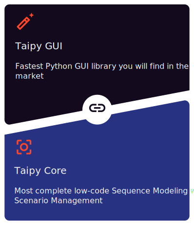

---
hide:
  - navigation
---

# Home

Taipy is an innovative **low-code** package to create complete applications.
It is composed of two main independent components:
**Taipy GUI** and **Taipy Core**.

Taipy requires *Python 3.8* or newer.

  

The **Graphical User Interface** of Taipy allows anyone with basic knowledge of Python to create a beautiful and
interactive interface. It is a simple and intuitive way to create a GUI. No need to know how to design web pages
with CSS or HTML. Taipy uses an augmented syntax of Markdown to create your desired Web page.

The **Scenario Management** component of Taipy is a powerful tool to manage business problems and pipelines. Using
**Taipy Core** is straightforward. Among other features, you are able to:

- Keep track of your KPI, data, scenarios, pipelines, etc.
- Have smart scheduling
- Simplify industrialization for Data Visualization, Machine-Learning, Optimization, etc.

You can use the GUI component without the Scenario Management and vice-versa. However, as you will see, they are
incredibly efficient when combined.

Other packages offer additional functionality, such as a **REST API** that allows for deploying
Taipy application on Web architectures.

The documentation for Taipy is divided in three main sections:

- [:material-arrow-right: **'Getting Started'**](getting_started/index.md)
  provides a step-by-step opening to Taipy. Taipy features are leveraged as the application
  becomes more and more complex.
- [:material-arrow-right: **'User Manual'**](manuals/about.md)
  describes what the product concepts are, and how you can use them.
- [:material-arrow-right: **'Reference Manual'**](manuals/reference)
  gathers all the Python APIs that Taipy exposes.
