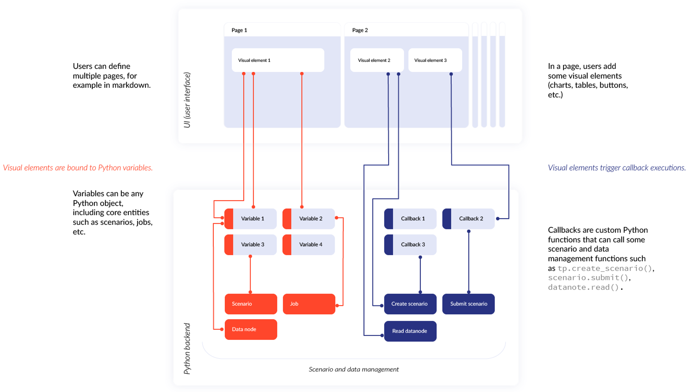
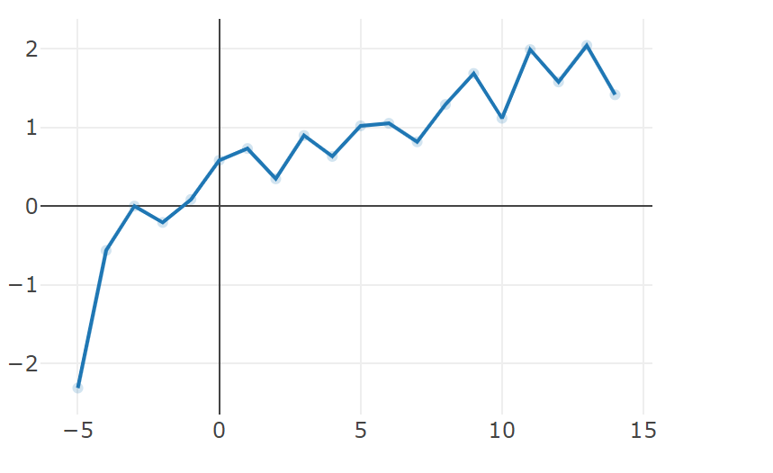
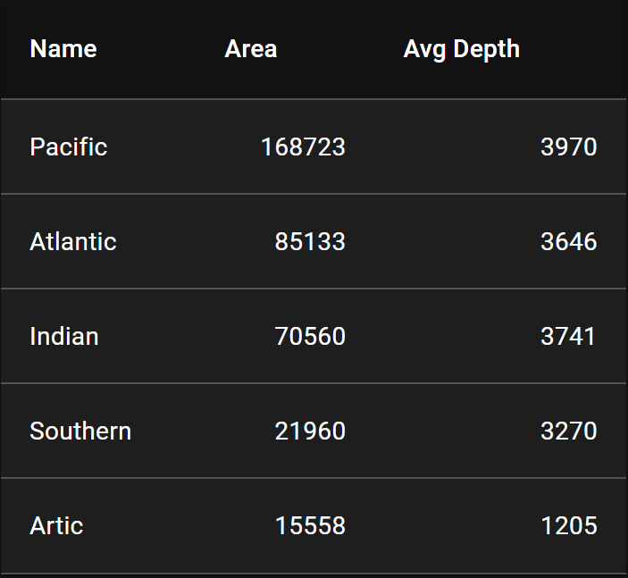

---
hide:
  - navigation
---

# Welcome to Taipy

Taipy, an open-source Python library, is a potent asset for shaping your applications' front-end and back-end facets. Notably, it delivers an uncomplicated syntax designed to expedite the creation of interactive, multi-page dashboards enriched with augmented Markdown. This web application builder empowers the generation of dynamic interfaces without requiring proficiency in web development.

Simultaneously, Taipy is tailor-made to forge influential and tailored data-driven back-end applications. It offers automatic components that facilitate the organization and management of data access and flow orchestration. This capability, aptly termed Scenario Management, necessitates minimal Python configuration.

Employing Taipy Studio, a graphical configuration editor, configuring your scenarios (data flows) has never been more streamlined. This resource provides a user-centric interface that enables seamless drag-and-drop interactions, layout customization, and effortless feature integration.

For data scientists and developers alike, Taipy acts as a catalyst for successful Python endeavors. Whether your aim is a straightforward pilot or a comprehensive application within IDEs or Notebooks, Taipy equips you with all indispensable functionalities. Its architecture is meticulously crafted to truncate both development and deployment timelines significantly.

Taipy is a complete tool that empowers individuals and enterprises to develop applications without extensive coding expertise. A primary advantage of Taipy lies in its ability to expedite development across both front-end and back-end domains, encompassing everything from initial prototypes to fully scalable, production-ready applications.

**Front-End Functionalities:**

- Creating a user interface requires a solid grasp of Python programming fundamentals.
- Taipy is purposefully engineered to prioritize user-friendliness, resulting in a straightforward and intuitive process of user interface creation.
- No prior knowledge of web design is necessary, and it eradicates the need for any prerequisites related to CSS and HTML.
- Leveraging augmented Markdown syntax, Taipy GUI aids users in seamlessly generating their desired web pages.

**Back-End Functionalities:**

- Taipy provides extensive support for establishing resilient pipelines capable of managing diverse scenarios.
- The process of modeling Directed Acyclic Graphs (DAGs) is simplified through Taipy's functionality.
- Enhancing the overall performance of Taipy applications, the data caching feature is integrated.
- Facilitating a registry of pipeline executions.
- Enabling pipeline versioning.
- Taipy equips users with the ability to monitor and assess the performance of their applications using the KPI tracking tool.
- Furthermore, Taipy offers a built-in visualization feature for pipelines and their associated data.

## Overview of the Taipy Flow

The subsequent schematic diagram illustrates the complete sequence encompassing all stages within the Taipy flow.

  

    <figure align="center">
      
    </figure>
  

## Quick Access

These frequently visited topics have been highlighted for your quick reference.

  

    <a class="tp-content-card" href="getting_started/">
      <header class="tp-content-card-header">
        
        
        <h3>Getting Started</h3>
      </header>
      

        This guide comprehensively outlines key steps and concepts in Python web application development, catering to both novices and proficient Python programmers venturing into Taipy for the first time.
      

      Read more
    </a>
  

  

    <a class="tp-content-card" href="manuals/gui/">
      <header class="tp-content-card-header">
        
        
        <h3>User interface</h3>
      </header>
      

        Taipy GUI provides controls and other elements to create powerful web apps in minutes. Taipy GUI empowers developers with a robust tool for visually designing user interfaces by organizing user interface block elements and utilizing style kits.
      

      Read more
    </a>
  

  

    <a class="tp-content-card" href="manuals/gui/viselements/chart/">
      <header class="tp-content-card-header">
        
        
        <h3>Charts</h3>
      </header>
      

        An essential facet of Taipy GUI, offering nearly boundless potential, Plotly is a graphing library that provides an extensive array of customizable visualizations for datasets, with these components accessible through Taipy's chart control, tightly linked to the underlying implementation.
      

      Read more
    </a>
  

  

    <a class="tp-content-card" href="manuals/core/concepts/scenario/">
      <header class="tp-content-card-header">
        
        
        <h3>Scenario</h3>
      </header>
      

        We introduce the essential notion of a Taipy Scenario, representing a singular business problem instance tackled using uniform data and parameter sets, allowing users to instantiate diverse versions of a problem with varying assumptions, an invaluable asset for decision-making in contexts demanding impact and what-if analysis.
      

      Read more
    </a>
  
  

## Build your UI with dozens visual elements

Taipy offers components within open-source Python libraries that are instrumental for web application development.
Below, you'll find a succinct elucidation of each term, contextualized within the framework of the Taipy web application builder.

<ul class="tp-pills-list">
  <li>
    <a class="tp-pill" href="manuals/gui/viselements/chart/">
      Chart
      

        
        
A chart visually depicts data through graphs, charts, or plots.

      

    </a>
  </li>
  <li>
    <a class="tp-pill" href="manuals/gui/viselements/table/">
      Table
      

        
        
A table presents data in rows and columns, often used in web applications for structured data display and interaction.

      

    </a>
  </li> 
  <li>
    <a class="tp-pill" href="manuals/gui/viselements/button/">
      Button
      

        
        
You can employ this class name to target the buttons on your page and apply styling.

      

    </a>
  </li>
  <li>
    <a class="tp-pill" href="manuals/gui/viselements/input/">
      Input
      

        
        
A control that displays some text that can potentially be edited.

      

    </a>
  </li>
  <li>
    <a class="tp-pill" href="manuals/gui/viselements/slider/">
      Slider
      

        
        
Displays and allows the user to set a value within a range.

      

    </a>
  </li>
  <li>
    <a class="tp-pill" href="manuals/gui/viselements/controls/">
      …
      

        
Browse the complete list of visual elements.

      

    </a>
  </li>
</ul>

## Main Taipy functionalities

<ul class="tp-pills-list">
  <li>
    <a class="tp-pill" href="manuals/gui/viselements/blocks/">
      Structure Pages
    </a>
  </li>
  <li>
    <a class="tp-pill" href="manuals/core/config/scenario-config/#from-task-configs">
      Configure Scenario
    </a>
  </li>
  <li>
    <a class="tp-pill" href="manuals/core/entities/scenario-creation/">
      Instantiate Scenario
    </a>
  </li>
  <li>
    <a class="tp-pill" href="manuals/core/entities/orchestrating-and-job-execution/#submit-a-scenario-pipeline-or-task/">
      Submit Scenario
    </a>
  </li>
  <li>
    <a class="tp-pill" href="manuals/core/versioning/">
      Manage versions
    </a>
  </li>
  <li>
    <a class="tp-pill" href="manuals/cli/">
      Taipy command-line interface (CLI)
    </a>
  </li>
  <li>
    <a class="tp-pill" href="manuals/rest/">
      Expose Taipy's REST APIs
    </a>
  </li>
    <li>
    <a class="tp-pill" href="manuals/about/">
      …
      

        
Browse the complete list of features.

      

    </a>
  </li>
</ul>
