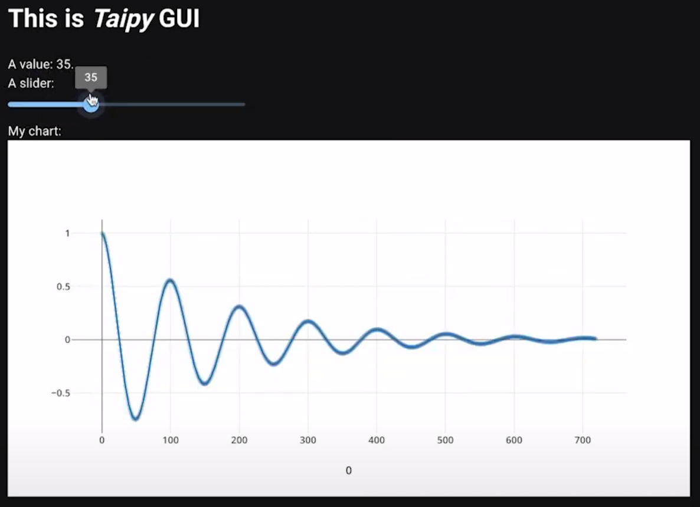
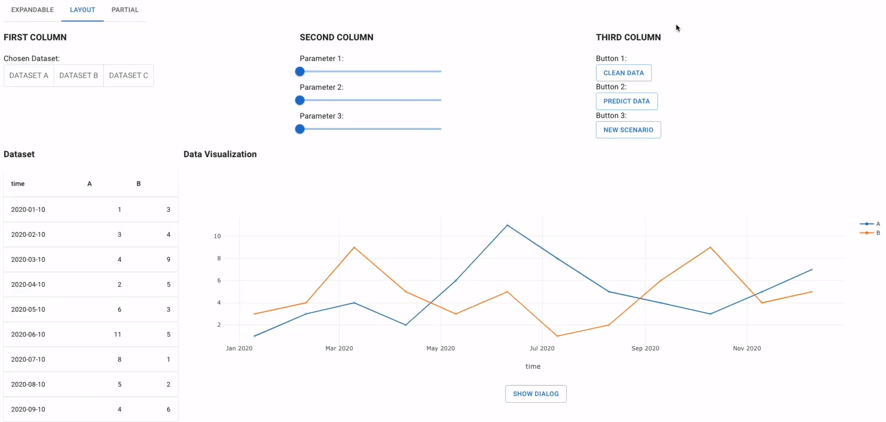

---
hide:
  - navigation
---

# Welcome to Taipy

Taipy, an open-source Python library, is a potent asset for shaping your applications' front-end and back-end facets. Notably, it delivers an uncomplicated syntax designed to expedite the creation of interactive, multi-page dashboards enriched with augmented Markdown. This web application builder empowers the generation of dynamic interfaces without requiring proficiency in web development.

Simultaneously, Taipy is tailor-made to forge influential and tailored data-driven back-end applications. It offers automatic components that facilitate the organization and management of data access and flow orchestration. This capability, aptly termed Scenario Management, necessitates minimal Python configuration.

Employing Taipy Studio, a graphical configuration editor, configuring your scenarios (data flows) has never been more streamlined. This resource provides a user-centric interface that enables seamless drag-and-drop interactions, layout customization, and effortless feature integration.

For data scientists and developers alike, Taipy acts as a catalyst for successful Python endeavors. Whether your aim is a straightforward pilot or a comprehensive application within IDEs or Notebooks, Taipy equips you with all indispensable functionalities. Its architecture is meticulously crafted to truncate both development and deployment timelines significantly.

Taipy's web application builder is a robust tool that empowers individuals and enterprises to develop web applications without extensive coding expertise. A primary advantage of Taipy lies in its ability to expedite development across both front-end and back-end domains, encompassing everything from initial prototypes to fully scalable, production-ready applications.

**Taipy Front-End Functionalities:**

- Crafting a user interface is accomplished with a foundational understanding of Python programming.
- Taipy is purposefully engineered to prioritize user-friendliness, resulting in a straightforward and intuitive process of user interface creation.
- No prior knowledge of web design is necessary, and it eradicates the need for any prerequisites related to CSS and HTML.
- Leveraging augmented markdown syntax, Taipy aids users in seamlessly generating their desired web pages.

**Taipy Back-End Functionalities:**

- Taipy provides extensive support for establishing resilient pipelines capable of managing diverse scenarios.
- The process of modeling Directed Acyclic Graphs (DAGs) is simplified through Taipy's functionality.
- Enhancing the overall performance of Taipy applications, the data caching feature is integrated.
- Facilitating a registry of pipeline executions.
- Enabling pipeline versioning.
- Taipy equips users with the ability to monitor and assess the performance of their applications using the KPI tracking tool.
- Furthermore, Taipy offers a built-in visualization feature for pipelines and their associated data.

## Overview of the Taipy Flow

The subsequent schematic diagram illustrates the complete sequence encompassing all stages within the Taipy flow.

  

    <figure align="center">
      
    </figure>
  

## Discover how Taipy functions

Taipy consists of two independent components: **Taipy Core** and **Taipy GUI**. While each can be used independently, they synergize remarkably when combined. 

  

    <article class="tp-content-card">
      <h3>Taipy GUI</h3>
      

       A user-friendly <strong>Graphical User Interface</strong> for crafting interactive interfaces with Python—no CSS or HTML expertise required.
      

    </article>
    <article class="tp-content-card">
      <h3>Taipy Core</h3>
      

        Empowers you with intuitive Directed Acyclic Graph (DAG) modeling, bright job orchestration, potent data caching, scenario-enabled pipelines, and KPI tracking.
      

    </article>
  

  

    <figure align="center">
      
    </figure>
  

Taipy also features other packages, such as a **REST API** for deploying Taipy Core applications as web services.

## Quick Access Taipy Library Components

Taipy offers components within open-source Python libraries that are instrumental for web application development.
Below, you'll find a succinct elucidation of each term, contextualized within the framework of the Taipy web application builder.

<ul class="tp-pills-list">
  <li>
    <a class="tp-pill" href="manuals/gui/viselements/button/">
      Button
      

        
        
You can employ this class name to target the buttons on your page and apply styling.

      

    </a>
  </li>
  <li>
    <a class="tp-pill" href="manuals/gui/viselements/chart/">
      Chart
      

        
        
A chart visually depicts data through graphs, charts, or plots.

      

    </a>
  </li>
  <li>
    <a class="tp-pill" href="manuals/gui/viselements/date/">
      Date
      

        
        
Date input pertains to a web app's field for selecting or inputting dates, often through a user-friendly calendar picker.

      

    </a>
  </li>
  <li>
    <a class="tp-pill" href="manuals/gui/pages/#dialogs">
      Dialogs
      

        
        
Dialogs are pop-up windows overlaying main content for user input or messages, prompting confirmation, alerts, or extra information, facilitated by Taipy's dialog components.

      

    </a>
  </li>
  <li>
    <a class="tp-pill" href="manuals/studio/config/graphview/">
      Graphs
      

        
        
Within a web application builder, a graph visualizes data via nodes and edges, illustrating relationships between data entities, with the Taipy Python library facilitating graph construction and analysis.

      

    </a>
  </li>
  <li>
    <a class="tp-pill" href="manuals/gui/viselements/image/">
      Image
      

        
        
Images are visual content showcased within a web application, with the Taipy Python library offering image processing, manipulation, and rendering capabilities.

      

    </a>
  </li>
  <li>
    <a class="tp-pill" href="getting_started/getting-started-gui/step_06/ReadMe/">
      Page layout
      

        
        
Layout dictates the organization of components (e.g., charts, inputs, tables) in a web app's interface, defining element structure and positioning on a web page.

      

    </a>
  </li>
  <li>
    <a class="tp-pill" href="manuals/gui/viselements/pane/">
      Pane
      

        
        
Panes within a web app builder indicate independently scrollable or resizable interface sections, aiding content organization and flexibility, supported by Taipy's pane-based layouts.

      

    </a>
  </li>
  <li>
    <a class="tp-pill" href="manuals/gui/pages/#partials">
      Partials
      

        
        
Partials are reusable components or templates, termed partial views, within web app frameworks, enhancing code modularity by embedding them in other templates to recycle shared elements across diverse views or pages.

      

    </a>
  </li>  
  <li>
    <a class="tp-pill" href="manuals/gui/viselements/indicator/">
      Indicator
      

        
        
Displays a label on a scale ranging from red to green at a specific position.

      

    </a>
  </li>
  <li>
    <a class="tp-pill" href="manuals/gui/viselements/input/">
      Input
      

        
        
A control that displays some text that can potentially be edited.

      

    </a>
  </li>
  <li>
    <a class="tp-pill" href="manuals/gui/viselements/menu/">
      Menu
      

        
        
Shows a left-side menu.

      

    </a>
  </li>
  <li>
    <a class="tp-pill" href="manuals/gui/viselements/slider/">
      Slider
      

        
        
Displays and allows the user to set a value within a range.

      

    </a>
  </li>
  <li>
    <a class="tp-pill" href="manuals/gui/viselements/table/">
      Table
      

        
        
A table presents data in rows and columns, often used in web applications for structured data display and interaction.

      

    </a>
  </li>
  <li>
    <a class="tp-pill" href="manuals/gui/binding/">
      Binding variables
      

        
        
Variable bindings establish connections between variables and assigned values, binding user input or component data to specific variables in a web app builder, enabling input capture, processing, and dynamic data updates based on user interactions.

      

    </a>
  </li>  
  <li>
    <a class="tp-pill" href="manuals/gui/viselements/controls/">
      …
      

        
Browse the complete list of visual elements.

      

    </a>
  </li>
</ul>

## Explore Core functionalities

<ul class="tp-pills-list">
  <li>
    <a class="tp-pill" href="manuals/core/config/data-node-config/#storage-type">
      Configure Data node
    </a>
  </li>
  <li>
    <a class="tp-pill" href="manuals/core/config/task-config/">
      Configure Task
    </a>
  </li>
  <li>
    <a class="tp-pill" href="manuals/core/config/scenario-config/#from-task-configs">
      Configure Scenario
    </a>
  </li>
  <li>
    <a class="tp-pill" href="manuals/core/entities/scenario-creation/">
      Instantiate Scenario
    </a>
  </li>
  <li>
    <a class="tp-pill" href="manuals/core/entities/orchestrating-and-job-execution/#submit-a-scenario-pipeline-or-task/">
      Submit Scenario
    </a>
  </li>
  <li>
    <a class="tp-pill" href="manuals/core/versioning/">
      Manage versions
    </a>
  </li>
  <li>
    <a class="tp-pill" href="manuals/core/">
      …
      

        
Browse the Core user manual.

      

    </a>
  </li>
</ul>
