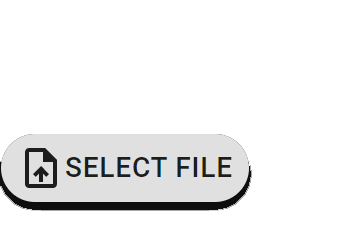

---
hide:
  - navigation
---

# Welcome to Taipy Documentation!

Taipy is an innovative **low-code** package to create complete applications.
This documentation is divided in three main sections:

- [**"Getting Started"**](getting_started/index.md) provides a step-by-step opening to Taipy. Taipy features are leveraged as the application becomes more and more complex.
- [**"User Manual"**](manuals/about.md) describes what the product concepts are, and how you can use them.
- [**"Reference Manual"**](manuals/reference) gathers all the Python APIs that Taipy exposes.

## Quick access

These topics are the most visited ones, we thought you’d like to have a glance on them!

  

    <a class="tp-content-card" href="#">
      
      
      <h3>Getting started</h3>
      

        This tour shows you how to create an entire application using the two components of Taipy
      

      Read more
    </a>
  

  

    <a class="tp-content-card" href="#">
      
      
      <h3>Reference Manual</h3>
      

        Description of Taipy’s API.
      

      Read more
    </a>
  

  

    <a class="tp-content-card" href="#">
      
      
      <h3>Controls</h3>
      

        Controls are UI objects for data vizualisation/interaction.
      

      Read more
    </a>
  

  

    <a class="tp-content-card" href="#">
      
      
      <h3>Taipy’s user interface</h3>
      

        The Taipy GUI library provides Python classes to create powerful Web apps in minutes.
      

      Read more
    </a>
  

## Browse dozens of controls to build your UI!

<ul class="tp-pills-list">
  <li>
    <a class="tp-pill" href="#">
      File selector
      

        
        
Allows uploading a file content.

      

    </a>
  </li>
</ul>

## How does it work?

Taipy is composed of two main independent components: **Taipy Core** and **Taipy GUI**. You can use the GUI component without the Scenario Management and vice-versa. However, as you will see, they are incredibly efficient when combined.

  

    <article class="tp-content-card">
      <h3>Taipy GUI</h3>
      

        The <strong>Graphical User Interface</strong> of Taipy allows anyone with basic knowledge of Python to create a beautiful and
        interactive interface. It is a simple and intuitive way to create a GUI. No need to know how to design web pages
        with CSS or HTML. Taipy uses an augmented syntax of Markdown to create your desired Web page.
      

    </article>
    <article class="tp-content-card">
      <h3>Taipy Core</h3>      
      
The <strong>Scenario Management</strong> component of Taipy is a powerful tool to manage business problems and pipelines. Using <strong>Taipy Core</strong> is straightforward. Among other features, you are able to:

      <ul>
        <li>Keep track of your KPI, data, scenarios, pipelines, etc.</li>
        <li>Have smart scheduling</li>
        <li>Simplify industrialization for Data Visualization, Machine-Learning, Optimization, etc.</li>
      </ul>
      
You can use the GUI component without the Scenario Management and vice-versa. However, as you will see, they are incredibly efficient when combined.

    </article>
  

  

    <figure align="center">
      
    </figure>
  

Other packages offer additional functionality, such as a **REST API** that allows for deploying Taipy application on Web architectures.

Taipy requires *Python 3.8* or newer.