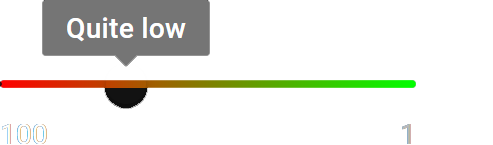
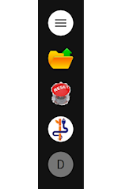

---
hide:
  - navigation
---

# Welcome to Taipy Documentation!

Taipy is an innovative **low-code** package to create complete applications.

This documentation is divided in three main sections:

- [**"Getting Started"**](getting_started/index.md) provides a step-by-step introduction to Taipy. Taipy features are leveraged as the application becomes more and more complex.
- [**"User Manual"**](manuals/about.md) describes the main concepts for Taipy GUI, Taipy Core and Taipy REST. It also  provides information on the deployment of your Taipy app.
- [**"Reference Manual"**](manuals/reference) documents all the Taipy APIs.

Taipy requires *Python 3.8* or newer.

## Quick access

These topics are the most visited ones, we thought you’d like to have a glance at them!

  

    <a class="tp-content-card" href="getting_started/">
      
      
      <h3>Getting started</h3>
      

        This tour shows you how to create an entire application using the two main components of Taipy.
      

      Read more
    </a>
  

  

    <a class="tp-content-card" href="manuals/about/">
      
      
      <h3>Reference Manual</h3>
      

        Get your hands on using Taipy, guided by examples.
      

      Read more
    </a>
  

  

    <a class="tp-content-card" href="manuals/gui/">
      
      
      <h3>User interface</h3>
      

        Taipy GUI provides controls and other elements to create powerful Web apps in minutes.
      

      Read more
    </a>
  

## Browse dozens of controls to build your UI!

<ul class="tp-pills-list">
  <li>
    <a class="tp-pill" href="manuals/gui/viselements/button/">
      Button
      

        
        
A control that can trigger a function when pressed.

      

    </a>
  </li>
  <li>
    <a class="tp-pill" href="manuals/gui/viselements/chart/">
      Chart
      

        
        
Displays data sets in a chart or a group of charts.

      

    </a>
  </li>
  <li>
    <a class="tp-pill" href="manuals/gui/viselements/date/">
      Date
      

        
        
A control that can display and specify a formatted date, with or without time.

      

    </a>
  </li>
  <li>
    <a class="tp-pill" href="manuals/gui/viselements/image/">
      Image
      

        
        
A control that can display an image.

      

    </a>
  </li>
  <li>
    <a class="tp-pill" href="manuals/gui/viselements/indicator/">
      Indicator
      

        
        
Displays a label on a red to green scale at a specific position.

      

    </a>
  </li>
  <li>
    <a class="tp-pill" href="manuals/gui/viselements/input/">
      Input
      

        
        
A control that displays some text that can potentially be edited.

      

    </a>
  </li>
  <li>
    <a class="tp-pill" href="manuals/gui/viselements/menu/">
      Menu
      

        
        
Shows a left-side menu.

      

    </a>
  </li>
  <li>
    <a class="tp-pill" href="manuals/gui/viselements/slider/">
      Slider
      

        
        
Displays and allows the user to set a value within a range.

      

    </a>
  </li>
  <li>
    <a class="tp-pill" href="manuals/gui/viselements/table/">
      Table
      

        
        
Displays a data set as tabular data.

      

    </a>
  </li>
  <li>
    <a class="tp-pill" href="manuals/gui/controls/">
      …
      

        
Browse the complete list of visual elements.

      

    </a>
  </li>
</ul>

## How does it work?

Taipy is composed of two main independent components: **Taipy Core** and **Taipy GUI**. You can use either component independently. However, as you will see, they are incredibly efficient when combined.

  

    <article class="tp-content-card">
      <h3>Taipy GUI</h3>
      

        The <strong>Graphical User Interface</strong> of Taipy allows anyone with basic knowledge of Python to create a beautiful and interactive interface. It is a simple and intuitive way to create a GUI. No need to know how to design web pages with CSS or HTML. Taipy uses an augmented Markdown syntax to create your desired Web page.
      

    </article>
    <article class="tp-content-card">
      <h3>Taipy Core</h3>      
      

        A simple yet powerful <strong>pipeline orchestration</strong> package. 
        Some of the key features:
      

      <ul>
        <li>Intuitive DAG modeling</li>
        <li>Smart scheduling</li>
        <li>Powerful data caching</li>
        <li>Scenario enabled pipelines</li>
        <li>KPI Tracking</li>
      </ul>
    </article>
  

  

    <figure align="center">
      
    </figure>
  

Other packages offer additional functionality, such as a **REST API** that allows for deploying Taipy Core applications as a Web service.
