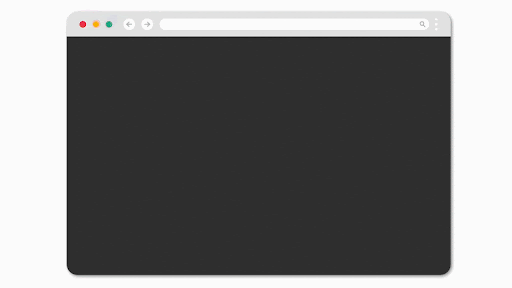

# Welcome to Taipy Documentation!

Taipy is a Python open-source library designed for easy development of data-driven web applications.

Taipy covers both front-end and back-end. It has been designed to expedite application development,
from initial prototypes to production-ready applications.

  

    <a class="tp-content-card" href="tutorials/articles/understanding_gui/">
      <header class="tp-content-card-header">
        
        
        <h3>User interface creation</h3>
      </header>
      
      

        Design user interfaces effortlessly. You don't need prior web design or web
        development knowledge to create interactive multi-page applications. You can craft dynamic
        web pages with ease.
      

      Read more
    </a>
  

  

    <a class="tp-content-card" href="tutorials/articles/scenario_management_overview/">
      <header class="tp-content-card-header">
        
        
        <h3>Scenario and Data Management</h3>
      </header>
      
      

        Create scenarios for efficient pipeline orchestration, easy data and parameter access, and
        effective monitoring of outputs and KPIs. Taipy speeds up the developer's work and
        empowers end-users to efficiently visualize, execute, and oversee scenarios.
      

      Read more
    </a>
  

# Quick Access

**Build your UI with dozens of visual elements:**

<ul class="tp-pills-list">
  <li>
    <a class="tp-pill" href="refmans/gui/viselements/generic/chart/">
      Chart
      

        
        
A chart visually depicts data through graphs, charts, or plots.

      

    </a>
  </li>
  <li>
    <a class="tp-pill" href="refmans/gui/viselements/generic/table/">
      Table
      

        
        

          A table presents data in rows and columns, often used in web applications for structured
          data display and interaction.
        

      

    </a>
  </li>
  <li>
    <a class="tp-pill" href="refmans/gui/viselements/generic/button/">
      Button
      

        
        
You can employ this class name to target the buttons on your page and apply styling.

      

    </a>
  </li>
  <li>
    <a class="tp-pill" href="refmans/gui/viselements/generic/input/">
      Input
      

        
        
A control that displays some text that can potentially be edited.

      

    </a>
  </li>
  <li>
    <a class="tp-pill" href="refmans/gui/viselements/generic/slider/">
      Slider
      

        
        
Displays and allows the user to set a value within a range.

      

    </a>
  </li>
  <li>
    <a class="tp-pill" href="refmans/gui/viselements/">
      …
      

        
Browse the complete list of visual elements.

      

    </a>
  </li>
</ul>

**Main Taipy functionalities:**

<ul class="tp-pills-list">
  <li>
    <a class="tp-pill" href="refmans/gui/viselements/#block-elements">
      Structure Pages
    </a>
  </li>
  <li>
    <a class="tp-pill" href="userman/scenario_features/data-integration/">
      Data integration
    </a>
  </li>
  <li>
    <a class="tp-pill" href="userman/scenario_features/task-orchestration/">
      Task orchestration
    </a>
  </li>
  <li>
    <a class="tp-pill" href="userman/scenario_features/what-if-analysis/">
      What if analysis
    </a>
  </li>
  <li>
    <a class="tp-pill" href="userman/advanced_features/versioning/">
      Version management
    </a>
  </li>
  <li>
    <a class="tp-pill" href="userman/ecosystem/cli/">
      Taipy command-line interface (CLI)
    </a>
  </li>
  <li>
    <a class="tp-pill" href="userman/scenario_features/rest/">
      Expose Taipy's REST APIs
    </a>
  </li>
    <li>
    <a class="tp-pill" href="userman/">
      …
      

        
Browse the complete list of features.

      

    </a>
  </li>
</ul>
