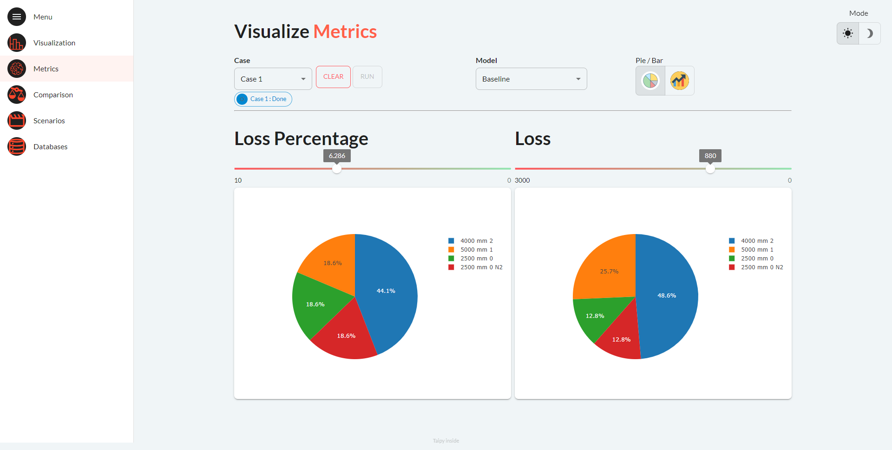
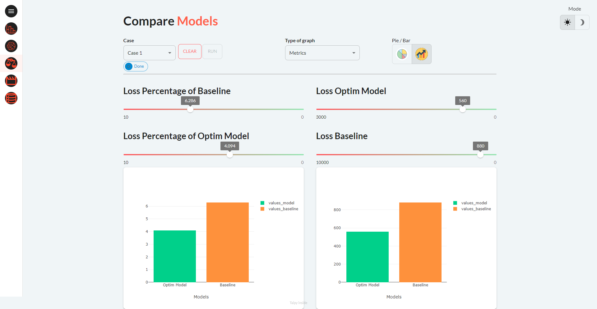

This demo showcases how to optimize
the bar-cutting process for minimal waste.
Bar-cutting optimization minimizes waste by choosing optimal cut sizes in bars.
This visualization is crucial in industries with significant material 
costs or shortages.

[Try it Live](https://bar-cutting.taipy.cloud/Databases)

# Understand the Application
The application comprises five pages accessible via the left panel by 
expanding the menu list.

## Page 1: Bar Visualization

  1. Load the selected dataset Choose from two cases and RUN.
  2. Execute either the Baseline or the Optim algorithms models.
  3. Display results, highlighting loss in blue on a bar chart.
  4. Switch algorithms to compare material waste.

{width=80%}

To access additional information, you can open the Parameters panel 
(Taipy Expandable) to review the input data related to the selected case, 
Stock available and Demand to fulfill.

## Page 2: Visual Metrics
On this page, you'll find metrics for both the Baseline Model and the 
Optim Model presented in two distinct formats: bar charts and pie charts. 
These metrics provide insights into the loss, which can be visualized as 
either a percentage of the total length of the mother bars utilized or as 
the precise loss value measured in millimeters.

{width=80%}

## Page 3: Compare Models
- Compare Baseline and Optim models' performance side by side.

{width=80%}


## Page 4: Compare Cases
Assess the performance of each model across various scenarios. This 
represents one of Taipy's most valuable features.

{width=80%}

## Page 5: Databases
Results are neatly summarized in a table, allowing you to select the case, 
model and table. The results are then accessible for download in CSV format.

{width=80%}


# Disclaimer
Code for this demo is not publicly available yet. [Contact us](https://www.taipy.io/contact-us/) 
for a sample.


```$pip install taipy```
