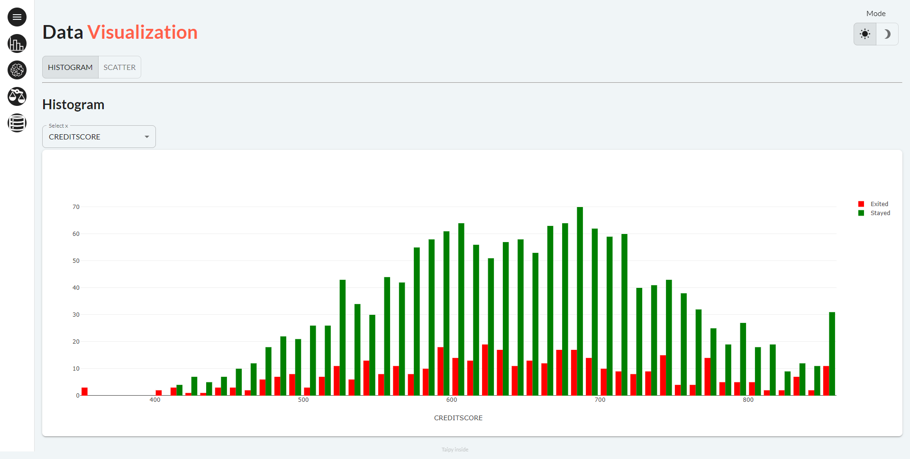
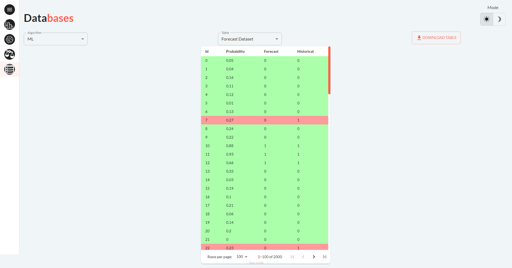

In the fast-paced world of business, retaining customers
is a top priority because keeping current customers is often
more cost-effective than acquiring new ones. By identifying
customers who may leave early and applying retention strategies,
businesses can lower churn rates and boost customer loyalty.

[Try it live](https://churn-classification.taipy.cloud/Data-Visualization){: .tp-btn target='blank' }
[Get it on GitHub](https://github.com/Avaiga/demo-churn-classification){: .tp-btn .tp-btn--accent target='blank' }

# Understanding the Application
The application comprises four pages accessible via the left panel.

## Page 1: Data Visualization

This page allows to conduct an Exploratory Data Analysis (EDA).
You have the option to select among two types of graph (scatter plot or histogram)
and choose the data content you want to explore with the "Select x" selector.

{width=80%}

{width=80%}

## Page 2: Model Manager

Here, users can access the performance results of the selected algorithm. Users can choose:
- Classification algorithm amongst 2 options (a ‘baseline or ‘ML’)
- A chart type to visualize predictions on a validation dataset.

{width=80%}

## Page 3: Model Comparison

This page displays the performance of two models side by side, facilitating easy comparison.

{width=80%}

## Page 4: Databases

Through this page, access to various datasets, including: training dataset,
test dataset, forecast, scoring results, and the Confusion Matrix of the
selected algorithm. Users can also download specified data frames as CSV files.

{width=80%}
