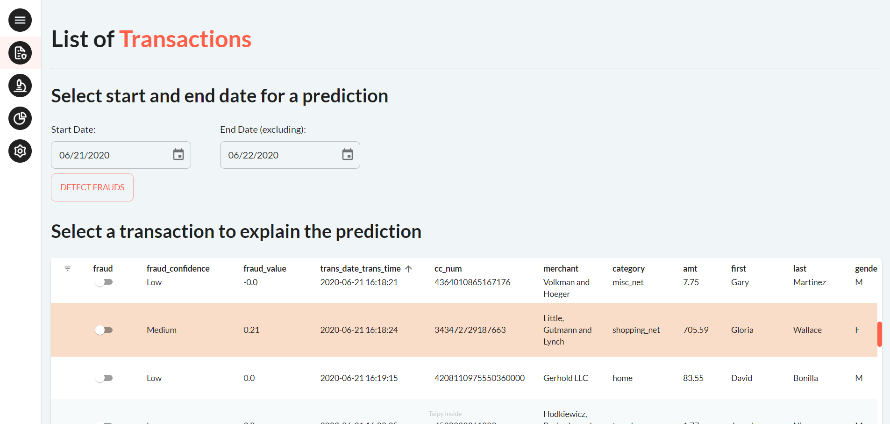
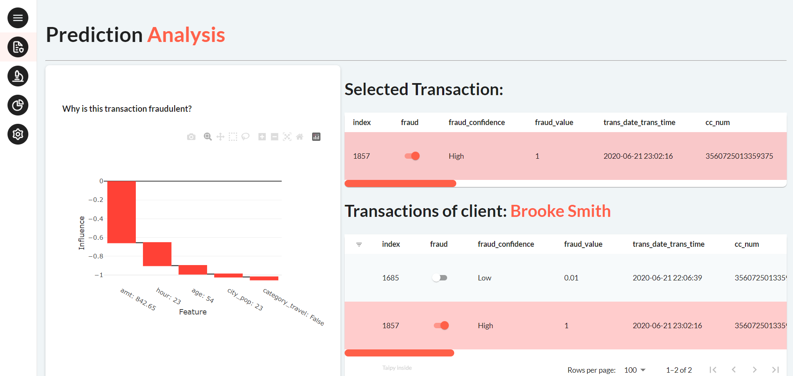
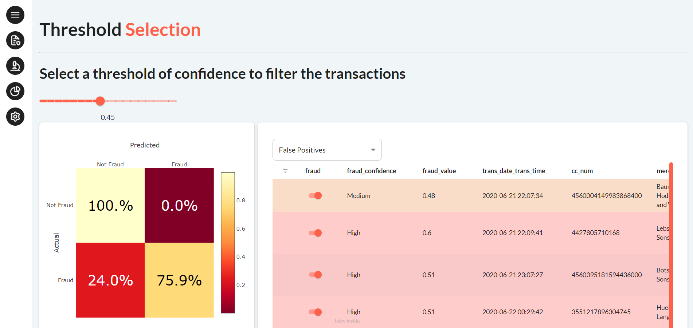

A Taipy Application that analyzes credit card transactions to detect fraud.

[Try it live](https://fraud-detection.taipy.cloud/Transactions?null=){: .tp-btn target='blank' }
[Get it on GitHub](https://github.com/Avaiga/demo-fraud-detection){: .tp-btn .tp-btn--accent target='blank' }

# Understanding the Application
This application shows a list of credit card transactions. The user can select a date range to predict fraud on.
 The application will then use an XGB model to mark potentially fraudulent transactions in red or yellow. 

{width=100%}

The user can select a transaction to see an explanation of the model's prediction, as well as the client's
 other transactions.

{width=100%}

The user can also choose the threshold of the model. The threshold is the output of the model
 above which a transaction is considered fraudulent. The user can choose the model according
  to the displayed confusion matrix and by looking at False Positive and False Negative transactions.

{width=100%}