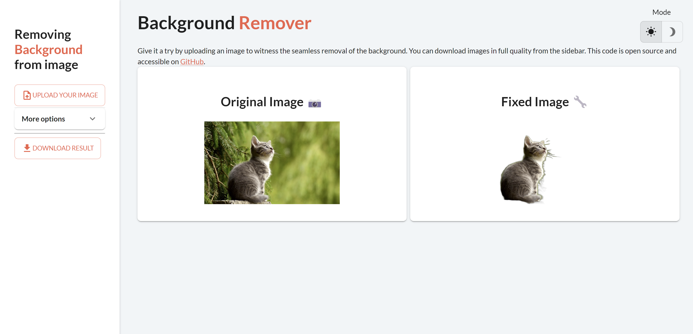
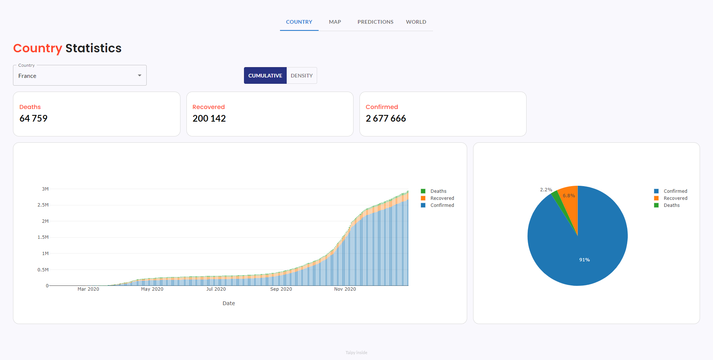
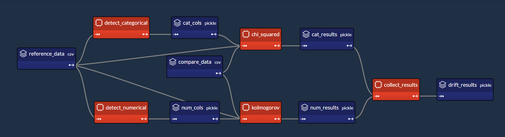
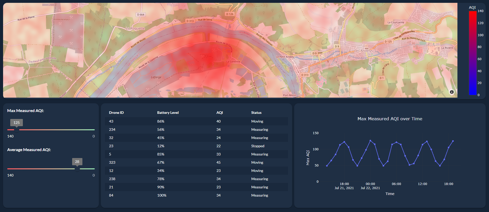
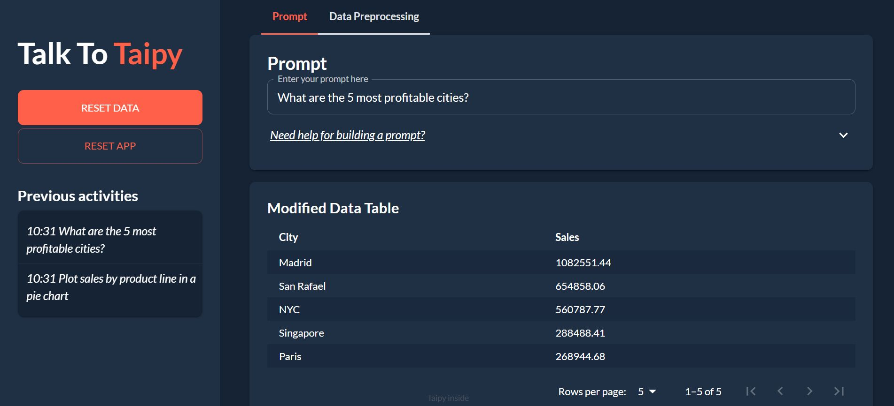
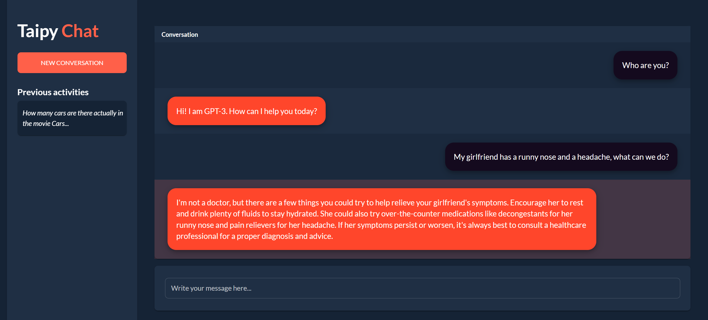
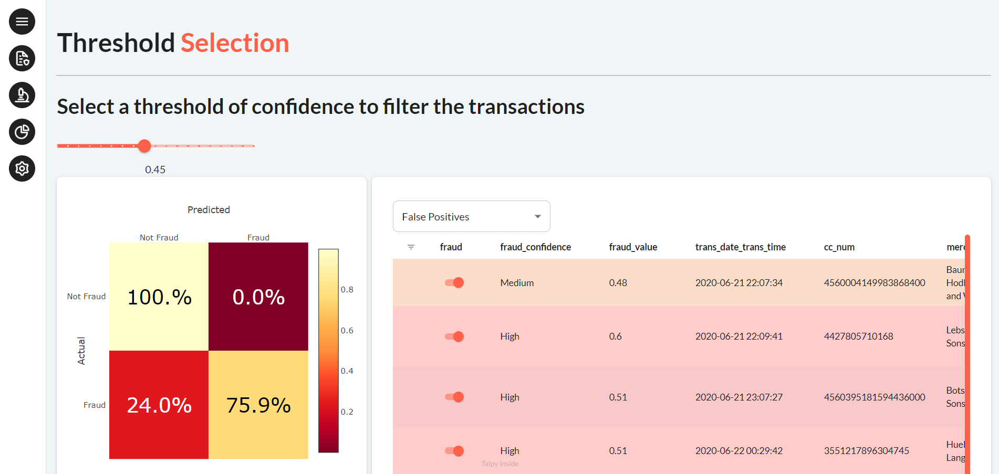

---
hide:
  - toc
---

Let's explore demos of applications made with Taipy.

<!-- Filters -->
<ul class="tp-pills-list tp-pills-filter">
  <li>
    <input type="checkbox" name="filter-all" id="filter-all" value="all" checked>
    <label class="tp-pill" for="filter-all">
      All
    </label>
  </li>
  <li>
    <input type="checkbox" name="filter-gui" id="filter-gui" value="gui">
    <label class="tp-pill" for="filter-gui">
      GUI
    </label>
  </li>
  <li>
    <input type="checkbox" name="filter-dashboard" id="filter-dashboard" value="dashboard">
    <label class="tp-pill" for="filter-dashboard">
      Dashboard
    </label>
  </li>
  <li>
    <input type="checkbox" name="filter-scenario" id="filter-scenario" value="scenario">
    <label class="tp-pill" for="filter-scenario">
      Scenario
    </label>
  </li>
  <li>
    <input type="checkbox" name="filter-ai" id="filter-ai" value="ai">
    <label class="tp-pill" for="filter-ai">
      Machine Learning
    </label>
  </li>
  <li>
    <input type="checkbox" name="filter-optimization" id="filter-optimization" value="optimization">
    <label class="tp-pill" for="filter-optimization">
      Optimization
    </label>
  </li>
</ul>

<ul class="tp-row tp-row--gutter-sm tp-filtered">
  <li class="tp-col-12 tp-col-md-6 d-flex" data-keywords="gui dashboard vizelement layout chart">
    <a class="tp-content-card tp-content-card--horizontal tp-content-card--small" href="sales_dashboard">
      <header class="tp-content-card-header">
        
      </header>
      

        <h4> Sales Dashboard </h4>
        Front-end | Back-end
        
 Check out our Sales Dashboard demo. It reads Excel files and shows valuable insights.
            You can filter data by city, customer, and gender to find specific metrics and use
            two dynamic charts for trend analysis.
        

      

    </a>
  </li>

  <li class="tp-col-12 tp-col-md-6 d-flex" data-keywords="gui ai">
    <a class="tp-content-card tp-content-card--horizontal tp-content-card--small" href="tweet_generation">
      <header class="tp-content-card-header">
        
      </header>
      

        <h4> Tweet Generation </h4>
        Front-end | Back-end
        
 Experience the AI-powered Tweet Generation. Create compelling Tweets effortlessly
            using GPT-3's Davinci engine for text and DALL·E for images.
        

      

    </a>
  </li>

  <li class="tp-col-12 tp-col-md-6 d-flex" data-keywords="gui ai">
    <a class="tp-content-card tp-content-card--horizontal tp-content-card--small" href="background_remover">
      <header class="tp-content-card-header">
        
      </header>
      

        <h4> Background Remover </h4>
        Front-end | Back-end
        
 Background Remover simplifies background removal of your images with automatic detection, an interactive interface, and efficient Python code.
        

      

    </a>
  </li>

  <li class="tp-col-12 tp-col-md-6 d-flex" data-keywords="gui ai">
    <a class="tp-content-card tp-content-card--horizontal tp-content-card--small" href="face_recognition">
      <header class="tp-content-card-header">
        
      </header>
      

        <h4> Real-time Face Recognition </h4>
        Front-end | Back-end
        
 Explore real-time face detection and recognition demo. Learn how to create custom UI
            components and use OpenCV for accurate face identification.
        

      

    </a>
  </li>

  <li class="tp-col-12 tp-col-md-6 d-flex" data-keywords="gui ai">
    <a class="tp-content-card tp-content-card--horizontal tp-content-card--small" href="sentiment_analysis">
      <header class="tp-content-card-header">
        
      </header>
      

        <h4>Sentiment Analysis: Detect emotional tones from a text</h4>
        Front-end | Back-end
        
 Explore the power of Taipy's sentiment analysis capabilities with our two-page
            application. Analyze user input and uploaded text to uncover sentiments effortlessly.
        

      

    </a>
  </li>

  <li class="tp-col-12 tp-col-md-6 d-flex" data-keywords="gui optimization scenario">
    <a class="tp-content-card tp-content-card--horizontal tp-content-card--small" href="bar_cutting">
      <header class="tp-content-card-header">
        
      </header>
      

        <h4>Optimize Bar Cut Sizes</h4>
        Front-end | Back-end
        
 Try out our Bar Cut Optimization demo. It uses Taipy to optimize bar cut sizes for two
            scenarios with distinct algorithms that reduces raw material waste in a visually
            intuitive way.
        

      

    </a>
  </li>

  <li class="tp-col-12 tp-col-md-6 d-flex" data-keywords="gui ai classification">
    <a class="tp-content-card tp-content-card--horizontal tp-content-card--small" href="image_classif">
      <header class="tp-content-card-header">
        
      </header>
      

        <h4>Image Classification</h4>
        Front-end | Back-end
        
 Explore our interactive image classification application built with Taipy, Nvidia CUDA,
            and TensorFlow.
        

      

    </a>
  </li>

  <li class="tp-col-12 tp-col-md-6 d-flex" data-keywords="gui ai classification scenario">
    <a class="tp-content-card tp-content-card--horizontal tp-content-card--small" href="churn_classification">
      <header class="tp-content-card-header">
        
      </header>
      

        <h4>Churn Classification</h4>
        Front-end | Back-end
        
 Explore our Churn Classification demo. Use Taipy for data analysis, model management,
            and model comparison in churn prediction. Witness the capabilities of Taipy in
            streamlining and improving decision-making.
        

      

    </a>
  </li>

  <li class="tp-col-12 tp-col-md-6 d-flex" data-keywords="gui optimization scenario cycle comparison">
    <a class="tp-content-card tp-content-card--horizontal tp-content-card--small" href="production_planning">
      <header class="tp-content-card-header">
        
      </header>
      

        <h4>Production Planning</h4>
        Front-end | Back-end
        
 Discover our Production Planning demo application that optimize production, reduce
            costs, and simulate manufacturing scenarios.
        

      

    </a>
  </li>

  <li class="tp-col-12 tp-col-md-6 d-flex" data-keywords="gui ai dashboard">
    <a class="tp-content-card tp-content-card--horizontal tp-content-card--small" href="stock_visualization">
      <header class="tp-content-card-header">
        
      </header>
      

        <h4>Stock Visualization</h4>
        Front-end | Back-end
        
 Explore the Stock Visualization Dashboard that leverages Taipy GUI and Prophet to
            visualize historical stock data and make predictions over 5 years.
        

      

    </a>
  </li>

  <li class="tp-col-12 tp-col-md-6 d-flex" data-keywords="gui ai dashboard multi-page maps scenario datanode">
    <a class="tp-content-card tp-content-card--horizontal tp-content-card--small" href="covid_dashboard">
      <header class="tp-content-card-header">
        
      </header>
      

        <h4>Covid Dashboard</h4>
        Front-end | Back-end
        
 Discover our minimalist yet powerful COVID-19 dashboard. View and forecast COVID-19
            data for various countries, interact with maps, and gain insights into the global
            pandemic impact.
        

      

    </a>
  </li>

  <li class="tp-col-12 tp-col-md-6 d-flex" data-keywords="gui ai dashboard">
    <a class="tp-content-card tp-content-card--horizontal tp-content-card--small" href="movie_genre_selector">
      <header class="tp-content-card-header">
        
      </header>
      

        <h4>Movie Genre Selector</h4>
        Front-end | Back-end
        
 Explore Movie Genre Selector demo. See how this user-friendly tool helps you
            effortlessly discover movies from your favorite movie genres.
        

      

    </a>
  </li>

  <li class="tp-col-12 tp-col-md-6 d-flex" data-keywords="gui ai scenario datanode dag configuration">
    <a class="tp-content-card tp-content-card--horizontal tp-content-card--small" href="drift_detection">
      <header class="tp-content-card-header">
        
      </header>
      

        <h4>Drift Detection</h4>
        Front-end | Back-end
        
 Showcases the ability to select inputs and execute and visualize outputs of data
            pipelines in a Taipy application by using the example of detecting drift on a
            dataset.
        

      

    </a>
  </li>

  <li class="tp-col-12 tp-col-md-6 d-flex" data-keywords="gui dashboard vizelement layout chart">
    <a class="tp-content-card tp-content-card--horizontal tp-content-card--small" href="pollution_sensors">
      <header class="tp-content-card-header">
        
      </header>
      

        <h4>Realtime Pollution Dashboard</h4>
        Front-end | Back-end
        
 Displays real-time pollution data from sensors around a factory. The data is streamed
            from another server and displayed in a dashboard.
        

      

    </a>
  </li>

  <li class="tp-col-12 tp-col-md-6 d-flex" data-keywords="gui vizelement layout chart ai">
    <a class="tp-content-card tp-content-card--horizontal tp-content-card--small" href="talk_to_taipy">
      <header class="tp-content-card-header">
        
      </header>
      

        <h4>TalkToTaipy</h4>
        Front-end
        
 Explore datasets using only natural language using TalkToTaipy!
        

      

    </a>
  </li>

  <li class="tp-col-12 tp-col-md-6 d-flex" data-keywords="gui vizelement ai">
    <a class="tp-content-card tp-content-card--horizontal tp-content-card--small" href="chatbot">
      <header class="tp-content-card-header">
        
      </header>
      

        <h4>LLM ChatBot</h4>
        Front-end
        
 A chatbot that uses OpenAI's API with GPT-3. Can be used as a template for implementing apps that use LLM inference.
        

      
 
    </a>
  </li>
  
  <li class="tp-col-12 tp-col-md-6 d-flex" data-keywords="gui dashboard vizelement layout chart ai multi-page classification">
    <a class="tp-content-card tp-content-card--horizontal tp-content-card--small" href="fraud_detection">
      <header class="tp-content-card-header">
        
      </header>
      

        <h4>Fraud Detection</h4>
        Front-end
        
 A Taipy Application that analyzes credit card transactions to detect fraud.
        

      
 
    </a>
  </li>
</ul>
