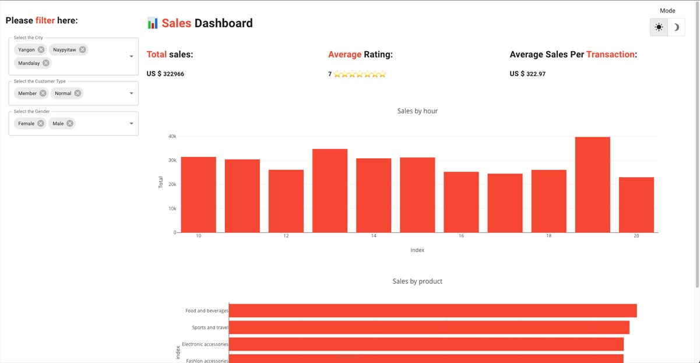

This demo allows users to extract data from an Excel file and derive meaningful insights. 
When Users apply filters based on city, customer type, and gender, Taipy automatically refreshes 
the two charts: "_Sales by hour_" and "_Sales by product_".


[Try it live](https://sales-dashboard.taipy.cloud/) 

[Get it on GitHub](https://github.com/Avaiga/demo-sales-dashboard)


# Understanding the Application
This demo is a one-page application.

{width=80%}

The dashboard includes filters and two interactive charts: 
"_Sales by hour_" and "_Sales by product_". 
These charts make it easy to spot trends, patterns, etc.


```$pip install taipy```

## Source
The idea, as well as part of the code of this application, come from Sven Bosau. 
The original code can be found [here](https://github.com/Sven-Bo/streamlit-sales-dashboard). 
It was recreated using Taipy.
