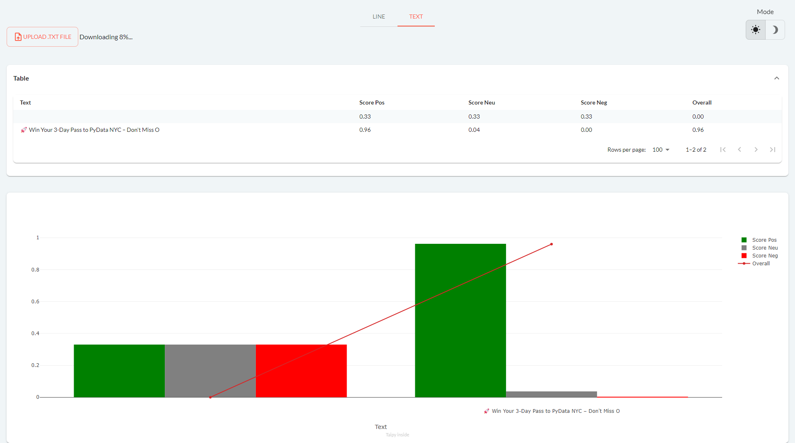

Sentiment analysis, also called "opinion mining", is a technique in
Natural Language Processing (NLP) used to figure out the 
emotional tone conveyed in a text. 

It helps businesses and individuals better grasp the feelings, 
viewpoints, and attitudes expressed in written content. Taipy's
sentiment analysis model excels in making this process highly efficient and accurate.

[Try it live](https://sentiment-analysis.taipy.cloud/line) 

[Get it on GitHub](https://github.com/Avaiga/demo-sentiment-analysis)

# Understanding the Application
The application comprises two pages accessible via the upper tabs : "_Line_", "_Text_"

## Page 1: Line - Analyzing User Input
The initial page of our Sentiment Analysis app, named "Line", is 
meant for instantly analyzing user input. Whether it's a brief 
sentence or a longer paragraph, just type or paste the text into 
the input box, and Taipy will quickly evaluate the sentiments conveyed
in the text. This is perfect for rapidly gauging the sentiments in social
media comments, customer reviews, or any text you come across online.

{width=80%}

## Page 2: Text - Uploading and Analyzing Text Files
The second page, named "Text" allows users to upload entire text files for 
comprehensive sentiment analysis. Users can select a text file from their 
device, and the application will provide insights into the sentiments 
expressed throughout the document. This feature is particularly useful 
for processing longer texts such as articles, reports, or extensive 
customer feedback.

{width=80%}

```$pip install taipy```
