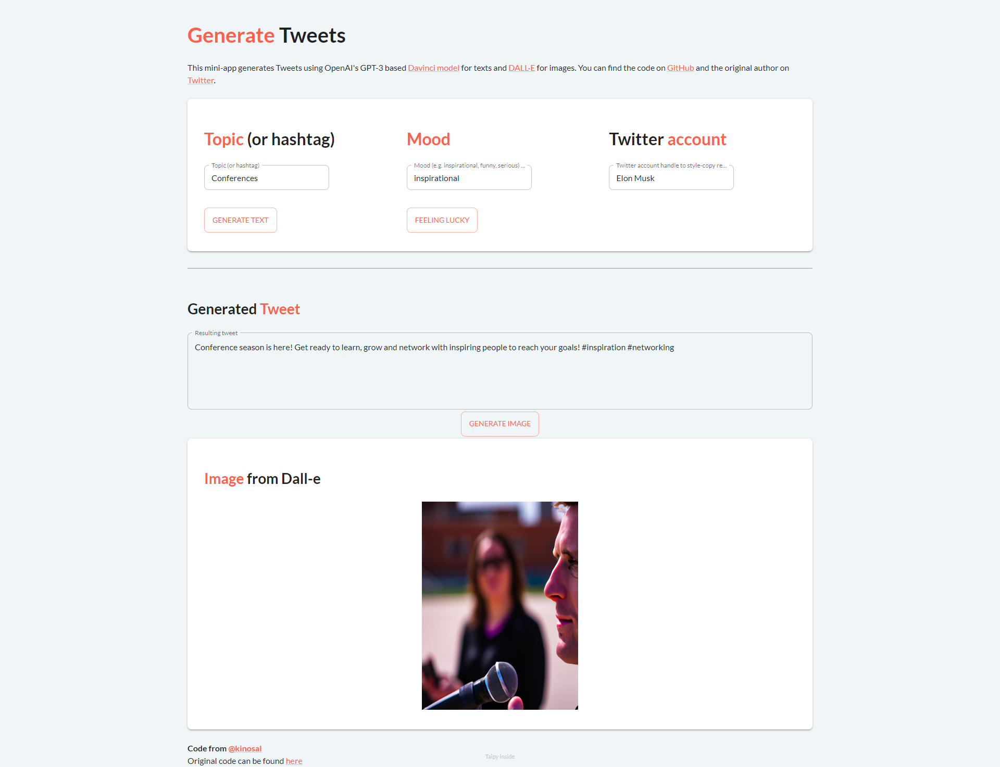

This demo uses generative AI to enable users to create one-of-a-kind Tweets with the assistance of AI models. 
It uses [GPT-3](https://openai.com/blog/gpt-3-apps)'s Davinci Engine for text generation and [DALL·E](https://openai.com/dall-e-3) 
for image generation.

This application should be useful for individuals and businesses 
seeking to improve their social media presence.


[Try it live](https://tweet-generation.taipy.cloud/) 

[Get it on GitHub](https://github.com/Avaiga/demo-tweet-generation)

# Understanding the Application
This application highlights several key features:

1. **AI-Powered Content Creation**: Taipy leverages GPT-3's
    Davinci engine to predict and generate text based on user inputs, resulting in captivating Tweets.
   
2. **Image Integration with DALL·E**: The application seamlessly integrates
   DALL·E, OpenAI's image creation model, to generate images that
   complement the Tweet text, creating visually appealing content.

   
3. **Style Transfer**: Users can infuse the style of a specific
   Twitter account into their Tweet, making it feel more authentic
   and aligned with their desired audience.


{width=80%}

# How to generate Tweets
To create captivating Tweets, follow these steps:
1. Fill out the text prompt creation form, including the topic,
   optional mood parameter, and a Twitter account for style transfer.

2. It will generate a Tweet based on your input.
   
3. The GPT-3 Davinci engine predicts the next word tokens,
   generating a whole Tweet.
   
4. Optionally, the application can request and display an
   image from DALL·E based on the generated Tweet text.
   
5. Enjoy your unique Tweet, combining text and image
   for maximum impact.


```$pip install taipy```
