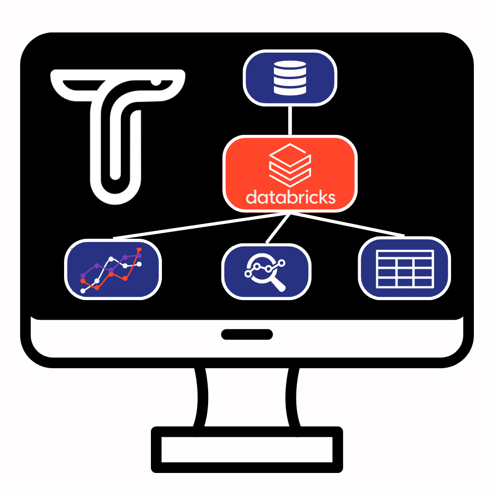

Integration with other platforms to execute jobs and functions is sometimes necessary.
This tip shows how to integrate Taipy scenarios with platforms like Databricks.
Taipy scenarios serve as a potent tool for orchestrating tasks and examining various
versions of a business problem. In this article, we'll look into the integration of
Databricks jobs with Taipy scenarios, showcasing how this can elevate your data
processing capabilities.

TO DO, put illustration
{width=100%}

## Scenarios and Databricks Integration

Creating and executing jobs on Databricks involves several steps, from setting up your
Databricks workspace to defining and running jobs. Here's a step-by-step guide on how
to create and run jobs on Databricks, which can be seamlessly integrated with Taipy
scenarios:

**Requirements:**

- A Databricks Workspace.

### 1. Create a Databricks Notebook

- **Navigate to Workspace:** In Databricks, navigate to the workspace where you want to
create the notebook.

- **Create a Notebook:** Click on the "Workspace" tab, then select "Create" and choose
"Notebook."

- **Define Notebook Details:** Enter a name for your notebook, choose the language
(e.g., Python, Scala, or SQL), and select the cluster you want to use.

### 2. Define Databricks Job Logic

- **Create the Cluster**: Go to the Compute section to create a cluster with your
packages required by your code. You would also need to install `dbutils` to be able to
have widgets/parameters and get the results of your job.

- **Write Code:** In the notebook, write the code that defines the logic of your
Databricks job. This code can include data processing, analysis, or any other tasks you
need to perform.

Here is an example of a Notebook where parameters are passed to the job and results are
then being retrieved:

```python
import pandas as pd

# Get the parameter values
param1 = dbutils.widgets.get("param1")
param2 = dbutils.widgets.get("param2")

# Use the parameter values in your code if you like
print("Parameter 1:", param1)
print("Parameter 2:", param2)

# Your code
data = pd.read_csv("https://raw.githubusercontent.com/Avaiga/taipy-getting-started-core/develop/src/daily-min-temperatures.csv")

# Results sent as the output of the job
dbutils.notebook.exit(data[:5])
```

`dbutils.widgets.get("param1")`: is how you can get the parameters passed to your job.
Note that results and parameters are stringified. No complex objects can be passed
through this interface.

- **Test in Notebook:** Test your code within the notebook to ensure it runs
successfully.

### 3. Create a Databricks Job

- **Convert Notebook to Job:** Once your code is ready, convert the notebook into a
job. Click on the "File" menu in the notebook and select "Jobs" > "Create Job."

- **Configure Job Settings:**
  - **Name and Description:** Provide a name and description for your job.
  - **Existing Cluster:** Choose an existing cluster or create a new one.
  - **Notebook Path:** Specify the path to your notebook.
  - **Job Libraries:** Add any additional libraries required for your job.

- **Advanced Options:** Configure any advanced options based on your requirements.

### 4. Run and Monitor the Databricks Job

- **Run the Job:** After configuring the job settings, click "Run Now" to execute the job immediately.

- **Monitor Job Execution:** Monitor the job execution in real-time. Databricks
provides logs and detailed information about the job's progress.


## Databricks Class: Bridging the Gap

To seamlessly integrate Databricks jobs with scenarios, we introduce the `Databricks`
class. This class facilitates communication with Databricks clusters, enabling users to
trigger jobs and retrieve results.

```python
import requests
import time
import logging
import os


CLUSTER_NAME = "cluster_name"
BASIC_TIMEOUT = 60 * 15
INTERMEDIATE_TIMEOUT = 60


class Databricks:
    def __init__(self, token, databricks_endpoint, *args, **kwargs):
        # Initialization details...

    @property
    def cluster_id(self) -> str:
        # Retrieve cluster ID...

    def status(self):
        # Check cluster status...

    def run_and_get_results(self, endpoint, dataset=None, timeout=BASIC_TIMEOUT):
        """
        Call a Databricks job based on the endpoint, wait for job completion, and return the result.
        The timeout is approximate.
        """
        # Execute Databricks job...

    def _get_job(self, job_name_search):
        # Get job ID...

    def _list_jobs(self):
        # List available jobs...
```

The `Databricks` class allows users to trigger jobs, monitor their status, and retrieve
results seamlessly within the Taipy framework.

```python
default_param = {"param1": "value1", "param2": "value2"}

ENDPOINT = "job_endpoint"

def predict(parameters):
    databricks = Databricks(os.environ['DatabricksBearerToken'],
                            os.environ['DatabricksEndpoint'])

    try:
        return databricks.run_and_get_results(ENDPOINT, parameters)
    except Exception as e:
        try:
            logging.info("Taipy tries predict a second time")
            return databricks.run_and_get_results(ENDPOINT, parameters)
        except Exception as e:
            logging.info(f'Error during the databricks call\n{e}')
            return None

```

As you can see, multiple values are used to connect to Databricks and to the right job.

- *DatabricksBearerToken*: your bearer token. Create one using this [tutorial](https://docs.databricks.com/en/dev-tools/auth/pat.html).
- *DatabricksEndpoint*: Databricks endpoint which is the base URL of your Databricks (example: *xxxyyyyzzz.azuredatabricks.net*).

Now, this `predict` function is usable by Taipy inside a scenario. A potential
integration into the configuration is as follows:

```python
from taipy.config import Config

params_cfg = Config.configure_data_node("params",
                                        default_data={"param1": "value1",
                                                      "param2": "value2"})

results_cfg = Config.configure_data_node("result")

task_databricks_cfg = Config.configure_task("databricks",
                                            input=[params_cfg],
                                            function=predict,
                                            output=[results_cfg])

scenario_cfg = Config.configure_scenario("scenario", task_config=[task_databricks_cfg])
```

Now, that the scenario is configured, it can be created and executed to retrieve the
proper results.

```python
import taipy as tp

if __name__ == "__main__":
    tp.Core().run()

    scenario = tp.create_scenario(scenario_cfg)

    scenario.submit()
    print(scenario.result.read())
```

[Download the code](./example.py){: .tp-btn target='blank' }

## Databricks + Taipy

In conclusion, the integration of Databricks jobs with Taipy scenarios is unlocked by
creating a class for handling Databricks jobs. This class can then be used inside Taipy as a
normal task. With this capability, you can incorporate Databricks workflows with Taipy
to give insights for your decision-making processes, for example.
