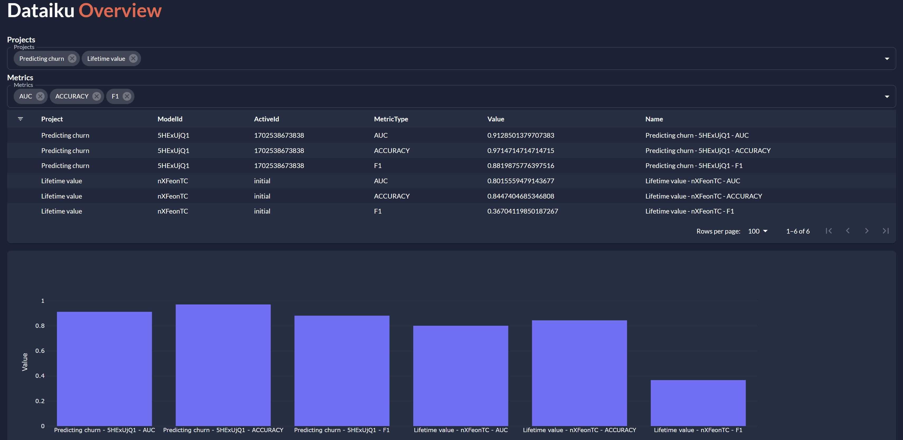
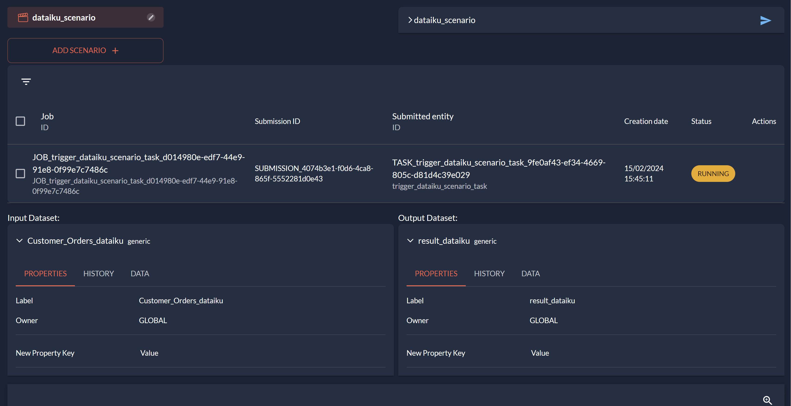

Integrating Dataiku with Taipy enhances your data analysis and processing workflows. 
This connection enables users to efficiently handle, analyze, and visualize data. 
The guide walks you through setting up your environment, connecting to Dataiku, and 
fetching data for visualization within Taipy's flexible framework.

By integrating Dataiku projects with Taipy scenarios, you gain streamlined workflows for 
data manipulation and scenario management. This involves creating custom functions for 
interacting with Dataiku's API to read from and write to datasets, seamlessly blending 
Dataiku's data processing capabilities with Taipy's task orchestration and data management.

{width=90% : .tp-image}

# Simple Integration: Visualization

First, let's integrate with Dataiku just by visualizing different data and metrics 
fetched from our Dataiku projects.

## Setting Up Your Environment

Start by ensuring that you have the required libraries installed. You'll need 
`dataiku-api-client` for accessing Dataiku and `taipy-gui` for building the GUI. 
Install these libraries using pip:

```bash
pip install dataiku-api-client taipy pandas
```

## Connecting to Dataiku

**Requirements:**

- A Dataiku Instance.
- A Dataiku Project.
- A knowledge of the Dataiku Python API

Use the `DSSClient` from the `dataikuapi` package to establish a connection with 
your Dataiku instance. Replace `"http://your-dataiku-instance.com"` and 
`"your_api_key"` with your actual Dataiku host and API key.

```python
from dataikuapi import DSSClient

host = "HOST"
apiKey = "your_api_key"

client = DSSClient(host, apiKey)
```

## Retrieving Data from Dataiku

Fetch data from your Dataiku projects by iterating through the projects and 
collecting relevant metrics for each model. This example code retrieves metrics like 
AUC and organizes them into a `pandas.DataFrame`.

```python
metrics_table = []
for project_keys in client.list_project_keys():
    project = client.get_project(project_keys)
    project_label = project.get_metadata()["label"]
    for model_id in project.list_saved_models():
        model = project.get_saved_model(model_id["id"])
        try:
            active_id = model.get_active_version().get("id", None)
            metrics = model.get_metric_values(active_id)
            for metric in metrics.raw['metrics']:
                value = metric['lastValues'][0]['value']
                metrics_table.append({'Project': project_label,
                                        'ModelId': model_id['id'],
                                        'ActiveId': active_id,
                                        'MetricType': metric['metric']['metricType'],
                                        'Value': value})
        except Exception as e:
            print(e)
            pass

metrics_df = pd.DataFrame(metrics_table)
```

## Preparing Data for Visualization

Before visualization, you may need to prepare your data further. For instance, you 
can concatenate certain columns to form a unique identifier or name for each entry. 
Here, we add a 'Name' column to our DataFrame.

```python
metrics_df['Name'] = metrics_df[['Project', 'ModelId', 'MetricType']].agg(' - '.join, axis=1)
```

## Creating a Taipy Application

Create your own Taipy application to visualize all this information. It can 
include dynamic selectors for projects and metrics, a table to display 
data, and a bar chart for visualizing metric values.

```python
from taipy.gui import Gui

selected_projects = list(metrics_df['Project'].unique())
selected_metrics = ["AUC"]  # Initially focusing on AUC metrics.

def show_projects(metrics_df, selected_projects, selected_metrics):
    return metrics_df[(metrics_df['Project'].isin(selected_projects)) &
                      (metrics_df['MetricType'].isin(selected_metrics))]

md = """
# Dataiku **Overview**{: .color-primary}

**Projects**

<|{selected_projects}|selector|lov={list(metrics_df['Project'].unique())}|dropdown|multiple|class_name=fullwidth|label=Projects|>

**Metrics**

<|{selected_metrics}|selector|lov={list(metrics_df['MetricType'].unique())}|dropdown|multiple|class_name=fullwidth|label=Metrics|>

<|{show_projects(metrics_df, selected_projects, selected_metrics)}|table|filter|>

<|{show_projects(metrics_df, selected_projects, selected_metrics)}|chart|x=Name|y=Value|type=bar|>
"""

Gui(md).run()
```

[Download the code](./src/metrics_visualization.py){: .tp-btn target='blank' }

{width=90% : .tp-image-border}

# Run a Dataiku pipeline from your Taipy application

The integration process involves using Dataiku's Python API to create a bridge 
between Taipy and Dataiku, enabling you to trigger scenarios and manage data 
workflows within your Taipy application.

Creating and executing projects on Dataiku involves several steps, from setting up 
your Dataiku instance to defining and running projects. 

**Requirements:**

- A Dataiku Instance.
- A Dataiku Project.
- A Dataiku Scenario that we want to run from a Taipy application
- A knowledge of the Dataiku Python API

**Integrate with Taipy**

- **API Calls or Plugins:** Use Dataiku's API or develop plugins to seamlessly 
integrate with Taipy scenarios for job triggering and result retrieval.

By adapting the given Dataiku API script to work with a generic data node in Taipy, 
you can define reading and writing functions to interact with Dataiku datasets. 
Then, configure a generic data node to use these functions for data handling.

## Custom Dataiku Data Nodes

To adapt the given Dataiku API script to work with a generic data node in a 
framework like Taipy, you would first define the reading and writing functions that 
interact with your Dataiku datasets. Then, you configure a generic data node to use 
these functions for data handling. The concept involves creating custom functions to 
interact with Dataiku's API for reading from and writing to datasets, and then 
integrating these functions into Taipy's data node configuration.

These functions will be responsible for interfacing with Dataiku's API, similar to 
how you directly interacted with the Dataiku datasets in the original script.

```python
from dataikuapi import DSSClient
import pandas as pd

# Create your own read function for your data or use this one
def read_data_from_dataiku(dataset_name, project_key, host, api_key):
    """
    Fetches a dataset from Dataiku DSS and returns it as a pandas DataFrame.
    
    It checks if a cached version of the dataset exists and is up-to-date before
    fetching data from Dataiku DSS. If the cached version is outdated or nonexistent,
    it fetches the data, updates the cache, and then returns the data.
    
    Parameters:
    - dataset_name: Name of the dataset to fetch.
    - project_key: Key of the project containing the dataset.
    - host: URL of the Dataiku DSS instance.
    - api_key: Authentication API key for Dataiku DSS.
    
    Returns:
    - A pandas DataFrame containing the dataset.
    """
    cache_path = f"{cache_dir}/{dataset_name}.csv"
    try:
        client = DSSClient(host, api_key)
        project = client.get_project(project_key)
        dataset = project.get_dataset(dataset_name)
        last_modified_on = dataset.get_info().info.get('timeline', {}).get('lastModifiedOn', 0)

        # Convert to datetime for comparison
        last_modified_datetime = pd.to_datetime(last_modified_on, unit='ms')

        # Check cache validity
        cache_is_valid = os.path.exists(cache_path) and \
            tp.get_entities_by_config_id(dataset_name+'_dataiku')[0].last_edit_date > last_modified_datetime

        if cache_is_valid:
            print(f"Reading {dataset_name} from cache.")
            return pd.read_csv(cache_path)

        # Fetching data from Dataiku
        columns = [column['name'] for column in dataset.get_schema()['columns']]
        data_list = list(dataset.iter_rows())
        data = pd.DataFrame(data=data_list, columns=columns)

        # Updating cache
        os.makedirs(cache_dir, exist_ok=True)
        data.to_csv(cache_path, index=False)
        print(f"Data for {dataset_name} fetched and cached.")
    except Exception as e:
        print(f"Error fetching {dataset_name} from Dataiku DSS: {e}")
        data = pd.DataFrame()  # Return an empty DataFrame in case of error

    return data


# Create your own write function for your data or use this one
def write_data_to_dataiku(data, dataset_name, project_key, host, api_key):
    """
    Writes data from a pandas DataFrame to a specified Dataiku DSS dataset.
    
    This function checks if the columns in the DataFrame match the target dataset's schema.
    If they match, it updates the dataset with the new data. If not, it prints a warning.
    
    Parameters:
    - data: pandas DataFrame containing the data to write.
    - dataset_name: Name of the dataset to update.
    - project_key: Key of the project containing the dataset.
    - host: URL of the Dataiku DSS instance.
    - api_key: Authentication API key for Dataiku DSS.
    """
    cache_path = f"{cache_dir}/{dataset_name}.csv"
    try:
        client = DSSClient(host, api_key)
        project = client.get_project(project_key)
        dataset = project.get_dataset(dataset_name)
        target_cols = [column['name'] for column in dataset.get_schema()['columns']]
        new_cols = list(data.columns)

        # Ensure column names in DataFrame match the target dataset schema
        if set(target_cols) == set(new_cols):
            os.makedirs(cache_dir, exist_ok=True)
            data.to_csv(cache_path, index=False)
            
            with open(cache_path, "rb") as fp:
                try:
                    # Attempt to clear the dataset and upload new file
                    dataset.clear()
                    dataset.uploaded_add_file(fp, f"{dataset_name}.csv")
                    print(f"Data successfully written to {dataset_name} in Dataiku DSS.")
                except Exception as e:
                    print(f"Failed to upload data to {dataset_name}: {e}")
        else:
            print("Column mismatch: The columns in the DataFrame do not match the target dataset's schema.")
    except Exception as e:
        print(f"An error occurred while processing {dataset_name}: {e}")

```

Now, it's time to set up your data nodes from these custom functions. 
This enablies a better integration of Taipy's scenarios and data management 
capabilities with Dataiku. This setup empowers you to read and write data 
efficiently, track changes, and use the data node with pipelines crucial for 
your application.

```python
from taipy import Config, Scope
import os

cache_dir = ".cache_dataiku"
os.makedirs(cache_dir, exist_ok=True)

# Configuration Constants
HOST = "HOST"
API_KEY = "API"
PROJECT_KEY = "PROJECT_KEY"
SCENARIO_ID = "SCENARIO_ID"
INPUT_DATASET_NAME = "INPUT_DATASET_NAME"
OUTPUT_DATASET_NAME = "OUTPUT_DATASET_NAME"

response_cfg = Config.configure_data_node(id="response")

# Configure input and output data nodes for Dataiku datasets
input_data_node_cfg = Config.configure_generic_data_node(
    id="input_dataiku_dataset",
    read_fct=custom_read_from_dataiku,
    read_fct_args=[INPUT_DATASET_NAME, PROJECT_KEY, HOST, API_KEY],
    write_fct=custom_write_to_dataiku,
    write_fct_args=[INPUT_DATASET_NAME, PROJECT_KEY, HOST, API_KEY]
)

output_data_node_cfg = Config.configure_generic_data_node(
    id="output_dataiku_dataset",
    read_fct=custom_read_from_dataiku,
    read_fct_args=[OUTPUT_DATASET_NAME, PROJECT_KEY, HOST, API_KEY],
    write_fct=custom_write_to_dataiku,
    write_fct_args=[OUTPUT_DATASET_NAME, PROJECT_KEY, HOST, API_KEY]
)
```

## Triggering Dataiku scenarios

With data nodes handling data autonomously, tasks now focus on action triggers, such 
as starting Dataiku scenarios. Let's assume we have a function 
`trigger_dataiku_scenario` that initiates a specific scenario within a Dataiku 
project:

```python
def run_dataiku_scenario():
    """Executes a specified Dataiku scenario."""
    try:
        client = DSSClient(HOST, API_KEY)
        project = client.get_project(PROJECT_KEY)
        scenario = project.get_scenario(SCENARIO_ID)
        scenario.run_and_wait()
        return scenario
    except Exception as e:
        print(f"An error occurred: {e}")
        return False
```

Configure a Taipy task that uses these data nodes and triggers the Dataiku scenario:

```python
# Task configuration to trigger a Dataiku scenario
trigger_scenario_task_cfg = Config.configure_task(
    id="trigger_dataiku_scenario_task",
    function=run_dataiku_scenario,
    input=[],
    output=[response_cfg]
)
```

## Configuring the Scenario

Now, encapsulate the task within a scenario configuration to define a complete 
workscenario, including data preparation, triggering the Dataiku scenario, and 
post-processing:

```python
# Scenario configuration incorporating the Dataiku scenario trigger task
dataiku_scenario_cfg = Config.configure_scenario(
    id="dataiku_scenario",
    task_configs=[trigger_scenario_task_cfg],
    additional_data_node_configs=[input_dataiku_cfg, output_dataiku_cfg]
)
```

This scenario outlines a workscenario where Taipy manages the overall process, 
including the initiation of Dataiku scenarios, with data nodes autonomously handling 
data exchanges with Dataiku.

## Execution: Bringing It All Together

To execute the scenario, use Taipy's execution model. This initiates the configured 
workscenario, including autonomous data exchange with Dataiku and triggering the 
specified scenario:

```python
import taipy as tp

# Create and execute the scenario
if __name__ == "__main__":
    tp.Core().run()
    scenario = tp.create_scenario(dataiku_scenario_scenario_cfg)

    scenario = None
    scenario_md = """
<|1 1|layout|
<|{scenario}|scenario_selector|>

<|{scenario}|scenario|>
|>

<|job_selector|>

<|1 1|layout|
Input Dataset:
<|{scenario.Customer_Orders_dataiku if scenario else None}|data_node|>

Output Dataset:
<|{scenario.result_dataiku if scenario else None}|data_node|>
|>

<|{scenario}|scenario_dag|>
"""

    tp.Gui(scenario_md).run()
```

[Download the code](./src/scenario_dataiku.py){: .tp-btn target='blank' }

{width=90% : .tp-image-border}

This approach, where tasks focus on action triggers (like starting 
Dataiku scenarios) while data nodes manage data reading and writing, enhances the 
interaction between the end user and its data and models.

In conclusion, integrating Dataiku with Taipy provides a powerful 
solution for data processing, visualization, and workscenario orchestration. 
By leveraging Taipy's scenario management and Dataiku's robust capabilities, 
organizations can enhance efficiency, scalability, and collaboration in their data 
workscenarios. This integration enables seamless interaction between Dataiku 
projects and Taipy, facilitating the creation and scalability data-driven 
applications.
