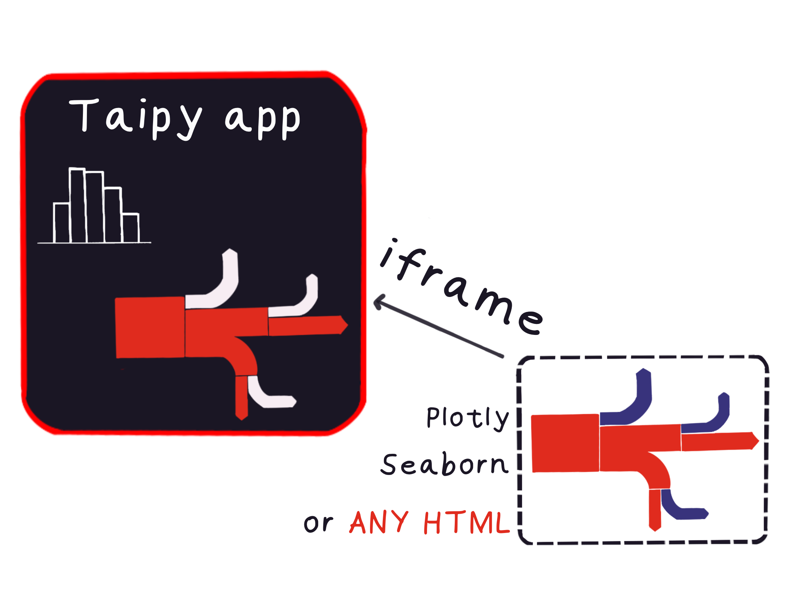

This tips explains how to use iframes to embed interactive visualizations in web 
applications. Specifically, we will use an example to demonstrate how to embed a 
Sankey Diagram in an iframe.

{width=100%}

Let's dive right in!

## What is an iFrame?

An iFrame, or Inline Frame, is an HTML document embedded inside another HTML document 
on a website. It is often used to embed content from another source, such as 
interactive visualizations, videos, and advertisements.

## Why use iFrames?

iFrames are an excellent tool for embedding external content because they create a 
separate window or 'sandbox' within your web page. This ensures that the embedded 
content does not interfere with the rest of your page's content. It also provides a 
level of security by restricting the embedded content's ability to access the parent 
page's DOM (Document Object Model).

### Example: Embedding a Sankey Diagram

{width=100%}

A Sankey Diagram is a type of flow diagram that visualizes the flow of resources or 
information between multiple entities. It is often used in energy studies, to 
visualize cost flows, or in network analysis.

In our example, we have a Python application that processes recruitment data, 
performs some analysis, and then visualizes the results as a Sankey Diagram using 
Plotly, a Python library for interactive visualizations.

Here is a snippet of the Python code used to generate the Sankey Diagram:

```python
def sankey_graph(df):
    # Processing the data for a Sankey Diagram
    ...

    fig = go.Figure(data=[go.Sankey(
        node=dict(
            label=unique_stages2, 
        ),
        link=dict(
            source=sankey_pairs['source'],
            target=sankey_pairs['target'],
            value=sankey_pairs['count'],
        )
    )])

    fig.update_layout(
        title='Sequences per application',
        font=dict(size=12),
    )

    return fig
```

In this code snippet, we first process the recruitment data, then create a Sankey 
Diagram using the processed data. The *sankey_graph* function takes a pandas 
DataFrame *df* as input, processes the data, and then returns a Plotly *fig* object 
representing the Sankey Diagram. This code has nothing to do with Taipy, just Plotly.

Now, we want to embed this Sankey Diagram in our web application. To do this, we will 
use the *get_user_content_url* function to embed the Plotly *fig* object in an iFrame.

Here is how we can do it:

```python
from taipy.gui import Gui, get_user_content_url, notify


def expose_plotly(fig):
    buffer = io.StringIO()
    fig.write_html(buffer)
    return buffer.getvalue()


html = expose_plotly(sankey_graph(data))
uc_url = None


def on_user_content(state, path: str, query: dict):
    return state.html

def on_init(state):
    state.uc_url = get_user_content_url(state, "val", {"name": "param"})
```

In this code snippet, we first create a function *expose_plotly* that takes a Plotly 
*fig* object as input and converts it to HTML. Then we create two callback functions 
*on_user_content* and *on_init* that will be called when the user interacts with the 
GUI. The *on_init* function sets the *uc_url* state variable to the URL generated by 
the *get_user_content_url* function. The *on_user_content* function returns the HTML 
representation of the Sankey Diagram when called.

Finally, we can use the *uc_url* variable to embed the Sankey Diagram in our web application using the following iframe element:


`<|part|page={uc_url}|height=800px|>`

This iframe element will embed the Sankey Diagram in our web application with a 
height of 800 pixels.

And that's it! We have successfully embedded a Sankey Diagram in our web application 
using an iframe.

## Conclusion

iFrames are a powerful tool for embedding external content in web applications. They 
provide a level of security by restricting the embedded content's ability to access 
the parent page's DOM and ensure that the embedded content does not interfere with 
the rest of your page's content.

In this tip, we showed you how to embed a Sankey Diagram in a web application using 
an iframe and the *get_user_content_url* function.

# Entire Code

```python
# Plotly code to create "fig"
import plotly.graph_objects as go
import urllib.request, json


url = 'https://raw.githubusercontent.com/plotly/plotly.js/master/test/image/mocks/sankey_energy.json'
response = urllib.request.urlopen(url)
data = json.loads(response.read())


# override gray link colors with 'source' colors
opacity = 0.4
# change 'magenta' to its 'rgba' value to add opacity
data['data'][0]['node']['color'] = ['rgba(255,0,255, 0.8)' if color == "magenta" else color for color in data['data'][0]['node']['color']]
data['data'][0]['link']['color'] = [data['data'][0]['node']['color'][src].replace("0.8", str(opacity))
                                    for src in data['data'][0]['link']['source']]


fig = go.Figure(data=[go.Sankey(
    # Define nodes
    node = dict(
      label =  data['data'][0]['node']['label'],
      color =  data['data'][0]['node']['color']
    ),
    # Add links
    link = dict(
      source =  data['data'][0]['link']['source'],
      target =  data['data'][0]['link']['target'],
      value =  data['data'][0]['link']['value'],
      label =  data['data'][0]['link']['label'],
      color =  data['data'][0]['link']['color']
))])


fig.update_layout(title_text="Energy forecast for 2050")


# Taipy Code
from taipy.gui import Gui, get_user_content_url, notify
import io


def expose_plotly(fig):
    buffer = io.StringIO()
    fig.write_html(buffer)
    return buffer.getvalue()


def on_user_content(state, path: str, query: dict):
    return state.html


def on_init(state):
    state.uc_url = get_user_content_url(state, "hello", {"t": "a"})


html = expose_plotly(fig)
uc_url = None


iframe_example = "<|part|page={uc_url}|height=800px|>"


Gui(iframe_example).run()
```
