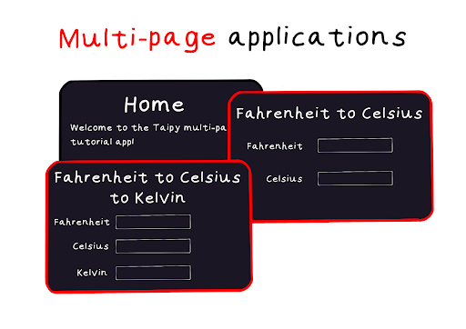
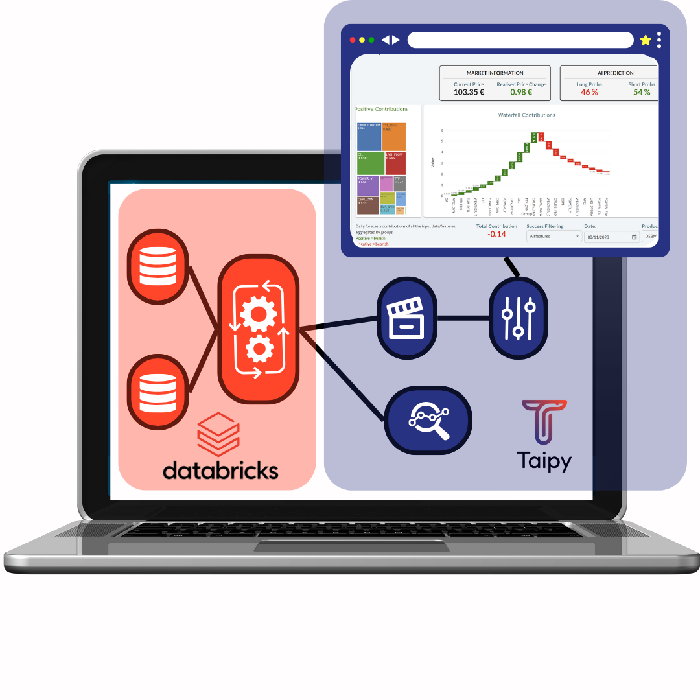

---
hide:
  - toc
---

Tips and Tricks!

<!-- Filters -->
<ul class="tp-pills-list tp-pills-filter">
  <li>
    <input type="checkbox" name="filter-all" id="filter-all" value="all" checked>
    <label class="tp-pill" for="filter-all">
      All
    </label>
  </li>
  <li>
    <input type="checkbox" name="filter-gui" id="filter-gui" value="gui">
    <label class="tp-pill" for="filter-gui">
      GUI
    </label>
  </li>
  <li>
    <input type="checkbox" name="filter-dashboard" id="filter-dashboard" value="dashboard">
    <label class="tp-pill" for="filter-dashboard">
      Dashboard
    </label>
  </li>
  <li>
    <input type="checkbox" name="filter-scenario" id="filter-scenario" value="scenario">
    <label class="tp-pill" for="filter-scenario">
      Scenario
    </label>
  </li>
  <li>
    <input type="checkbox" name="filter-stylekit" id="filter-stylekit" value="stylekit">
    <label class="tp-pill" for="filter-stylekit">
      Stylekit
    </label>
  </li>
</ul>

<ul class="tp-row tp-row--gutter-sm tp-filtered">
  <li class="tp-col-12 tp-col-md-6 d-flex" data-keywords="scenario cycle configuration datanode dag">
    <a class="tp-content-card tp-content-card--horizontal tp-content-card--small" href="scenarios">
      <header class="tp-content-card-header">
        
      </header>
      

        <h4> Scenarios </h4>
        Back-end | Test
        
 A Taipy scenario represents a run that can be an instance of a business problem to
            solve on data and parameter sets.
        

      

    </a>
  </li>

  <li class="tp-col-12 tp-col-md-6 d-flex" data-keywords="gui notebook deployment">
    
  </li>

  <li class="tp-col-12 tp-col-md-6 d-flex" data-keywords="gui notebook">
    <a class="tp-content-card tp-content-card--horizontal tp-content-card--small" href="jupyter_notebooks">
      <header class="tp-content-card-header">
        
      </header>
      

        <h4>Jupyter Notebooks</h4>
        Front-end 
        
 Optimize your coding experience with Taipy in Jupyter Notebooks. Learn essential
            functions for seamless front-end updates without the need to restart the kernel.
        

      

    </a>
  </li>

  <li class="tp-col-12 tp-col-md-6 d-flex" data-keywords="gui callback">
    <a class="tp-content-card tp-content-card--horizontal tp-content-card--small" href="long_running_callbacks">
      <header class="tp-content-card-header">
        
      </header>
      

        <h4>Long-running Callbacks</h4>
        Front-end 
        
 Discover the 'long-running callbacks' feature of Taipy GUI, ensuring responsiveness
            during lengthy tasks. This article provides practical examples, highlighting the
            potential for improved user experiences.
        

      

    </a>
  </li>

  <li class="tp-col-12 tp-col-md-6 d-flex" data-keywords="gui multi-page navbar">
    <a class="tp-content-card tp-content-card--horizontal tp-content-card--small" href="multipage_application">
      <header class="tp-content-card-header">
        
      </header>
      

        <h4>Multi-page Applications</h4>
        Front-end 
        
 Organize your data flows and visualizations in multi-pages applications, resulting in
            user-friendly and intuitive user interface.
        

      

    </a>
  </li>

  <li class="tp-col-12 tp-col-md-6 d-flex" data-keywords="gui vizelement tables callback stylekit">
    <a class="tp-content-card tp-content-card--horizontal tp-content-card--small" href="using_tables">
      <header class="tp-content-card-header">
        
      </header>
      

        <h4> Using Tables </h4>
        Front-end 
        
 Discover the power of Taipy front-end tables – your go-to for data presentation and
            control. Learn key settings and features for effortless table creation within data
            applications.
        

      

    </a>
  </li>

  <li class="tp-col-12 tp-col-md-6 d-flex" data-keywords="scenario datanode storage_type configuration">
    <a class="tp-content-card tp-content-card--horizontal tp-content-card--small" href="the_data_nodes">
      <header class="tp-content-card-header">
        
      </header>
      

        <h4> Data Nodes </h4>
        Front-end 
        
 Explore Taipy data nodes and understand their central role in accessing data from
            various sources. This article serves as your gateway to comprehending data nodes
            in Taipy.
        

      

    </a>
  </li>

  <li class="tp-col-12 tp-col-md-6 d-flex" data-keywords="gui stylekit">
    <a class="tp-content-card tp-content-card--horizontal tp-content-card--small" href="css_style_kit">
      <header class="tp-content-card-header">
        
      </header>
      

        <h4> Stylekit </h4>
        Front-end 
        
 Learn how to tailor your Taipy applications appearance with the CSS StyleKit. Easily
            change the visual style with pre-made stylesheets, CSS variables, and utility classes.
        

      

    </a>
  </li>

  <li class="tp-col-12 tp-col-md-6 d-flex" data-keywords="scenario task datanode job submission configuration">
    <a class="tp-content-card tp-content-card--horizontal tp-content-card--small" href="skippable_tasks">
      <header class="tp-content-card-header">
        
      </header>
      

        <h4> Skippable tasks </h4>
        Front-end 
        
 Explore the 'skippable' task feature to improve your efficiency in pipeline
            orchestration.
        

      

    </a>
  </li>

  <li class="tp-col-12 tp-col-md-6 d-flex" data-keywords="gui callback">
    <a class="tp-content-card tp-content-card--horizontal tp-content-card--small" href="the_on_change_callback">
      <header class="tp-content-card-header">
        
      </header>
      

        <h4> Callbacks </h4>
        Front-end 
        
 Make your multi-user graphical interface fully interactive using the on-change callback.
        

      

    </a>
  </li>

  <li class="tp-col-12 tp-col-md-6 d-flex" data-keywords="gui dashboard">
    <a class="tp-content-card tp-content-card--horizontal tp-content-card--small" href="multithreading">
      <header class="tp-content-card-header">
        
      </header>
      

        <h4> Real-time data visualization </h4>
        Front-end 
        
 Display data sent from another thread in real-time to your Taipy application.
        

      

    </a>
  </li>

  <li class="tp-col-12 tp-col-md-6 d-flex" data-keywords="gui vizelement chart">
    <a class="tp-content-card tp-content-card--horizontal tp-content-card--small" href="3rd_party_components">
      <header class="tp-content-card-header">
        
      </header>
      

        <h4> Integrate Third-Party Components </h4>
        Front-end 
        
 Use the `part` visual element to embed any HTML inside your application.
        

      

    </a>
  </li>

  <li class="tp-col-12 tp-col-md-6 d-flex" data-keywords="scenario task datanode job configuration">
    <a class="tp-content-card tp-content-card--horizontal tp-content-card--small" href="big_data_models">
      <header class="tp-content-card-header">
        
      </header>
      

        <h4> Big data models vs. Computer memory </h4>
        Front-end 
        
 A guide to building models that are bigger than your computer memory.
        

      

    </a>
  </li>

  <li class="tp-col-12 tp-col-md-6 d-flex" data-keywords="gui ai">
    <a class="tp-content-card tp-content-card--horizontal tp-content-card--small" href="decimator">
      <header class="tp-content-card-header">
        
      </header>
      

        <h4> Charts for Big Data </h4>
        Front-end 
        
 Taming Big Data without crashing.
        

      

    </a>
  </li>

  <li class="tp-col-12 tp-col-md-6 d-flex" data-keywords="scenario task">
    <a class="tp-content-card tp-content-card--horizontal tp-content-card--small" href="databricks">
      <header class="tp-content-card-header">
        
      </header>
      

        <h4> Integrating Databricks </h4>
        Front-end 
        
 A guide to integrate Databricks with Taipy scenarios.
        

      

    </a>
  </li>

  <li class="tp-col-12 tp-col-md-6 d-flex" data-keywords="scenario task">
    <a class="tp-content-card tp-content-card--horizontal tp-content-card--small" href="pyspark">
      <header class="tp-content-card-header">
        
      </header>
      

        <h4> Using PySpark for Big Data </h4>
        Front-end 
        
 Build, Visualize and Launch Big Data DAGs.
        

      

    </a>
  </li>
</ul>
