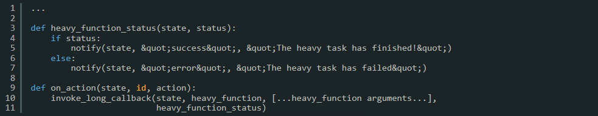

Tasks in web applications can take a lot of time, which can lead to problems with communication between 
the server (Python application) and the client (web browser).

{width=100%}

To deal with this issue, Taipy has a helpful feature called "long-running callbacks" to address this problem. 
These callbacks allow the server to do demanding processing in the background while still making sure 
the user interface stays responsive. 
This article talks about the concept of long-running callbacks in Taipy, gives examples of how to use them, 
and shows how they can improve the user experience.

## Example 1: Executing a Heavy Task in the Background

Imagine a situation where a callback starts a duty that requires a lot of resources and time to finish. 
To make this work, we can use a straightforward approach:

{width=100%}

In the previous example, the Taipy function called `invoke_long_callback()^` manages the resource-intensive task. 
It sets up a separate background thread to run the `heavy_function()`, allowing the rest of the application to continue running. 
The `on_action` function gets activated by a user action, like clicking a button, for instance.

## Example 2: Monitoring Task Status

Moreover, you can send notifications to the user's browser or update visual elements depending on the status of the ongoing process. 
Taipy offers a way to receive notifications when the task is complete, as shown below:

{width=100%}

In this example, we introduce the *heavy_function_status()* function, which is invoked by the `invoke_long_callback()^` method. 
When the callback is finished, this function is called. 

This gives you the opportunity to provide the necessary notifications or make updates to the user interface depending 
on whether the processing was successful or not.

## Handling heavy_function results: Updating the Application State

To update the State according to the returned value from *heavy_function()*, you can modify *heavy_function_status()* as follows:

{width=100%}

We added a parameter called *result*, which represents the return value of the *heavy_function()*. When the *heavy_function()* 
completes successfully (*status* is True), 
we update the State with the result by assigning it to a state variable (e.g., `state.result = result`). 
This allows you to access the result in other parts of your application or display it to the user as needed.

Make sure that the *heavy_function()* returns a value. For example:

{width=100%}

When you update the State with the result of the *heavy_function()*, you make sure that the user interface shows 
the result of the resource-intensive task. 
This creates a smooth and seamless user experience.

## Example 3: Tracking Task Progress

Occasionally, it's useful to give regular updates on the progress of a long-running task. Taipy's `invoke_long_callback()^` 
provides a convenient method to accomplish this:

{width=100%}

In the code above, when you include a *period* parameter, the *heavy_function_status()* function will be regularly activated 
at the set interval, such as every 5 seconds. 
This allows your user interface to show live updates, keeping the end user informed about the ongoing work.

## Conclusion

Taipy's long-running callbacks make it much easier to handle time-consuming tasks in web applications. 
By running demanding tasks in the background, Taipy ensures that the user interface stays quick to respond 
and avoids potential communication timeouts. 
With the option to keep an eye on the task's progress and offer updates, developers can create a smooth user experience, 
even when dealing with hefty operations.
