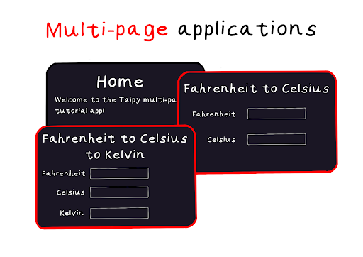
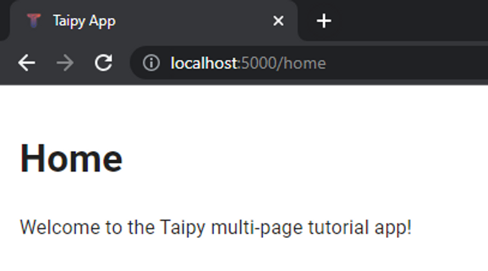
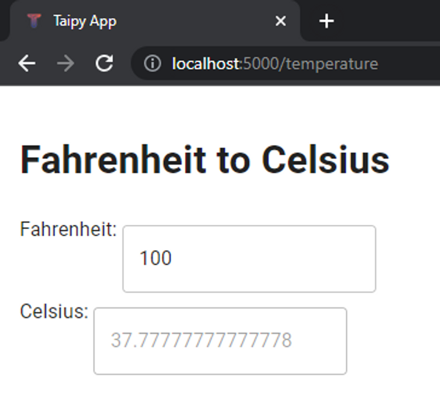
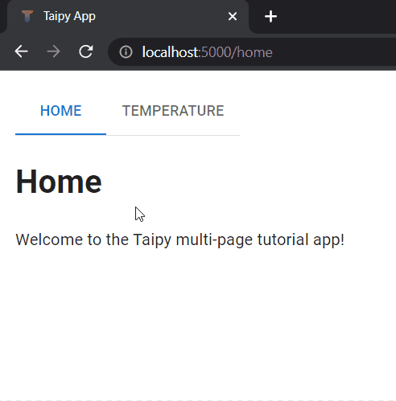
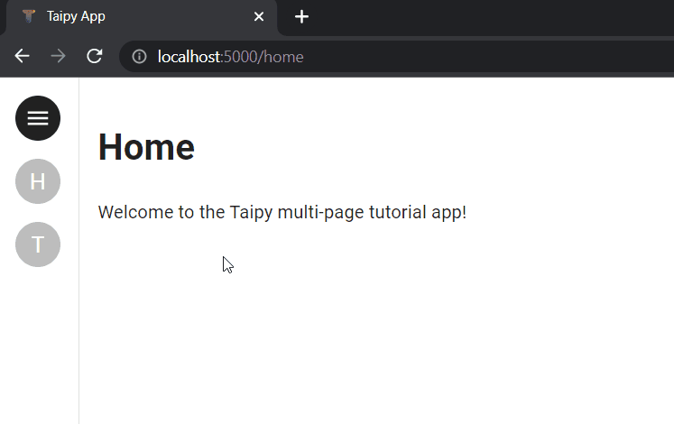
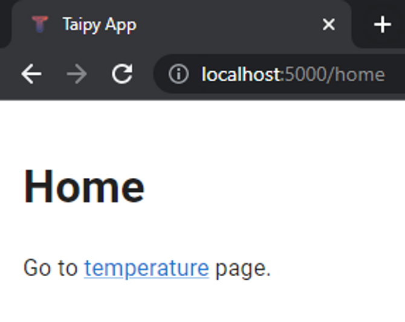

Are you tired of messy and confusing dashboards that make it hard to find the information you need? 
If so, it might be a good idea to switch to multi-page applications!

{width=100%}

Multipage applications allow you to organize your data and visualizations into separate pages, 
making it easier to navigate and focus on specific insights. At Taipy, we understand how 
important clear and effective data visualization is, which is why we've created a multi-page 
feature that lets you build user-friendly dashboards that are easy to understand.

We've prepared a two-part series of articles to explain how to use Taipy's multi-page functionality:

In Part 1, we'll go over the basics of creating a multi-page application, including how to set 
up your application and add pages.

Stay tuned for Part 2, where we'll cover more advanced features like interactivity and 
customization. Taipy makes creating multi-page applications a breeze.

So, if you're ready to enhance your data visualization, check out our multi-page feature and 
start creating your own intuitive and insightful applications with Taipy.

# Part 1 – Building a Multi-Page Application

While it's possible to create a multi-page Taipy application in a single script, it's often a 
good practice to organize your code into a folder structure like this:

```py
app/
├─ main.py
├─ pages/
│ ├─ home.py
│ ├─ temperature.py
```

In this arrangement, every submodule in the **pages** folder (like `home.py` and `temperature.py`) 
holds the code for each page in our application. We're demonstrating with just two pages in this 
example, but you can add as many as you need.

## Defining the Pages

To make it simple, we'll ensure that each page does not affect any other page. In other words, 
when you do something on one page, it won't affect the other pages. We'll discuss how pages 
interact with each other in the second part of this series.

Now, let's examine the code for each of our page modules.

```py
### home.py
 
from taipy.gui import Markdown
 
text = "Welcome to the Taipy multi-page tutorial app!"
 
home_md = Markdown("""
# Home
 
<|{text}|>
""")
```

```py
### temperature.py
 
from taipy.gui import Markdown
 
def fahrenheit_to_celsius(fahrenheit):
    return (fahrenheit - 32) * 5 / 9
 
fahrenheit = 100
celsius = fahrenheit_to_celsius(fahrenheit)
 
temperature_md = Markdown("""
# Fahrenheit to Celsius
```

No need to worry if you don't understand all the code details! What's important is that both 
pages work independently:

- The `home_md` page shows a welcome message.
- The `temperature_md` page lets a user convert temperatures from Fahrenheit (°F) to Celsius (°C).

Usually, if we were making a simple one-page application, we'd give one of our pages (Taipy 
[Markdown](../../../manuals/reference/taipy.gui.Markdown.md) or 
[HTML](../../../manuals/reference/taipy.gui.Html.md) objects) to the 
`[`Gui` constructor](Gui.init()^)` constructor. For example, to turn `home.py` into a one-page Taipy application, 
we could add these lines:

```py
### home.py, as a standalone one-page app
 
from taipy.gui import Markdown, Gui
 
# same code as before
 
home_md = Markdown(…) # same content as before
 
Gui(page=home_md).run() # or simply, Gui(home_md).run()
```

## Running the Multi-Page Application

Up to this point, we've structured our multi-page Taipy application by keeping two one-page 
applications in a sub-folder named `pages`.

Now, the next step is to create and define our main module, `main.py` within the `app/` folder. 
After that, we'll initialize our multi-page Gui object.

We started by importing two Markdown objects, `home_md` and `temperature_md` from the two 
scripts we previously created. Then, we made a dictionary called `pages`:

1. Each key in the dictionary specifies the URL where you can access that page.
2. Each value in the dictionary is the `Markdown^` object for that page.

In the end, we provided this *pages* dictionary as an argument to the *pages* parameter of the 
`Gui` object. Then, we called its `run()` method, and that's how we got our first Taipy 
multi-page application working!

If you open your web browser and go to **localhost:5000** (assuming you're using the 
[default port](../../../manuals/reference/taipy.gui.Gui.md)), you'll see the following:

{width=50%}

You're directed to the */home* URL automatically because it was the first page listed in the
`pages` dictionary, and that's where you'll find our first page!

If you change the URL from */home* to */temperature*, you will see the following:

{width=50%}

## Navigating between pages

Manually changing the URL to navigate between pages isn't ideal. Taipy provides several methods 
for adding navigation to your multi-page application, making it more user-friendly and intuitive.

### 1. The navbar

{width=50%}

One straightforward technique to make your application's navigation more appealing is by utilizing 
the Taipy [`navbar`](../../../manuals/gui/viselements/navbar.md) control. To incorporate the 
navbar into the home page, all you need to do is add a single line to the beginning of the 
*home_md* page definition:

```py
### home.py, with navbar
 
from taipy.gui import Markdown
 
text = "Welcome to the converter app!"
 
home_md = Markdown("""
<|navbar|>
 
# Home
 
<|{text}|>
""")
```

By default, the navbar control automatically creates an entry for each page in the `pages`
dictionary, requiring no further required specification of properties - making it a quick and 
easy way to add navigation.

However, the code change above only added a navbar to the *home_md* page - we would still need to 
make the same change to *temperature_md* and any other page we have in our application. A better 
alternative that does not require any code modification in any of the pages is to add a
**root page**.

Rather than modifying each page to include the navbar, we can also simply modify `main.py` to 
utilize the [root page](../../../manuals/gui/pages.md#root-page):

```py
### main.py, with root page navbar
 
from taipy.gui import Gui
from pages.home import home_md
from pages.temperature import temperature_md
 
pages = {
    "/": "<|navbar|>",
    "home": home_md,
    "temperature": temperature_md,
}
 
Gui(pages=pages).run(dark_mode=False)
```

Since every page inherits the root page, you can easily make every page inherit the navbar control 
by adding just one line to `main.py`.<br/>

As an additional tip, you can use HTML *center* tags to center the `navbar` on the page: 
`<center><|navbar|></center>`

The concept of the *root* page is more advanced in Taipy and will be explored in more detail in 
Part 2 of this Taipy multi-page series.

### 2. The navigate function

The `navigate()^` function is self-explanatory in its purpose, it is used to navigate to 
other pages. For example, this is a code snippet of the `navigate()^` function being used to 
navigate to the *home* page when the [button](../../../manuals/gui/viselements/button.md) 
control is clicked:

```py
from taipy.gui import navigate
 
md = "<|Click to go Home|button|on_action=go_home|>"
def go_home(state):
    navigate(state, "home")
```

Naturally, this function is only used within callbacks. To use `navigate()^`, we simply pass along 
the *state* variable present in all callbacks, as well as the name of the page we wish to go to. 
In the example above, the user will be directed to the */home* page.

The `navigate()^` function provides a lot of flexibility to the developer to manage navigation 
in the application beyond what the navbar offers. For example, we can manage:

1. After executing some process, direct the user to either the /success or /failure page 
    depending on the process status. 
   
2. Direct the user back to the /home page when an exception occurs 
    by using navigate in [on_exception](../../../manuals/gui/callbacks.md#exception-handling).

If you prefer, you can replicate the functionality of the *navbar* using the `navigate()^` feature 
with a different control, like a [selector](../../../manuals/gui/viselements/selector.md) 
control or [tree](../../../manuals/gui/viselements/tree.md) control. In this example, let's 
combine the `navigate` feature with the [menu](../../../manuals/gui/viselements/menu.md) control
(a collapsible side panel) to create the following app:

{width=50%}

The menu navigation was implemented by modifying `main.py` to the following:

```py
### main.py, with menu navigation
 
from taipy.gui import Gui, navigate
from pages.home import home_md
from pages.temperature import temperature_md
 
pages = {
    "/": "<|menu|lov={page_names}|on_action=menu_action|>",
    "home": home_md,
    "temperature": temperature_md,
}
page_names = [page for page in pages.keys() if page != "/"]
 
def menu_action(state, id, action, payload):
    page = payload["args"][0]
    navigate(state, page)
 
gui = Gui(pages=pages)
gui.run(dark_mode=False, run_browser=False, use_reloader=True)
```

Unlike `navbar` which automatically populates its *lov* (list of values) with the page names 
and intrinsically navigates the user to the selected page when it is interacted with, the code 
example above using the menu control and navigate is a little more verbose.

We define two properties for the menu control:

1. `lov={page_names}`: The list of values which may be selected from the menu. 
    In this case, we interpolate the *page_names* variable, which we then assign the keys from 
    *pages* (other than "/") — functionally equivalent to `page_names = ["home", "temperature"]`. 
    Refer to the [menu](../../../manuals/gui/viselements/menu.md) for more details, such as for 
    setting icons and labels.
2. `on_action=menu_action`: Assigns the `menu_action` function as the callback function which is 
    executed when the user clicks an item from the menu.

We define the *menu_action()* function with the parameters as stated in the menu control 
documentation, then call `navigate(state, page)^` to direct the user to the selected *page*. In 
practice, we effectively have the same functionality as the navbar, but had to do a bit more 
work to expressly create that functionality.

### 3. Hyperlinks

Finally, the simplest way to implement navigation in Taipy is with a hyperlink:

```py
### home.py, hyperlink to temperature
 
from taipy.gui import Markdown
 
home_md = Markdown("""
# Home
 
Go to [temperature](/temperature) page.
""")
```

This results in the following clickable "/temperature" text, which directs the user to the 
*/temperature* URL:

{width=50%}

# Part 2 - Advanced Multi-Page Applications

In preparation for Part 2 of the **Taipy Tips: Building a Multi-Page Application** series, you 
can anticipate learning about the following topics:

1. Accessing state variables across multiple pages, enabling interaction between pages.
2. Gaining insight into how Taipy GUI searches for variables and functions utilized in pages.
3. Practical code examples to illustrate these concepts.
