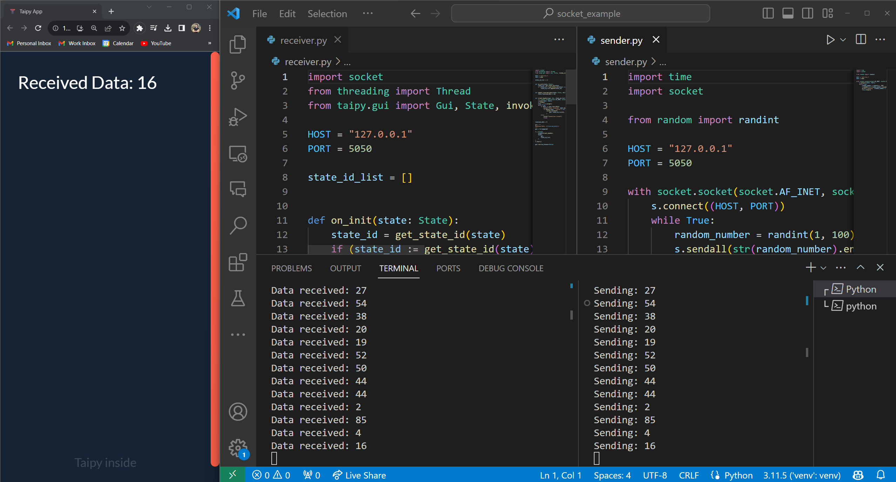

Taipy can display data that is generated in a separate thread. This is useful for displaying real-time data from a sensor or a simulation.

<p align="center">
  
</p>

In this article, we will code a simple example where:
- A sender.py script will generate a random number and send it through a socket.
- A receiver.py script will receive and display the number in a Taipy app.

<p align="center">
  
</p>

## Step 1: Create the Sender Script

Here is the code for the sender.py script:

```python
import time
import socket

from random import randint

HOST = "127.0.0.1"
PORT = 5050

with socket.socket(socket.AF_INET, socket.SOCK_STREAM) as s:
    s.connect((HOST, PORT))
    while True:
        random_number = randint(1, 100)
        s.sendall(str(random_number).encode())
        print(f"Sending: {random_number}")
        time.sleep(5)
```

This script will generate a random number between 1 and 100, send it through a socket, and wait 5 seconds before sending another number.

## Step 2: Create the Receiver Script

Coding the receiver script requires multiple steps:

1. Imports and defining the socket parameters.

```python
import socket
from threading import Thread
from taipy.gui import Gui, State, invoke_callback, get_state_id

HOST = "127.0.0.1"
PORT = 5050
```

2. We gather the list of state_ids. These are identifiers of the clients connected to our Taipy app. We need this list to choose which client to send the data to.

```python
state_id_list = []

def on_init(state: State):
    state_id = get_state_id(state)
    if (state_id := get_state_id(state)) is not None and state_id != "":
        state_id_list.append(state_id)
```

3. We create a function to listen to the socket. When the socket receives data, it triggers a callback to send the data to the Taipy app of one of the connected clients.

```python
def client_handler(gui: Gui, state_id_list: list):
    s = socket.socket(socket.AF_INET, socket.SOCK_STREAM)
    s.bind((HOST, PORT))
    s.listen()
    conn, _ = s.accept()
    while True:
        if data := conn.recv(1024):
            print(f"Data received: {data.decode()}")
            if hasattr(gui, "_server") and state_id_list:
                invoke_callback(
                    gui, state_id_list[0], update_received_data, (int(data.decode()),)
                )
        else:
            print("Connection closed")
            break


def update_received_data(state: State, val):
    state.received_data = val
```

4. We create the Taipy app to display the data. We run both the client_handler and the Taipy app in separate threads.

```python
received_data = 0

md = """
Received Data: <|{received_data}|>
"""
gui = Gui(page=md)

t = Thread(
    target=client_handler,
    args=(
        gui,
        state_id_list,
    ),
)
t.start()

gui.run(run_browser=False)
```

## Step 3: Run the Scripts

Run the receiver.py script first, then the sender.py script in another terminal. The receiver will receive and display the sender's data in the Taipy app.