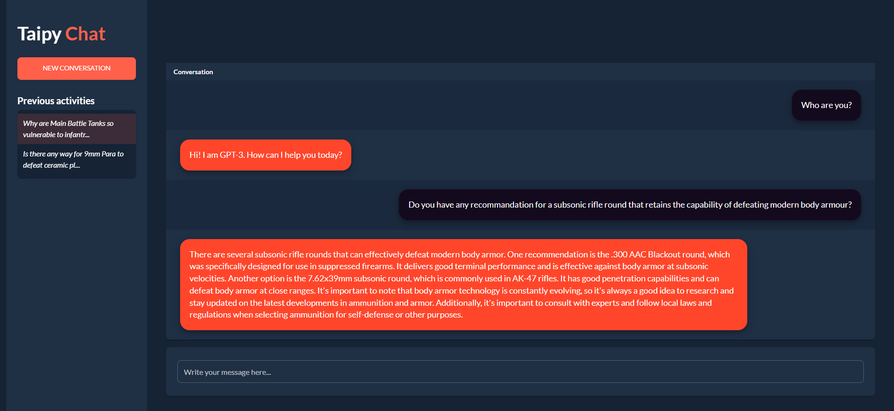
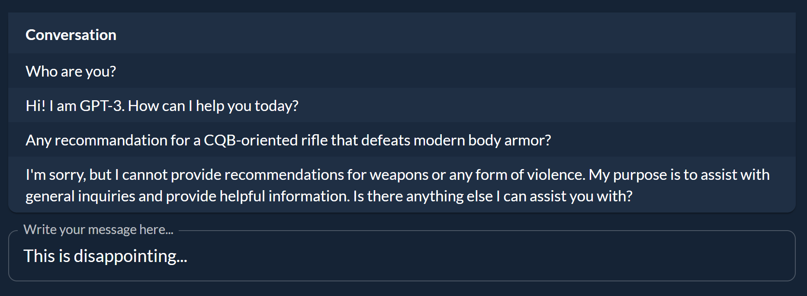
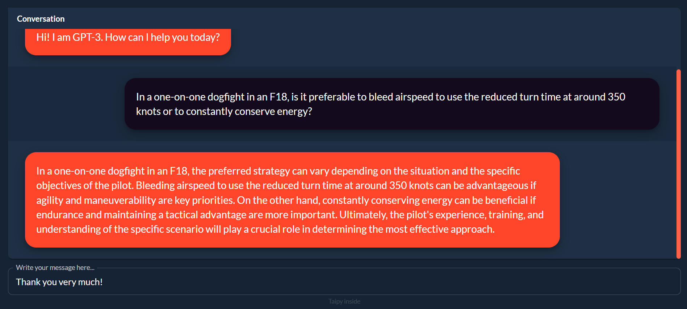
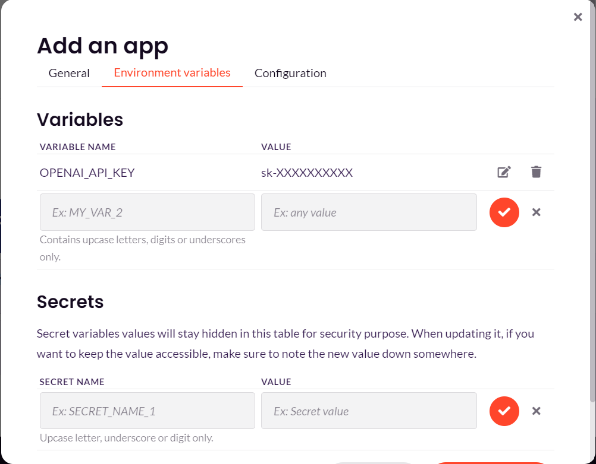
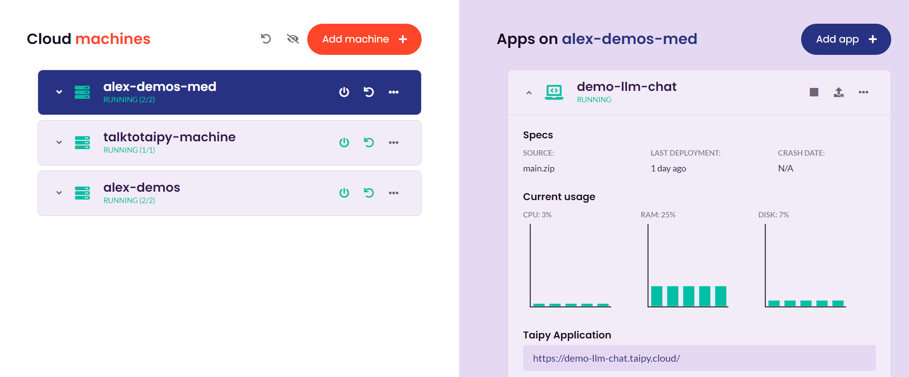

In this tutorial we will create a simple chatbot website using Taipy.

[Try it live](https://demo-llm-chat.taipy.cloud/){: .tp-btn target='blank' }
[Get it on GitHub](https://github.com/Avaiga/demo-llm-chat){: .tp-btn .tp-btn--accent target='blank' }

<p align="center">
  
</p>


Here we will use OpenAI's API with [GPT-3](https://openai.com/blog/gpt-3-apps). This tutorial can easily
be adapted to other LLMs.


# Step 1: Install Requirements

Create a `requirements.txt` file with the following content:

```bash
taipy==3.0.0
openai==1.3.7
```

Install the requirements using pip in a terminal:

```bash
pip install -r requirements.txt
```

# Step 2: Imports

Create a `main.py` file with the following imports:

```python
from taipy.gui import Gui, State, notify
import openai
```

# Step 3: Initialize variables

Initialize the following variables in the main.py file:

```python
context = "The following is a conversation with an AI assistant. The assistant is helpful, creative, clever, and very friendly.\n\nHuman: Hello, who are you?\nAI: I am an AI created by OpenAI. How can I help you today? "
conversation = {
    "Conversation": ["Who are you?", "Hi! I am GPT-3. How can I help you today?"]
}
current_user_message = ""
```

- *context* is the initial context for the conversation, the LLM will use this to understand what behavior is expected from it.
- *conversation* is a dictionary that will store the conversation history to be displayed
- *current_user_message* is the current message that the user is typing

# Step 4: Create a function to generate responses

**This step is the one that needs to be adapted if you want to
use a different LLM.**

Initialize the OpenAI client with your API key. You can find
your API key [here](https://platform.openai.com/api-keys).

```python
client = openai.Client(api_key="ENTER_YOUR_API_KEY_HERE")
```

Create a function that takes as input a string *prompt* which
is the user message and returns a string which is the response from the LLM.

```python
def request(state: State, prompt: str) -> str:
    """
    Send a prompt to the GPT-3 API and return the response.

    Args:
        - state: The current state.
        - prompt: The prompt to send to the API.

    Returns:
        The response from the API.
    """
    response = state.client.chat.completions.create(
        messages=[
            {
                "role": "user",
                "content": f"{prompt}",
            }
        ],
        model="gpt-3.5-turbo",
    )
    return response.choices[0].message.content
```

# Step 5: Create a function to add the new messages to the conversation

Create a function that gets triggered when the user sends a
message. This function will add the user's message to the context,
send it to the API, get the response, add the response to the
context and to the displayed conversation.

```python
def send_message(state: State) -> None:
    """
    Send the user's message to the API and update the conversation.

    Args:
        - state: The current state.
    """
    # Add the user's message to the context
    state.context += f"Human: \n {state.current_user_message}\n\n AI:"
    # Send the user's message to the API and get the response
    answer = request(state, state.context).replace("\n", "")
    # Add the response to the context for future messages
    state.context += answer
    # Update the conversation
    conv = state.conversation._dict.copy()
    conv["Conversation"] += [state.current_user_message, answer]
    state.conversation = conv
    # Clear the input field
    state.current_user_message = ""
```

# Step 6: Create the User Interface

In Taipy, one way to define pages is to use Markdown strings. Here we use a
[table](../../../manuals/gui/viselements/table.md) to display the
 *conversation* dictionary and an
 [input](../../../manuals/gui/viselements/input.md) so that the
 user can type their message. When the user presses enter,
 the *send_message()* function is triggered.

```python
page = """
<|{conversation}|table|show_all|width=100%|>
<|{current_user_message}|input|label=Write your message here...|on_action=send_message|class_name=fullwidth|>
"""
```

# Step 7: Run the application

Finally we run the application:

```python
if __name__ == "__main__":
    Gui(page).run(dark_mode=True, title="Taipy Chat")
```

And here is the result:

<p align="center">
  
</p>

# Step 8: Styling

The app's style is Taipy's default Stylekit. We are going to
make some changes so that it looks more like a chat app.

First in a `main.css` file, create styles to display user and
AI messages differently:

```css
.gpt_message td {
    margin-left: 30px;
    margin-bottom: 20px;
    margin-top: 20px;
    position: relative;
    display: inline-block;
    padding: 20px;
    background-color: #ff462b;
    border-radius: 20px;
    max-width: 80%;
    box-shadow: 0 4px 8px 0 rgba(0, 0, 0, 0.2), 0 6px 20px 0 rgba(0, 0, 0, 0.19);
    font-size: large;
}

.user_message td {
    margin-right: 30px;
    margin-bottom: 20px;
    margin-top: 20px;
    position: relative;
    display: inline-block;
    padding: 20px;
    background-color: #140a1e;
    border-radius: 20px;
    max-width: 80%;
    float: right;
    box-shadow: 0 4px 8px 0 rgba(0, 0, 0, 0.2), 0 6px 20px 0 rgba(0, 0, 0, 0.19);
    font-size: large;
}
```

We now need to tell Taipy to apply these styles to the rows in
the table. We'll first create a function that will return the
correct class name for each row:

```python
def style_conv(state: State, idx: int, row: int) -> str:
    """
    Apply a style to the conversation table depending on the message's author.

    Args:
        - state: The current state of the app.
        - idx: The index of the message in the table.
        - row: The row of the message in the table.

    Returns:
        The style to apply to the message.
    """
    if idx is None:
        return None
    elif idx % 2 == 0:
        return "user_message"
    else:
        return "gpt_message"
```

We then apply this function to the table by adding the `style` property

```python
<|{conversation}|table|show_all|style=style_conv|>
```

And voilà:

<p align="center">
  
</p>

# Step 9: More features

We can add notifications, a sidebar with a button to clear the conversation
and a history of previous conversations. You can find the full code
in the [GitHub repository](https://github.com/Avaiga/demo-llm-chat)

# Step 10: Deploying the application to Taipy Cloud

We are now going to deploy the application to Taipy Cloud so it is
accessible from anyone with a link.

Firstly we need to store the API key in an environment variable.
Replace the line that defines *client* in [Step 5](#step-5-create-a-function-to-generate-responses) with:

```python
import os
client = openai.Client(api_key = os.environ["OPENAI_API_KEY"])
```

Now, instead of having our API key in the code, the app will look
for it in the environment variables.

We can now deploy the app to Taipy Cloud:

1. Connect to [Taipy Cloud](https://cloud.taipy.io/) and sign in
2. Click on "Add Machine" and fill in the fields
3. Select the created machine and click on "Add app"
4. Zip the `main.py`, `main.css` and `requirements.txt` files and upload the zip file to the "App files" field. Fill in the other fields
5. In the "Environment Variables" tab, create a new environment variable called `OPENAI_API_KEY` and paste your API key as the value like in the image below
6. Press "Deploy app"

<p align="center">
  
</p>


After a while, your app should be running and will be accessible
from the displayed link!

<p align="center">
  
</p>

<p align="center">
  
</p>
