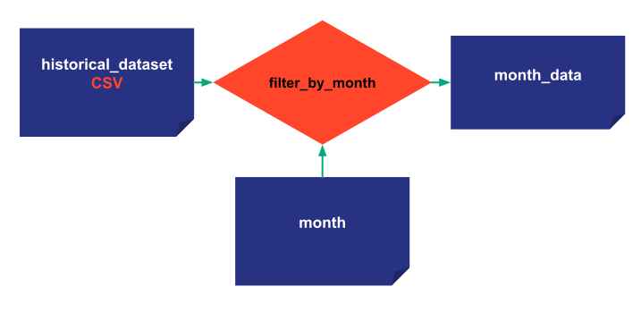
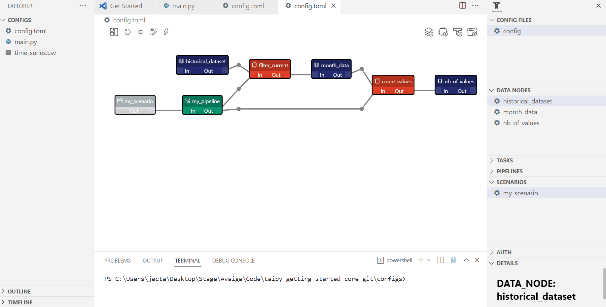
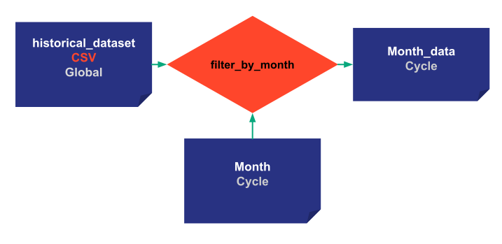
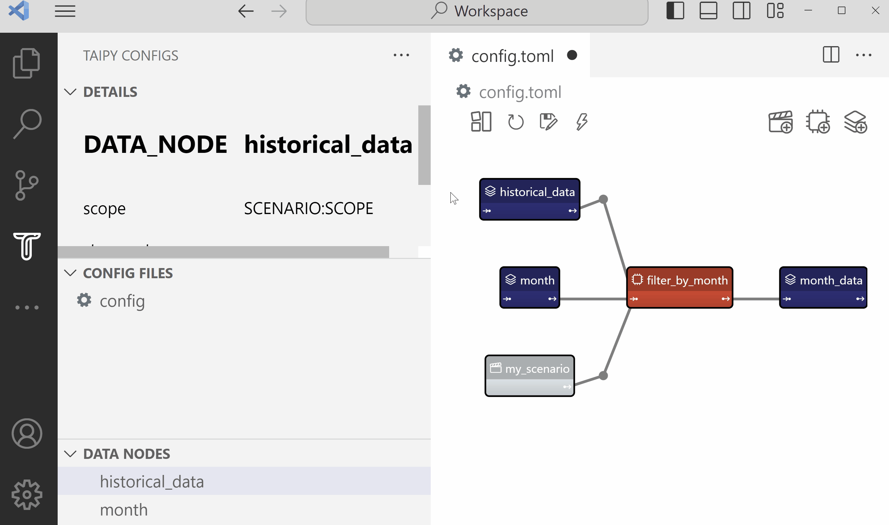

> You can download the code 
<a href="/scope_and_cycle.py" download>here</a>. Here is the 
<a href="/scope_and_cycle_toml.py" download>Python version</a> 
with the 
<a href="/config.toml" download>TOML file</a>. 
Two datasets have also to be downloaded (
<a href="/config.toml" download>here</a> and 
<a href="/config.toml" download>here</a>).

*Estimated Time for Completion: 30 minutes; Difficulty Level: Intermediate*

In this section, we will explore the intricate relationship between
[Scopes](../../../manuals/core/concepts/scope.md) and 
[Cycles](../../../manuals/core/concepts/cycle.md), two core concepts that help manage data 
nodes and scenarios effectively in Taipy.


# Cycles

[Cycles](../../../manuals/core/concepts/cycle.md) have been introduced to reflect business 
situations companies frequently encounter and can be extremely useful. 

For example, a big fast-food chain wants to predict its store sales every week. When they create 
a scenario for a particular week, it has to be linked to that specific week. Usually, there will 
be just one scenario used for all the scenarios created for a particular week. 
This special 'official' scenario is called the 'Primary' scenario in Taipy.

Note that Cycles can be ignored entirely if the business problem has no time frequency. 

## Advantages of Cycles:

- **Time-Based Organization:** Cycles facilitate the organization and analysis of scenarios over 
    specific periods.

- **Primary Scenario Identification:** Cycles allow the designation of a primary scenario for
    reference or official analysis.

- **Enhanced Data Consistency:**
    They ensure data and parameter consistency across scenarios linked to a specific time period.

- **Custom Frequency:** Cycles can be customized to various frequencies to align with specific 
    business needs.

- **Scenario Comparison:** Cycles make it easier to compare and analyze different scenarios 
    within the same time frame.

## Example: Filtering by Month

```python
def filter_by_month(df, month):
    df['Date'] = pd.to_datetime(df['Date']) 
    df = df[df['Date'].dt.month == month]
    return df
```


{ width=700 style="margin:auto;display:block;border: 4px solid rgb(210,210,210);border-radius:7px" }

## Configuration

!!! example "Configuration"

    === "Taipy Studio"

        { width=700 style="margin:auto;display:block;border: 4px solid rgb(210,210,210);border-radius:7px" }
        
        - Construct the configuration

        - Add the frequency property for the scenario and put "MONTHLY:FREQUENCY" (DAYLY, WEEKLY, MONTHLY, YEARLY)
        
        - Load the new [configuration](./config.toml) in the code

    === "Python configuration"

        A parameter is added in the scenario configuration for the frequency.

        ```python
        from taipy.config import Frequency

        historical_data_cfg = Config.configure_csv_data_node(id="historical_data",
                                                             default_path="time_series.csv")

        month_cfg =  Config.configure_data_node(id="month")
        month_values_cfg =  Config.configure_data_node(id="month_values")

        task_filter_cfg = Config.configure_task(id="filter_by_month",
                                                function=filter_by_month,
                                                input=[historical_data_cfg, month_cfg],
                                                output=month_values_cfg)


        scenario_cfg = Config.configure_scenario(id="my_scenario",
                                                 task_configs=[task_filter_cfg],
                                                 frequency=Frequency.MONTHLY)

        ```


Since we have specified `frequency=Frequency.MONTHLY`, the corresponding scenario when created, 
is automatically attached to the correct period (month). 

The Cycle which a Scenario belongs to is based on the _creation_date_ of the scenario. It can be 
"attached" to a specific cycle by manually setting its _creation_date_, as we are doing in the 
following example.


```python
tp.Core().run()

scenario_1 = tp.create_scenario(scenario_cfg,
                                creation_date=dt.datetime(2022,10,7),
                                name="Scenario 2022/10/7")
scenario_2 = tp.create_scenario(scenario_cfg,
                                creation_date=dt.datetime(2022,10,5),
                                name="Scenario 2022/10/5")
```

Scenario 1 and Scenario 2 are two separate scenario entities created using the same scenario 
configuration. They are part of the same Cycle but have different data nodes. By default, each 
scenario instance has its own data node instances, and they are not shared with any other scenario. 

## Interplay between Scopes and Cycles

Cycles are generated according to the _creation_date_ of scenarios. The scope, on the other
hand, determines how data nodes are shared within these cycles and scenarios.

# Scopes

Sharing data nodes between entities allows you to organize and manage your data better. 
It avoids data duplications and allows Taipy to better manage execution (see 
[skippable tasks](../../tips/skippable_tasks/index.md)).
The developer may decide:

- `Scope.SCENARIO` (_default_): Having one data node for each scenario.
- `Scope.CYCLE`: Extend the scope by sharing data nodes across all scenarios of a given cycle.
- `Scope.GLOBAL`: Expand the scope globally, applying it across all scenarios in all cycles.

Modifying the scope of a Data Node is straightforward.
Let's change the configuration of our data nodes:

- *historical_data*: is a Global data node. It will be shared by every cycle and scenario.

- *month*: is a Cycle data node. All scenarios of the same month will share this data.

- *month_values*: same for *month_values*.

{ width=700 style="margin:auto;display:block;border: 4px solid rgb(210,210,210);border-radius:7px" }

!!! example "Configuration"

    === "Taipy Studio"

        { width=700 style="margin:auto;display:block;border: 4px solid rgb(210,210,210);border-radius:7px" }
        
        - Change the Scope of historical_data to be global
        
        - Change the Scope of month_data and month to be Cycle

    === "Python configuration"

        The configuration is the same as the last step except for the data node 
        configurations. New parameter are added for scopes.

        ```python
        from taipy.config import Frequency, Scope

        historical_data_cfg = Config.configure_csv_data_node(id="historical_data",
                                                             default_path="time_series.csv",
                                                             scope=Scope.GLOBAL)

        month_cfg =  Config.configure_data_node(id="month", scope=Scope.CYCLE)
        month_values_cfg =  Config.configure_data_node(id="month_values", scope=Scope.CYCLE)
   
        ```


Defining the _month_ of scenario 1 will also determine the _month_ of scenario 2 since they 
share the same Data Node. 

```python
scenario_1.month.write(10)


print("Month Data Node of Scenario 1:", scenario_1.month.read())
print("Month Data Node of Scenario 2:", scenario_2.month.read())

scenario_1.submit()
scenario_2.submit()
```

Results:
```
Month Data Node of Scenario 1: 10
Month Data Node of Scenario 2: 10
```

In this unusual example where both scenarios are in the same cycle and all their data nodes 
are at least with a Cycle Scope, executing one is the same as executing the other as they share 
all their data nodes.

# Going further into Cycles

## Primary scenarios

In each Cycle, there is a primary scenario. A primary scenario is interesting because 
it represents the important scenario of the Cycle, the reference. By default, the 
first scenario created for a cycle is primary.


### Python code associated to primary scenarios

[`tp.set_primary(<Scenario>)`](../../../manuals/core/entities/scenario-cycle-mgt.md#promote-a-scenario-as-primary) 
allows changing the primary scenario in a Cycle.

`<Scenario>.is_primary` identifies as a boolean whether the scenario is primary or not.

```python
before_set_1 = scenario_1.is_primary
before_set_2 = scenario_2.is_primary

tp.set_primary(scenario_2)

print('Scenario 1: Primary?', before_set_1, scenario_1.is_primary)
print('Scenario 2: Primary?', before_set_2, scenario_2.is_primary)
```

Results:

```
Scenario 1: Primary? True False
Scenario 2: Primary? False True
```

## Useful functions on cycles

- `tp.get_primary_scenarios()`: returns a list of all primary scenarios.

- `tp.get_scenarios(cycle=<Cycle>)`: returns all the scenarios in the Cycle.

- `tp.get_cycles()`: returns the list of Cycles.

- `tp.get_primary(<Cycle>)`: returns the primary scenario of the Cycle.


### GUI-Core visual elements

You can utilize GUI-Core elements to control Cycles. Cycles can be seen in either the
*scenario_selector* or *data_node_selector*. Additionally, it's possible to designate a scenario
as primary directly through the `scenario` visual element.

```python
data_node = None
scenario = None

tp.Gui("""<|{scenario}|scenario_selector|>
          <|{scenario}|scenario|>
          <|{scenario}|scenario_dag|>
          <|{data_node}|data_node_selector|>""").run()
```

## Conclusion

By understanding the dynamics between scopes and cycles, developers can effectively manage
data nodes and scenarios to suit specific business needs and scenarios. Experiment with
different configurations to gain deeper insights into their functionalities and applications.


# Entire code

```python
from taipy.config import Config, Frequency, Scope
import taipy as tp
import datetime as dt
import pandas as pd


def filter_by_month(df, month):
    df['Date'] = pd.to_datetime(df['Date']) 
    df = df[df['Date'].dt.month == month]
    return df


historical_data_cfg = Config.configure_csv_data_node(id="historical_data",
                                                     default_path="time_series.csv",
                                                     scope=Scope.GLOBAL)
month_cfg =  Config.configure_data_node(id="month",
                                        scope=Scope.CYCLE)
month_values_cfg =  Config.configure_data_node(id="month_data",
                                               scope=Scope.CYCLE)


task_filter_cfg = Config.configure_task(id="filter_by_month",
                                        function=filter_by_month,
                                        input=[historical_data_cfg, month_cfg],
                                        output=month_values_cfg)


scenario_cfg = Config.configure_scenario(id="my_scenario",
                                         task_configs=[task_filter_cfg],
                                         frequency=Frequency.MONTHLY)


if __name__ == '__main__':
    tp.Core().run()

    scenario_1 = tp.create_scenario(scenario_cfg,
                                    creation_date=dt.datetime(2022,10,7),
                                    name="Scenario 2022/10/7")
    scenario_2 = tp.create_scenario(scenario_cfg,
                                    creation_date=dt.datetime(2022,10,5),
                                    name="Scenario 2022/10/5")

    scenario_1.month.write(10)

    print("Month Data Node of Scenario 1:", scenario_1.month.read())
    print("Month Data Node of Scenario 2:", scenario_2.month.read())

    scenario_1.submit()
    
    before_set_1 = scenario_1.is_primary
    before_set_2 = scenario_2.is_primary

    tp.set_primary(scenario_2)

    print('Scenario 1: Primary?', before_set_1, scenario_1.is_primary)
    print('Scenario 2: Primary?', before_set_2, scenario_2.is_primary)

    scenario = None
    data_node = None

    tp.Gui("""<|{scenario}|scenario_selector|>
              <|{scenario}|scenario|>
              <|{scenario}|scenario_dag|>
              <|{data_node}|data_node_selector|>""").run()
```
