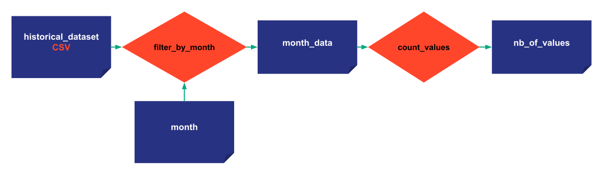

> You can download the code for
<a href="./../src/step_04.py" download>Step 4</a> 
or all the steps <a href="./../src/src.zip" download>here</a>. 

# Cycles

*Estimated Time for Completion: 15 minutes; Difficulty Level: Intermediate*

[Cycles](../../../../manuals/core/concepts/cycle.md) have been introduced to reflect business situations our customers frequently encounter and can be extremely useful. 

For example, a big fast-food chain wants to predict its store sales every week. When they create a scenario 
for a particular week, it has to be linked to that specific week. Usually, there will be just one scenario 
used for all the scenarios created for a particular week. 
This special 'official' scenario is called the 'Primary' scenario in Taipy.


Note that Cycles can be ignored entirely if the business problem has no time frequency. 


In this step, scenarios are connected to a MONTHLY cycle. With the help of Cycles, developers can take advantage 
of Taipy's specific functions to work with these Cycles. For instance, by providing the Cycle, Taipy can retrieve 
all the scenarios created within a month. You can also easily access every primary scenario generated 
in the past X months to track KPIs over time.

Let's make a slight adjustment to the filter function by passing the month as an argument. You'll need to create a new Data Node that represents the month. 
Follow the steps below:

```python
def filter_by_month(df, month):
    df['Date'] = pd.to_datetime(df['Date']) 
    df = df[df['Date'].dt.month == month]
    return df
```


Then to introduce Cycles, you need to set the frequency (predefined attribute) of the scenario to Monthly (as described below).


{ width=700 style="margin:auto;display:block;border: 4px solid rgb(210,210,210);border-radius:7px" }


!!! example "Configuration"

    === "Taipy Studio"

        { width=700 style="margin:auto;display:block;border: 4px solid rgb(210,210,210);border-radius:7px" }

        - Recreate the config of the previous step but change the task accordingly with a new input Data Node (_month_).
        
        - Add the frequency property for the scenario and put "MONTHLY:FREQUENCY" (DAYLY, WEEKLY, MONTHLY, YEARLY)
        
        - Load the new [configuration](../src/config_04.toml) in the code

    === "Python configuration"

        The configuration is the same as the last step except for the scenario and task configuration. A new parameter is added for the frequency.

        ```python
        from taipy.config import Scope

        month_cfg =  Config.configure_data_node(id="month")

        task_filter_cfg = Config.configure_task(id="filter_by_month",
                                                     function=filter_by_month,
                                                     input=[historical_data_cfg, month_cfg],
                                                     output=month_values_cfg)

        ...

        scenario_cfg = Config.configure_scenario(id="my_scenario",
                                                            task_configs=[task_filter_cfg,
                                                                          task_count_values_cfg],
                                                            frequency=Frequency.MONTHLY)

        ```


In the code snippet, you can observe that a Cycle becomes active when you've set the desired frequency for the scenario. In this code snippet, since we have specified 
`frequency=Frequency.MONTHLY`, the corresponding scenario is automatically attached to the correct period (month) when it is created. 


The Cycle which a Scenario belongs to is based on the _creation_date_ 
(`datetime.datetime.now()` by default) of the scenario. It can be "attached" 
to a specific cycle by manually setting its _creation_date_, as we are doing in the following example.


```python
tp.Core().run()

scenario_1 = tp.create_scenario(scenario_cfg,
                                creation_date=dt.datetime(2022,10,7),
                                name="Scenario 2022/10/7")
scenario_2 = tp.create_scenario(scenario_cfg,
                                creation_date=dt.datetime(2022,10,5),
                                name="Scenario 2022/10/5")
```

Scenario 1 and Scenario 2 are two separate scenario entities created using the same scenario configuration. 
They are part of the same Cycle but have different Data Nodes. By default, each scenario instance 
has its own data node instances, and they are not shared with any other scenario. 
The Scope concept can change this behavior, and we'll discuss it in the next step.


```python
scenario_1.month.write(10)
scenario_2.month.write(10)


print("Month Data Node of Scenario 1", scenario_1.month.read())
print("Month Data Node of Scenario 2", scenario_2.month.read())

scenario_1.submit()
scenario_2.submit()
```


Results:
```
Month Data Node of Scenario 1 10
Month Data Node of Scenario 2 10
[2022-12-22 16:20:04,746][Taipy][INFO] job JOB_filter_by_month_... is completed.
[2022-12-22 16:20:04,833][Taipy][INFO] job JOB_count_values_... is completed.
[2022-12-22 16:20:05,026][Taipy][INFO] job JOB_filter_by_month_... is completed.
[2022-12-22 16:20:05,084][Taipy][INFO] job JOB_count_values_... is completed.
[2022-12-22 16:20:05,317][Taipy][INFO] job JOB_filter_by_month_... is completed.
[2022-12-22 16:20:05,376][Taipy][INFO] job JOB_count_values_... is completed.
```

## Primary scenarios

In each Cycle, there is a primary scenario. A primary scenario is interesting because 
it represents the important scenario of the Cycle, the reference. By default, the 
first scenario created for a cycle is primary.

### GUI-Core visual elements

You can utilize GUI-Core elements to control Cycles. Cycles can be seen in either the *scenario_selector* or *data_node_selector*. 
Additionally, it's possible to designate a scenario as primary directly through the `scenario` visual element.

```python
data_node = None
scenario = None

tp.Gui("""<|{scenario}|scenario_selector|>
          <|{scenario}|scenario|>
          <|{scenario}|scenario_dag|>
          <|{data_node}|data_node_selector|>""").run()
```

### Python code associated to primary scenarios

[`tp.set_primary(<Scenario>)`](../../../../manuals/core/entities/scenario-cycle-mgt.md/#promote-a-scenario-as-primary) allows changing the primary scenario in a Cycle.

`<Scenario>.is_primary` identifies as a boolean whether the scenario is primary or not.

```python
print("Scenario 1 before", scenario_1.is_primary)
print("Scenario 2 before", scenario_2.is_primary)

tp.set_primary(scenario_2)

print("Scenario 1 after", scenario_1.is_primary)
print("Scenario 2 after", scenario_2.is_primary)
```

Results:

```
Scenario 1 before True
Scenario 2 before False
Scenario 1 after False
Scenario 2 after True
```

Scenario 3 is the only scenario in another Cycle due to its creation date and is the default primary scenario.

```python
scenario_3 = tp.create_scenario(scenario_cfg,
                                creation_date=dt.datetime(2021,9,1),
                                name="Scenario 2022/9/1")

print("Is scenario 3 primary?", scenario_3.is_primary)
```

Results:

```
Is scenario 3 primary? True
```

## Useful functions on cycles

- `tp.get_primary_scenarios()`: returns a list of all primary scenarios

- `tp.get_scenarios(cycle=<Cycle>)`: returns all the scenarios in the Cycle

- `tp.get_cycles()`: returns the list of Cycles

- `tp.get_primary(<Cycle>)`: returns the primary scenario of the Cycle
