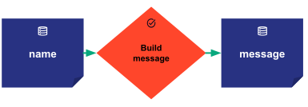

# Hello world

Taipy Core provides the key concept of _Scenario_. Among other functionalities, a _Scenario_ represents an instance
of a data science problem with its datasets (modeled as _Data nodes_ in Taipy Core) and holds the algorithms used to
solve the problem. The algorithms are modeled as an execution graph (a Directed Acyclic Graph or DAG) that can be
seen as a succession of functions (or _Tasks_) that exchange data. With Taipy Core, you can model
simple or very complex algorithms.

This section aims to build a _Hello world_ example to show how to quickly configure, create and submit
a scenario. The following picture represents the scenario execution graph made of two data nodes
(blue boxes) and one task (orange box).

{width=75%}

It first consists in one data node named _name_. It represents an input data node.
Then a task named _build message_ takes the first data node and returns a second data node named _message_.

Building the corresponding Taipy Core application requires three easy steps.

## Configuring the application

The purpose is to configure the structure of the execution graph. It includes in particular the
configuration of the data nodes, tasks, and scenarios.

```python linenums="1"
from taipy import Config


def build_message(name: str):
    return f"Hello {name}!"


name_data_node_cfg = Config.configure_data_node(id="name")
message_data_node_cfg = Config.configure_data_node(id="message")
build_msg_task_cfg = Config.configure_task("build_msg", build_message, name_data_node_cfg, message_data_node_cfg)
scenario_cfg = Config.configure_scenario("scenario", task_configs=[build_msg_task_cfg])
```

In lines 4-5, we define the function used later in the task to configure.

In lines 8 and 9, we configure the two data nodes named _name_ and _message_.

In line 10, we configure the task named _build_msg_ representing the function `build_message()`.
Since the function has one parameter and returns one value, the task has one input data node _name_ and one
output data node _message_.

Finally, in line 11, we configure the execution graph of the scenario providing the previously configured task.

## Running Core service

Running Taipy Core as a service allows Taipy to set up all necessary variables to use Core functionalities.

``` python linenums="1"
from taipy import Core

if __name__ == "__main__":
    Core().run()
```

Line 3 is a standard boilerplate code that ensures the code is executed only from the main module. It protects
users from accidentally invoking the script when they didn't intend to. We strongly recommend using it.

In line 4, we simply instantiate and run a Core service.

## Creating Scenarios and accessing data

Now you can create and manage _Scenarios_, submit the graph of _Tasks_ for execution, and access the _data nodes_.

```python linenums="1"
import taipy as tp

zinedine_scenario = tp.create_scenario(scenario_cfg)
zinedine_scenario.name.write("Zinedine")
zinedine_scenario.submit()
print(zinedine_scenario.message.read())

kylian_scenario = tp.create_scenario(scenario_cfg)
kylian_scenario.person.write("Kylian Mbappe")
kylian_scenario.submit()
print(kylian_scenario.message.read())
```

In line 3, method `tp.create_scenario()` instantiates the new scenario `zinedine_scenario`
from the scenario configuration built before.

In line 4, we get the input data node `name` of the `zinedine_scenario` and set its data
with the string value `"Zinedine"` using the method `write()`.

In line 5, the `zinedine_scenario` is submitted for an execution. This triggers the creation
and execution of a job. This job reads the input data node, passes the value
to the function `build_message()` and writes the result in the output data node.

Line 6 reads and prints the output data node `message` that has been written by the execution
of the scenario `zinedine_scenario`.

In line 8, we use the same scenario configuration to instantiate a second scenario: `kylian_scenario`.
Similarly, in lines 9-11, we write some value in its input data node, submit it and print the result written
in its output data node.


Here is the complete python code corresponding to the example:
<a href="./code_example/basic_example.py" download>`basic_example.py`</a>

And here is the expected output.

``` console
[2023-02-08 20:19:35,062][Taipy][INFO] job JOB_build_msg_9e5a5c28-6c3e-4b59-831d-fcc8b43f882e is completed.
Hello Zinedine!
[2023-02-08 20:19:35,395][Taipy][INFO] job JOB_build_msg_684b8a3e-8e5a-406d-8790-009565ed57be is completed.
Hello Kylian Mbappe!
```

!!! note

    This third step consists in calling the various Core APIs to access, manage and submit the Taipy
    entities. Typically it is implemented in Python functions that are called by a graphical interface
    built with [Taipy GUI](../../gui/index.md).

    For example, the `tp.create_scenario()` or the `tp.submit()`
    methods are called when clicking respectively on a "create scenario" or "submit scenario" buttons.
    When displaying a data node in a graphical component (chart, table, etc. ) the `read()` and `write()`
    method are called to edit and retrieve the data.


!!! important

    Please refer to the [Getting started with Core](../../../getting_started/getting-started-core/index.md)
    manual for a more realistic use case.
