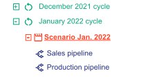
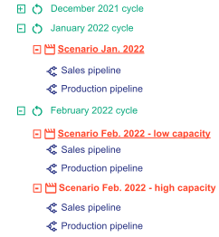

Data applications are often used to solve business problems that operate in time cycles.

Examples:

- Predictions of sales data for Store X will need to occur every week
- The master planning of Company A’s supply chain needs to happen every month
- etc.

For this purpose, Taipy brings the concept of `Cycle^` (or work cycle), which represents a single iteration of such a
work pattern. Each _cycle_ has a start date and a duration dependent upon the production publication frequency of the
scenarios. In Taipy, scenarios may have a `Frequency^` among:

- `Frequency.DAILY`
- `Frequency.WEEKLY`
- `Frequency.MONTHLY`
- `Frequency.QUARTERLY`
- `Frequency.YEARLY`

At its creation, a new scenario is attached to a cycle, the one that matches its _frequency_ and its _creation_date_.

!!! example "Example for January cycle"

    { align=left width="250" }

    In our example, the end-user must publish production orders (i.e., a production plan) every month. During each
    month (the cycle), the end-user will be interested in "playing" with different scenarios untill only one of
    those scenarios is selected as the official production plan to be published. Using Taipy,
    each month is modeled as a cycle, and each Taipy cycle will contain one or more Taipy scenarios.

    The picture on the left shows the tree of entities: Cycles, Scenarios and their associated Pipeline(s). There
    is an existing past cycle for December and a current cycle for January containing a single scenario.

When comes the end of a _cycle_ (start date + duration), only one of the scenarios is applied in production. This
"official" scenario is called the _**primary scenario**_. Only one _**primary scenario**_ per cycle is allowed.

!!! example "Example for February cycle"

    { align=left width="250" }
    Now we start working on the February work cycle. We create two scenarios for the February cycle (one
    with a low capacity assumption and one with a high capacity assumption).
    As a user of the application, I can decide to apply the low capacity scenario in production for February.
    To accomplish that, I promote my low capacity scenario as _**primary**_ for the February cycle.

    The tree of entities resulting from the various scenarios created is represented in the picture on the left. The
    underlined scenarios are _**primary**_.

!!! note

    Note that cycles are optional. If a scenario has no Frequency, it will not be attached to any cycle.

The attributes of a scenario (the set of pipelines, the cycle, ... ) are populated based on the scenario configuration
`ScenarioConfig^` that must be provided when instantiating a new scenario. (Please refer to the
[`configuration details`](../config/scenario-config.md) documentation for more details on configuration).

[:material-arrow-right: The next section introduces the Job concept.](job.md)
