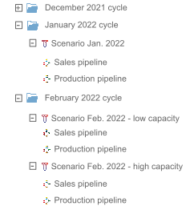

Business problems are often recurrent. A `Cycle^` (or work cycle) represents a single iteration of such a work
pattern. Each _cycle_ has a start date and a duration dependent upon the production publication frequency of the
scenario. In Taipy, a _cycle_ duration depends on scenario `Frequency^` among:

- `Frequency.DAILY`
- `Frequency.WEEKLY`
- `Frequency.MONTHLY`
- `Frequency.QUARTERLY`
- `Frequency.YEARLY`

Each recurrent scenario is attached to a _cycle_. I.e., each _cycle_ contains multiple scenarios. At the end of a
cycle (start date + duration), only one of the scenarios can be applied in production. This scenario is called the
_primary scenario_. There is only one _primary scenario_ per cycle.

!!! example

    The user must publish production orders every month. Each month is modeled as a cycle in Taipy, and each cycle
    contains one or more scenarios.

    Depending on the simulation we ran, we may have a single scenario (the primary one) for the January cycle and two
    scenarios for the February cycle (one with a low capacity assumption and one with a high capacity assumption).
    As a user of the application, I can decide to apply the low capacity scenario in production for February.
    To accomplish that, I promote my low capacity scenario as primary for the February cycle.

    The tree of entities resulting from the various scenarios created is represented in the following picture.
    { width="250" }

The attributes of a scenario (the set of pipelines, the cycle, ... ) are populated based on the scenario configuration
`ScenarioConfig^` that
must be provided when instantiating a new scenario. (Please refer to the
[`configuration details`](../config/scenario-config.md) documentation for more
details on configuration).

[:material-arrow-right: The next section introduces the Scope concept.](scope.md)
