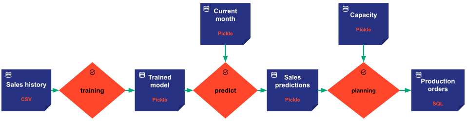

A datanode is one of the most important concepts in Taipy Core. It does not contain the data itself, but holds all
the necessary information to read and write the actual data. It can be seen as a dataset descriptor or data reference.

A _data node_ can reference any data:

- a text,
- a numeric value,
- a list of parameters,
- a custom python object,
- the content of a JSON file, a CSV file, a Pickle file, etc.
- the content of one or multiple database table(s),
- any other data.

It is made to model any type of data: input, intermediate, or output data, internal or external data, local or remote
data, historical data, set of parameters, trained model, etc.

The _data node_ information depends on the data itself, its exposed format, and its storage type.

First example: If the data is stored in an SQL database, the corresponding _data node_ should contain the username,
password, host, port, the queries to read and write the data,as well as the python class used for deserialization.

Second example: If the data is stored in a CSV file, the corresponding _data node_ should contain, for instance, the
path to the file and the python class used for deserialization.

!!! example "Let's take a realistic example."

    Let's assume we want to build an application to predict the monthly sales demand in order to adjust production
    planning, constrained by some capacity.

    The flowchart below represents the various data nodes we want to be processed byt the tasks (in orange).

    { align=left }

    For that purpose, we have six data nodes modeling the data (the dark blue boxes). One each for the sales history,
    the trained model, the current month, the sales predictions, the production capacity, and the production orders.

!!! Note

    Taipy proposes various predefined _data nodes_ corresponding to the most popular _storage types_. More details on
    the [Data node configuration page](../config/data-node-config.md)

    In our example, the sales history comes as a CSV file. We will use the predefined CSV _data node_ to model the
    sales history.

    For example, the sales history comes from our company record system, so we do not control its storage type. We
    got the data as a CSV file. We can use a predefined CSV _data node_ to model the sales history.

    As for  the production orders _data node_, we want to write the data into a database shared by other systems.
    We can use the SQL _data node_ to model the production orders.

    We have no particular specification for the other data nodes. We can use the default storage type: Pickle.

The data node's attributes are populated based on the data node configuration
`DataNodeConfig^`
that must be provided when instantiating a new data node. (Please refer to the
[`configuration details`](../config/data-node-config.md) documentation for more
details on configuration).

[:material-arrow-right: The next section introduces the Task concept](task.md).
