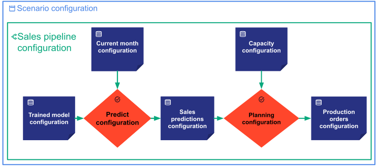
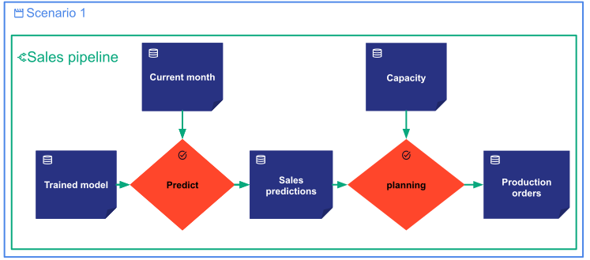
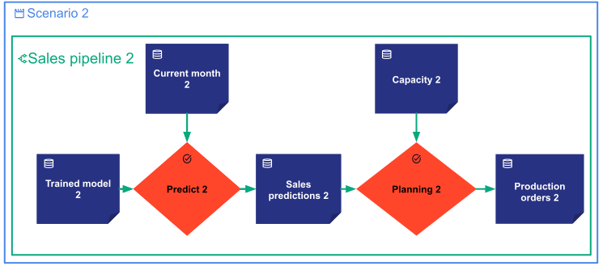
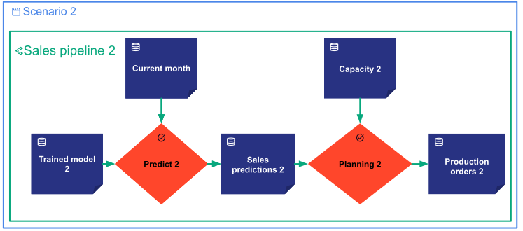

!!! important "Reminder: Config vs Entities"

    The **data nodes**, **tasks**, **pipelines**, and **scenarios** concepts have two types of Taipy objects
    related to them: **configs** and runtime **entities**.

    Remember that each **entity** is created from a **config**. Remember also that the same **config** can be used
    to instantiate multiple **entities**.

Let's take some scenario entity use cases to illustrate the logic behind the Taipy execution flow. For this purpose,
we will use the configuration graph below.

The picture above represents the graph of **configs** objects (`DataNodeConfig` and `TaskConfig` objects).

# Single Scenario Execution

Let’s assume we create a new scenario from the previous configuration graph. Let’s call it **Scenario 1**. All the
entities of **Scenario 1** will be instantiated from the various configuration objects. **Scenario 1** can also be
represented as the entity graph below:

Thanks to this graph representation, Taipy can understand the execution precedence constraints. When a
scenario/pipeline is submitted for execution, the tasks are smartly scheduled and executed in the correct order.

Taipy also optimizes the execution of pipelines and scenarios by not recomputing tasks that do not need to be executed.

Let’s assume that **scenario 1** has already been executed. If the end-user decides to re-execute the same scenario,
then only three situations can occur:

- <u>Situation 1</u>: Taipy will re-execute all the tasks. This is the default behavior.
- <u>Situation 2</u>: None of the data nodes have been modified since the last run. The data nodes _**sales
  predictions**_ and _**production orders**_ will be cached, and they don't need to be re-executed. Taipy will not
  re-execute the tasks. (Please refer to `DataNodeConfig^` documentation to activate the "cacheable" feature).
- <u>Situation 3</u>: If at least one of the input data nodes has been modified since the last run, Taipy will only
  execute the "appropriate" tasks. It implies that:
      * If the _**predict**_ task entity has any of its two input data nodes (_**trained model**_ or _**current
        month**_) changed since the last run, then in the second run, Taipy will re-execute both the _**predict**_
        and the _**planning**_ tasks.
      * If _**trained model**_ and _**current month**_ have not been modified but _**capacity**_ is, then Taipy
        will only re-execute the _**planning**_ task.

# Multiple Scenario Execution

Let’s continue with the previous example by creating a second scenario from the same config. Let’s call it
**Scenario 2**. In the case of multiple scenarios instantiated from the same configuration, what is the impact on
the entities and on the execution of one scenario have over the execution of another scenario?

Two options are possible with Taipy:

- <u> Option 1 </u>:
Taipy assumes that the entities of each scenario are "local" to each scenario and not shared with others. Similar to
the first scenario, the following entity graph will be created for **Scenario 2**.

Note that all the data nodes and tasks are new instances and prefixed by `2`.

- <u> Option 2 </u>:
Taipy assumes that some entities of the scenarios are "global" and are shared among scenarios. For instance,
_**current month**_ can be shared by **Scenario 1** and **Scenario 2**. In this second option, the following entity
graph will be created for **Scenario 2**.

To illustrate the two option behaviors, let’s assume that:

- First, **Scenario 1** has been executed with its **current month** entity set to "_January_".
- Then, the **current month** data node entity of **Scenario 2** has been set to "_February_".

If Option 1 applies, then when the end-user re-executes **Scenario 1**, Taipy will lead to producing the same execution
as before (or will not re-execute the tasks if the "cacheable" feature is activated).

If Option 2 applies, **current month** and **current month 2**  data nodes are the same entity. When the end–user
re-execute **Scenario 1**, Taipy detects that the **current Month** data node entity has changed. Then re-executing
**Scenario 1**, will run the entity graph with the **current month** set to "_February_".

To enable the difference in behavior, Taipy introduces the concept of Scope. In Taipy, Option 1 corresponds to the
by-default behavior: `SCOPE` default value is at the `SCENARIO` level. While Option 2 corresponds to setting the scope
to a level above SCENARIO (either `CYCLE` or `GLOBAL`).

[:material-arrow-right: The next section introduces the Scope concept.](scope.md)
