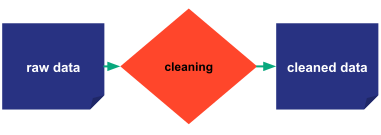
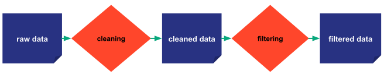
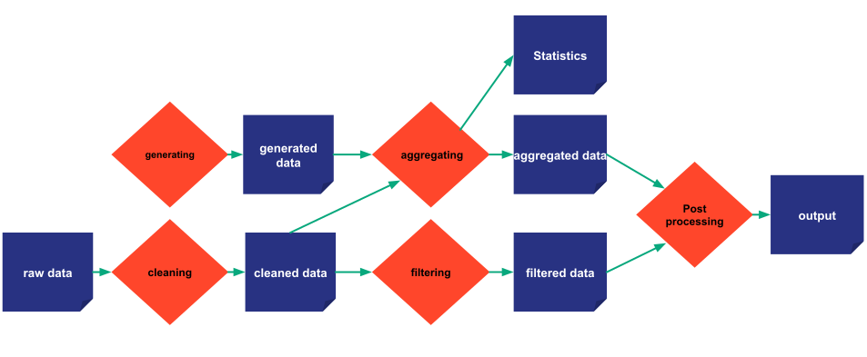
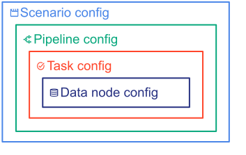

# Taipy's Core concepts

Taipy Core is an application builder designed to help Python developers turn their data algorithms into an interactive
production-ready data-driven application. Taipy Core provides the necessary concepts for modeling, executing, and
monitoring algorithms. In this documentation, such algorithms are called pipelines.

A pipeline can be seen as a succession of functions that exchange data. It can be described as an
execution graph (a Directed Acyclic Graph or DAG). With Taipy Core, one can model simple as well as very
complex pipelines.

!!! example "Let's take some examples."

    === "Simple single function example"

        The following picture represents a simple pipeline made of a single _*cleaning*_ function processing a single
        input, the _*raw data*_, and returning a single output, the _*cleaned data*_.

        { margin-left=25% width=52%}

    === "Linear example with two functions"

        The second example below is slightly more complex. The first function _*cleaning*_ processes a single input,
        the _*raw data*_, and returns some intermediate data named _*cleaned data*_. The second function _*filtering*_
        reads the same intermediate data _*cleaned data*_ and returns a single output _*filtered data*_.

        

    === "Branching example"

        The third example below introduces some complexity. As you can see in the picture below, the function
        _*generating*_ does not have any input. On the contrary, the function _*aggregating*_ takes multiple inputs and
        returns multiple outputs.

        

This section aims at defining the following Taipy Core concepts.

- A [Data node](data-node.md) (the dark blue boxes) represents a reference to a dataset. A data node can be
  used/shared by multiple tasks as input or output. It can refer to any type of data: a built-in Python object
  (e.g. an integer, a string, a dictionary or list of parameters, ...) or a more complex object (e.g. a file,
  a machine learning model, a list of custom objects, the result of a database query, ...).
  A data node can be shared by multiple tasks as input or output.
- A [Task](task.md) (the orange boxes) can be seen as a function receiving data node(s) as input and returning
  data node(s) as output.
- A [Job](job.md) represents a unique execution of a Task.
- A [Pipeline](pipeline.md) represents a set of tasks connected together through data nodes, that should be executed
  as a whole and forming a consistent algorithm.
- A [Scenario](scenario.md) is made of one or multiple pipelines. It represents an instance of a business problem to
  solve.
- A [Cycle](cycle.md) or work cycle is a time period corresponding to an iteration of a recurrent business problem.
  For instance, a company's sales forecast needs to be generated _every week_.
  A cycle is defined thanks to the **_Frequency_** of scenarios. For instance, if scenarios have a weekly
  frequency, then each cycle represents a particular week, and every scenario will be attached to a particular cycle
  (i.e. a week).
- A [Scope](scope.md) represents the _visibility_ of a data node in the graph of entities, and the level of its
  owner (Pipeline, Scenario, Cycle).

!!! important "Definition: Config vs Entities"

    Among the concepts described in this section, **data nodes**, **tasks**, **pipelines**, and **scenarios** have
    two types of Taipy objects related to them: _configuration_ objects and _runtime_ objects.

    To differentiate them, the configuration objects are named **_configs_** (`DataNodeConfig`, `TaskConfig`,
    `PipelineConfig`, and `ScenarioConfig`). In contrast, the runtime objects (`DataNode`, `Task`, `Pipeline`, and
    `Scenario`) are called **_entities_**.

    It will benefit the reader to visualize the different Taipy **_configs_** like a set of Russian dolls where each
    **_config_** belongs to a "larger" **_config_**:

    { margin-left=25% width=50%}

    One thing to wrap your head around (it may not be very intuitive for everyone at first) is that the **configs**
    are really just configuration objects describing the characteristics and the behaviors of the concepts they relate
    to. **Configs** can be seen as generators. Indeed, each **entity** is instantiated from a **config**. Note also that
    the same **config** can be used to instantiate multiple **entities**.

More details on the **configs** are available in the [Configuration](../config/index.md) chapter.

More details on the **entities** are available in the [Entities](../entities/index.md) chapter.

[:material-arrow-right: The next section introduces the data node concept](data-node.md).
