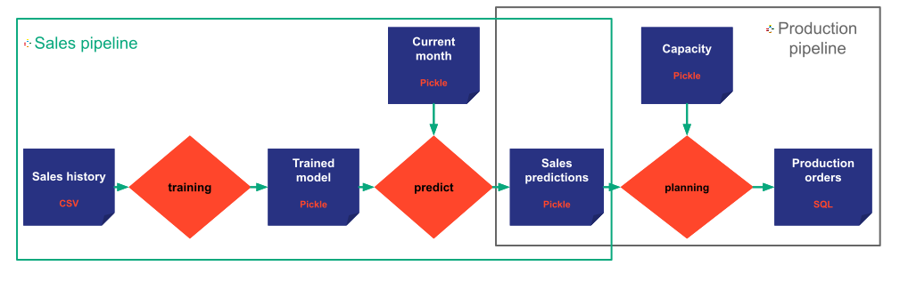

A `Pipeline^` is made to model an algorithm. It
represents a direct acyclic graph of input, intermediate, and output data nodes linked together by tasks.
A _pipeline_ is a set of connected tasks that the user wants to run together for functional reasons. It then
represents an execution graph as a consistent set of tasks.

In a typical machine learning application, we can have a _pipeline_ dedicated to preprocessing and preparing data, a
_pipeline_ for computing a training model, and a _pipeline_ dedicated to scoring.

!!! example "In the example"

    We want to have two pipelines.

    A first sales pipeline (boxed in the green on the picture) is made of training and predict tasks.
    A second production pipeline (in the dark grey rectangle on the picture) made of the planning task.
    Indeed, the two pipelines could represent two different workflows that can be run
    independently, on different schedule or by different users.

    { align=left }

Note that the various pipelines do not require to be disjointed.

The attributes of a pipeline (the set of tasks) are populated based on the pipeline configuration
`PipelineConfig^` that
must be provided when instantiating a new pipeline. (Please refer to the
[`configuration details`](../config/pipeline-config.md) documentation for more
details on configuration).

[:material-arrow-right: Next section introduces the Scenario concept.](scenario.md)
