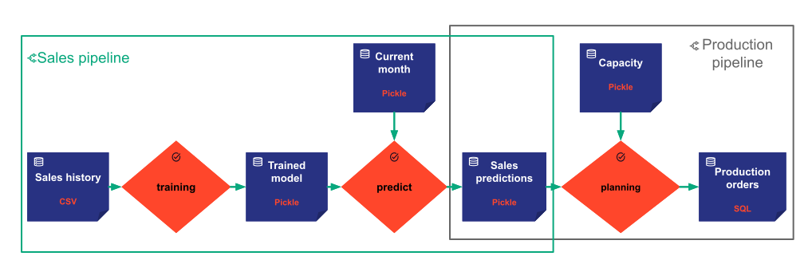

A `Pipeline^` is made to model an algorithm. It represents a direct acyclic graph of input, intermediate, and output
data nodes linked together by tasks. A _pipeline_ is a set of tasks designed to perform a set of functions.

For instance, in a typical machine learning application, we may have a _pipeline_ dedicated to preprocessing and
preparing data, a _pipeline_ for computing a training model, and a _pipeline_ dedicated to scoring.

!!! example "In the example"

    We have chosen to model two pipelines.

    { align=left }

    First, a sales pipeline (boxed in green in the picture) containing **training** and **predict** tasks.

    Second, a production pipeline (boxed in dark gray in the picture) containing the **planning** task.
    In fact, the two pipelines can be customized to represent two different workflows that run independently,
    under different schedules (for batch execution running on a fixed schedule (e.g. every week)) or by different users
    (For interactive execution triggered by end-users).

Note that the pipelines are not necessarily disjoint.

The attributes of a pipeline (the set of tasks) are populated based on the pipeline configuration
`PipelineConfig^` that must be provided when instantiating a new pipeline. (Please refer to the
[`configuration details`](../config/pipeline-config.md) documentation for more details on configuration).

[:material-arrow-right: The next section introduces the Scenario concept.](scenario.md)
